# Architecture: AI News Briefing System


This document describes the architecture, data flow, and design decisions behind the AI News Briefing system -- an automated daily AI news aggregation pipeline that uses one of four supported AI CLI engines (Claude Code, Codex, Gemini, Copilot) to search the web, compile a structured briefing, and publish it to Notion and/or Obsidian.

The system is cross-platform, supporting macOS (launchd) and Windows (Task Scheduler).

---

## Table of Contents

1. [System Architecture Overview](#1-system-architecture-overview)
2. [Execution Flow](#2-execution-flow)
3. [Component Details](#3-component-details)
4. [Data Flow](#4-data-flow)
5. [Search Strategy](#5-search-strategy)
6. [Output Format](#6-output-format)
7. [Scheduling Architecture](#7-scheduling-architecture)
8. [Error Handling](#8-error-handling)
9. [File System Layout](#9-file-system-layout)
10. [Security Considerations](#10-security-considerations)
11. [Teams and Slack Notification Pipelines](#11-teams-and-slack-notification-pipelines)
12. [Future Enhancements / Extension Points](#12-future-enhancements--extension-points)

> **See also:** [Section 3.11 -- Custom Topic Briefing Pipeline](#311-custom-topic-briefing-pipeline), [Section 3.12 -- Test Suite](#312-test-suite), [CUSTOM_BRIEF.md](CUSTOM_BRIEF.md), [TESTS.md](TESTS.md)

> [!NOTE]
> **Live Notion page:** [https://hoangsonw.notion.site/9c34d052d9354beda82a3423e2d2f404?v=d43c53fe405c4896bfd95ad0cc22246f](https://hoangsonw.notion.site/9c34d052d9354beda82a3423e2d2f404?v=d43c53fe405c4896bfd95ad0cc22246f)

---

## 1. System Architecture Overview

The system is composed of five primary layers: a platform-native scheduler, a scripted entry point, a CLI engine selection layer, the AI engine itself, and the Notion API as the output destination. The engine selection layer implements a registry pattern -- it checks for installed engines (Claude Code, Codex, Gemini, Copilot) and selects one based on the `AI_BRIEFING_CLI` environment variable or an automatic fallback chain (`claude` → `codex` → `gemini` → `copilot`). The core logic (prompt, search, compilation, Notion write, card generation) is identical across platforms and engines -- only the scheduling, scripting, and engine selection layers differ.

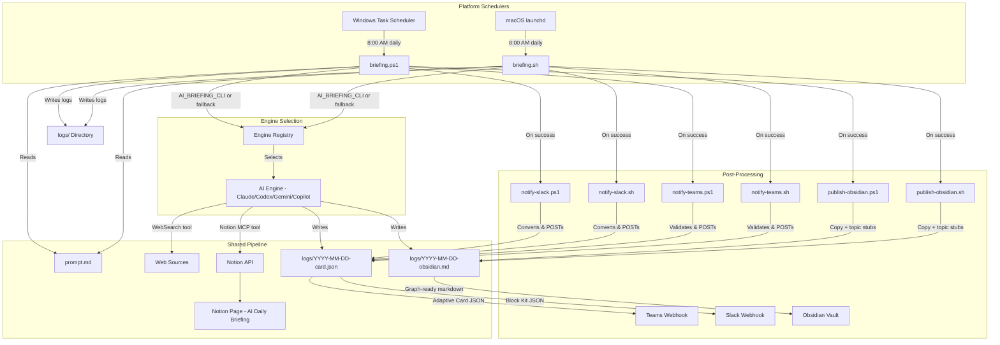

**Key design principles:**

- **Headless execution.** The entire pipeline runs without user interaction via the selected engine's headless/print mode.
- **Multi-engine support.** Four AI CLI engines are supported (Claude Code, Codex, Gemini, Copilot) with automatic fallback. The `AI_BRIEFING_CLI` env var overrides the fallback chain, and `AI_BRIEFING_MODEL` overrides the default model.
- **Cross-platform.** Platform-specific code is isolated to the entry point scripts and scheduler configs. The prompt, search strategy, and output format are shared.
- **Single responsibility.** Each file has one job: scheduling, orchestration, prompt definition, or installation.
- **Cost containment.** A hard budget cap of $2.00 per run prevents runaway API costs.
- **Observability.** All output (stdout and stderr) is captured in date-stamped log files.
- **Multi-channel delivery.** Briefings publish to Notion and optionally post to Microsoft Teams and/or Slack via webhooks.

---

## 2. Execution Flow

The system supports multiple trigger paths that converge on the same execution pipeline.

### Platform Entry Points

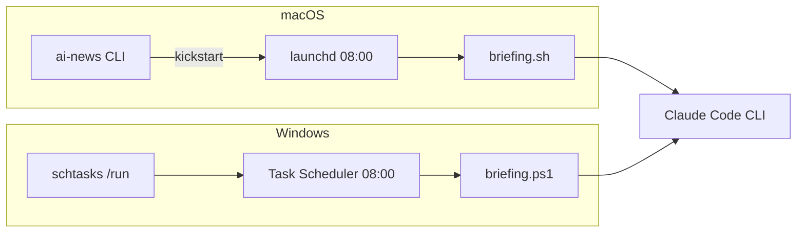

### Full Lifecycle Sequence

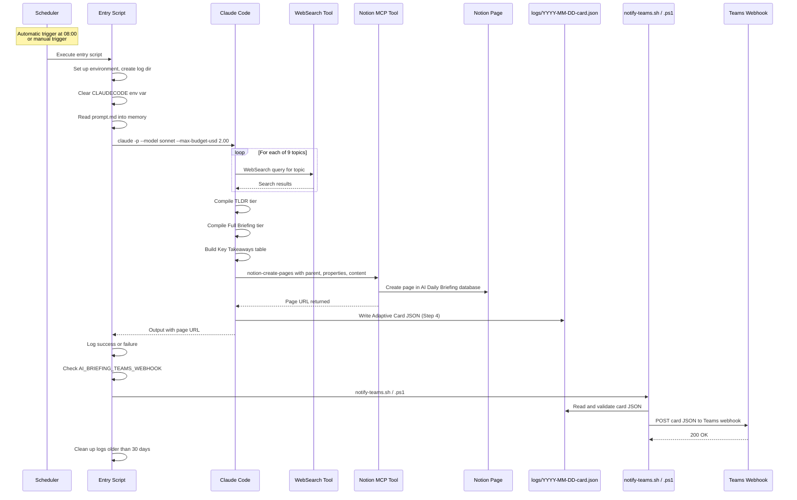

### Timing

Based on observed log data, a typical run takes approximately 3-5 minutes from start to completion. This covers the full cycle of web searches across 9 topics, content compilation, and Notion page creation.

---

## 3. Component Details

### 3.1 Schedulers

The system uses the native scheduler for each platform. Both are configured for identical behavior: fire once daily at 08:00, recover from missed runs when possible.

| Aspect | macOS (launchd) | Windows (Task Scheduler) |
|---|---|---|
| Config file | `com.ainews.briefing.plist` | Created by `install-task.ps1` |
| Task name | `com.ainews.briefing` | `AiNewsBriefing` |
| Default time | 08:00 | 08:00 |
| Missed run recovery | Fires on wake (sleep only) | `StartWhenAvailable` fires on wake or login |
| Powered-off recovery | Skipped for that day | Fires on next login |
| Concurrency guard | Single instance enforced by launchd | `ExecutionTimeLimit` of 30 minutes |
| Manual trigger | `launchctl kickstart` or `ai-news` CLI | `schtasks /run /tn AiNewsBriefing` |

#### macOS plist configuration

| Property | Value | Purpose |
|---|---|---|
| `Label` | `com.ainews.briefing` | Unique identifier for the job |
| `ProgramArguments` | `/bin/bash`, `briefing.sh` | Shell and script to execute |
| `StartCalendarInterval` | Hour: 8, Minute: 0 | Trigger at 08:00 daily |
| `StandardOutPath` | `logs/launchd-stdout.log` | Capture stdout from launchd itself |
| `StandardErrorPath` | `logs/launchd-stderr.log` | Capture stderr from launchd itself |
| `EnvironmentVariables` | `PATH`, `HOME` | Ensures Claude and tools are discoverable |

#### Windows Task Scheduler settings

| Setting | Value | Purpose |
|---|---|---|
| `AllowStartIfOnBatteries` | True | Run even on battery power (laptops) |
| `DontStopIfGoingOnBatteries` | True | Don't kill the task if AC is unplugged mid-run |
| `StartWhenAvailable` | True | Catch up on missed runs after sleep/shutdown |
| `ExecutionTimeLimit` | 30 minutes | Kill runaway tasks |
| `RunLevel` | Limited | No admin elevation required |

### 3.2 Entry Point Scripts

Both scripts are deliberately minimal -- their only job is to set up the environment and hand off to Claude Code. They share the same logic in platform-native languages.

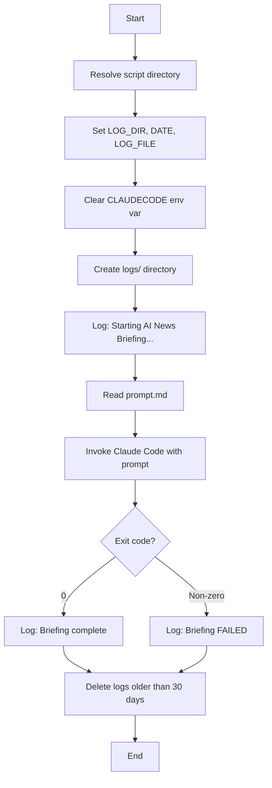

#### `briefing.sh` (macOS)

- **Language:** Bash with `set -e` (exit on error)
- **Claude path:** `$HOME/.local/bin/claude` (portable across users)
- **Log rotation:** `find` with `-mtime +30 -delete`
- **Error suppression:** `|| true` on cleanup to prevent script failure

#### `briefing.ps1` (Windows)

- **Language:** PowerShell 5.1+ with `Set-StrictMode` and `$ErrorActionPreference = "Stop"`
- **Claude path:** `$env:USERPROFILE\.local\bin\claude.exe`
- **Log rotation:** `Get-ChildItem` with `Where-Object` filtering by `LastWriteTime`
- **Error handling:** `try/catch` block captures Claude execution failures

**Shared design decisions:**

- **`unset CLAUDECODE` / `$env:CLAUDECODE = $null`**: Prevents nested session detection if the script is invoked from within a Claude Code terminal.
- **Log to file, not stdout:** All output is captured in date-stamped log files for observability without requiring a terminal.
- **30-day log rotation:** Prevents unbounded disk usage on both platforms.

### 3.3 Task Installer (`install-task.ps1`, Windows only)

A PowerShell script that registers (or re-registers) the Windows Task Scheduler task. Accepts `-Hour` and `-Minute` parameters for schedule customization. Removes any existing task with the same name before creating a new one, making it idempotent.

### 3.4 AI Prompt and Skill Definitions

The AI's behavior is governed by prompt files and Claude Code skill definitions:

- **Daily briefing:** `prompt.md` (headless) + `commands/ai-news-briefing.md` (interactive skill)
- **Custom brief:** `prompt-custom-brief.md` (headless with template variables) + `commands/custom-brief.md` (interactive skill)

The daily briefing prompts form the complete instruction set for a scheduled run. The custom brief prompt uses `{{TOPIC}}` and `{{PUBLISH_*}}` template variables that are injected by the CLI scripts at runtime. All prompts are shared across platforms with no platform-specific content.

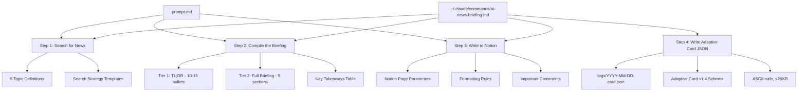

**How the prompt and skill guide Claude:**

1. **Topic enumeration.** The 9 topics are explicitly listed with examples of what to search for, removing ambiguity about scope.
2. **Search strategy.** Template queries like `"[topic] news today [current date]"` guide Claude toward recent content rather than evergreen articles.
3. **Two-tier output format.** The TL;DR tier provides a scannable summary; the full briefing tier provides depth. This separation is defined in the prompt, not in code.
4. **Exact Notion API parameters.** The `parent` database ID, property schema, and formatting rules are hardcoded in the prompt so Claude produces the correct API call every time.
5. **Guardrails.** Instructions like "Focus on NEWS from the past 24-48 hours only" and "If a topic has no significant news today, say 'No major updates today'" prevent hallucination and filler content.
6. **Card generation (Step 4).** The skill definition includes the Adaptive Card JSON template and constraints (valid JSON, ASCII-safe text, ≤26KB). Claude writes the final card payload directly to `logs/YYYY-MM-DD-card.json`, eliminating any need for post-hoc log parsing.

### 3.5 Makefile (Cross-Platform Task Runner)

The `Makefile` provides a unified command interface across macOS, Windows (Git Bash / MSYS2), and Linux. It auto-detects the platform at invocation and routes commands to the correct native tools.

**Design decisions:**

- **Platform detection.** Uses `uname -s` output to classify the environment as `macos`, `windows`, or `linux`. Handles MINGW, MSYS, and CYGWIN variants for Windows Git Bash environments.
- **Prerequisite gating.** The `check` target validates the Claude CLI binary exists before `run` or `install` execute, providing a clear error message instead of a cryptic failure.
- **Validation.** The `validate` target checks that all project files exist and that `prompt.md` contains the expected step structure (Step 0 through Step 3).
- **No dependencies beyond Make.** The Makefile uses only POSIX shell commands and platform-native tools. No additional packages are required.

**Target categories:**

| Category | Targets | Purpose |
|---|---|---|
| Daily Briefing | `run`, `run-bg`, `run-scheduled` | Trigger the daily briefing pipeline |
| Custom Brief | `custom-brief`, `custom-brief-bg` | Deep-research a specific topic on demand |
| Logs | `tail`, `log`, `logs`, `log-date`, `clean-logs`, `purge-logs` | View and manage log files |
| Scheduler | `install`, `uninstall`, `status` | Manage the platform scheduler |
| Validation | `check`, `validate` | Verify environment and project health |
| Info | `help`, `info`, `prompt` | Display configuration and documentation |

### 3.7 Utility Scripts (`scripts/`)

The `scripts/` directory contains 12 paired utility scripts (`.sh` + `.ps1`) that support system management, diagnostics, and maintenance. Each pair implements identical functionality in platform-native languages.

**Design decisions:**

- **Cross-platform parity.** Every script exists as both a Bash and PowerShell variant. The two versions produce the same output and accept equivalent parameters.
- **Auto-backup on mutation.** Scripts that modify `prompt.md` (`topic-edit`, `backup-prompt`) automatically create a timestamped backup before writing.
- **Read-only by default.** Most scripts are diagnostic (health-check, log-summary, cost-report). Only `topic-edit`, `backup-prompt`, `update-schedule`, `uninstall`, and `export-logs` perform writes.
- **No external dependencies.** All scripts use only built-in OS utilities (bash, PowerShell, grep, sed, Get-Content, Select-String).

**Script categories:**

| Category | Scripts | Purpose |
|---|---|---|
| Diagnostics | `health-check`, `log-summary`, `log-search`, `cost-report` | Inspect system health, run history, and spending |
| Testing | `dry-run`, `test-notion` | Validate pipeline and MCP connectivity without side effects |
| Data Management | `export-logs`, `backup-prompt` | Archive logs and version prompt.md |
| Configuration | `topic-edit`, `update-schedule` | Modify topics and scheduler timing |
| Lifecycle | `notify`, `uninstall` | Post-run notifications and full system removal |

**Interaction with other components:**

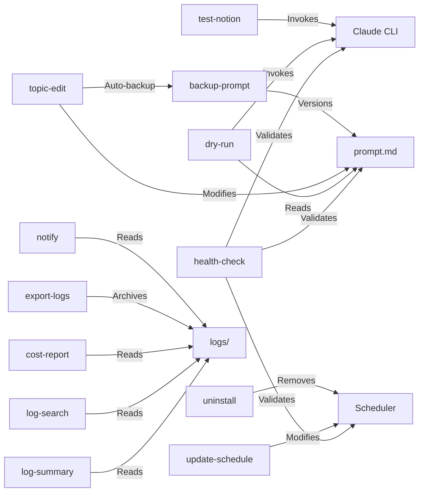

### 3.8 Manual CLI Trigger (macOS: `ai-news`)

Located at `~/.local/bin/ai-news` on macOS, this is a convenience script for on-demand execution. It calls `launchctl kickstart` to trigger the same launchd job, reusing the exact execution environment defined in the plist.

On Windows, the equivalent is `schtasks /run /tn AiNewsBriefing`, or simply `make run` on either platform.

### 3.9 Teams Notification Pipeline

After a successful briefing run, the system can optionally post a summary to Microsoft Teams via webhook. The Teams path is intentionally thin: it takes the generated card file, validates JSON, resolves webhook URL(s), and POSTs as-is.

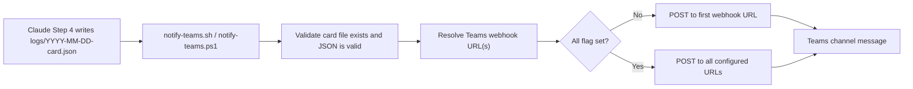

#### Runtime contract

1. Input: `logs/YYYY-MM-DD-card.json`.
2. Validation: file exists and is valid JSON.
3. Target resolution: parse `AI_BRIEFING_TEAMS_WEBHOOK` as semicolon-separated URL list.
4. Delivery:
   - default mode -> first URL only,
   - all mode (`--all` or `-All`) -> every URL in the list.
5. Exit behavior:
   - fail only if all target URLs fail,
   - warn if partial failures occur.

#### Files involved

| File | Language | Purpose |
|---|---|---|
| `prompt.md` | Markdown | Defines Step 4 card generation contract. |
| `scripts/notify-teams.sh` | Bash | Validates card JSON and POSTs via `curl`. |
| `scripts/notify-teams.ps1` | PowerShell | Same behavior on Windows via `Invoke-WebRequest`. |
| `scripts/build-teams-card.py` | Python 3 | **Legacy.** Old log-parsing card builder. No longer referenced by any script. Kept in repo for historical reference. |

#### Payload contract

The AI writes Adaptive Card JSON in Step 4 of `prompt.md`. This is the exact payload posted to Teams. No parser, no log extraction, no format conversion between generation and delivery.

Key constraints in the generation contract:

- valid JSON,
- payload size limit,
- Adaptive Card v1.4 envelope,
- required action button to Notion page URL.

#### Teams webhook configuration

`AI_BRIEFING_TEAMS_WEBHOOK` stores one or more Teams webhook URLs.

macOS / Linux:

```bash
export AI_BRIEFING_TEAMS_WEBHOOK="https://teams-webhook-1;https://teams-webhook-2"
```

Windows:

```powershell
[Environment]::SetEnvironmentVariable("AI_BRIEFING_TEAMS_WEBHOOK", "https://teams-webhook-1;https://teams-webhook-2", "User")
```

Direct script tests:

```bash
bash scripts/notify-teams.sh --all --card-file logs/2026-03-24-card.json
```

```powershell
.\scripts\notify-teams.ps1 -All -CardFile .\logs\2026-03-24-card.json
```

### 3.10 Slack Notification Pipeline

Slack delivery reuses the same source card file from Step 4, then converts it to Block Kit before POST. This keeps generation centralized while still producing Slack-native rendering.

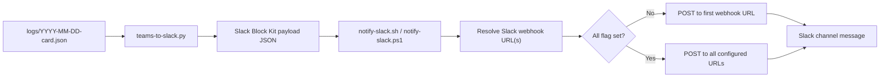

#### Runtime contract

1. Input: same `logs/YYYY-MM-DD-card.json` generated for Teams.
2. Conversion: `teams-to-slack.py` transforms Adaptive Card structure to Block Kit.
3. Validation: notify script confirms converted payload is valid JSON.
4. Target resolution: parse `AI_BRIEFING_SLACK_WEBHOOK` as semicolon-separated URL list.
5. Delivery and exit semantics match Teams notifier behavior.

#### Files involved

| File | Language | Purpose |
|---|---|---|
| `scripts/teams-to-slack.py` | Python 3 | Converts Teams Adaptive Card JSON to Slack Block Kit JSON. Pure stdlib, no external deps. |
| `scripts/notify-slack.sh` | Bash | macOS/Linux entry point. Calls converter, validates result, POSTs via `curl`. |
| `scripts/notify-slack.ps1` | PowerShell | Windows entry point. Same logic using `Invoke-WebRequest`. |

#### Teams-to-Slack mapping details

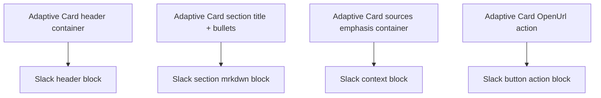

Slack webhook configuration:

```bash
export AI_BRIEFING_SLACK_WEBHOOK="https://slack-webhook-1;https://slack-webhook-2"
```

```powershell
[Environment]::SetEnvironmentVariable("AI_BRIEFING_SLACK_WEBHOOK", "https://slack-webhook-1;https://slack-webhook-2", "User")
```

Direct script tests:

```bash
bash scripts/notify-slack.sh --all --card-file logs/2026-03-24-card.json
```

```powershell
.\scripts\notify-slack.ps1 -All -CardFile .\logs\2026-03-24-card.json
```

#### Visual output examples

Teams:

<p align="center">
  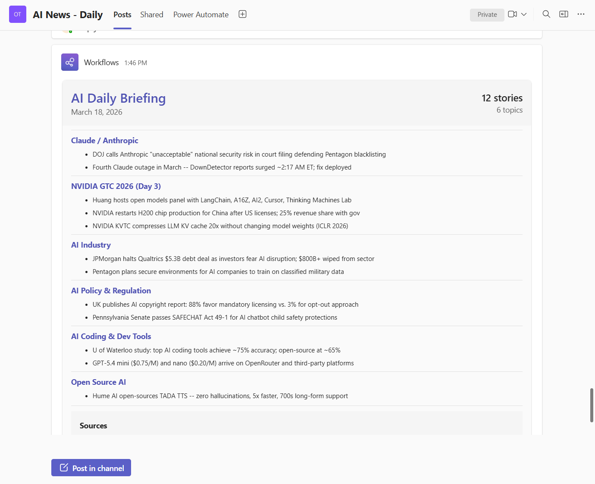
</p>

Slack:

<p align="center">
  
</p>

Deep-dive docs:

- [NOTIFY_TEAMS.md](NOTIFY_TEAMS.md)
- [NOTIFY_SLACK.md](NOTIFY_SLACK.md)

### 3.11 Custom Topic Briefing Pipeline

The custom brief is an on-demand deep research pipeline that investigates any user-defined topic using 5 parallel research agents. Unlike the daily briefing (which scans 9 fixed categories), the custom brief goes deep on a single topic from multiple angles.

#### Architecture Overview

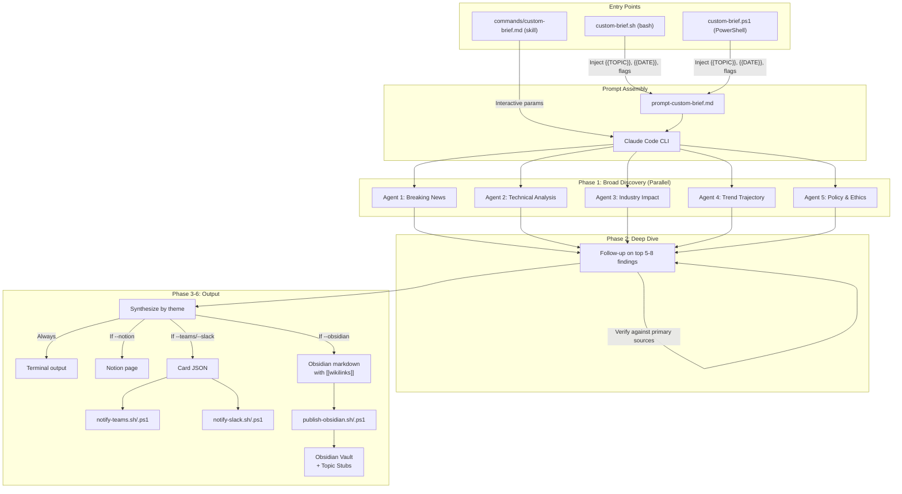

<p align="center">
  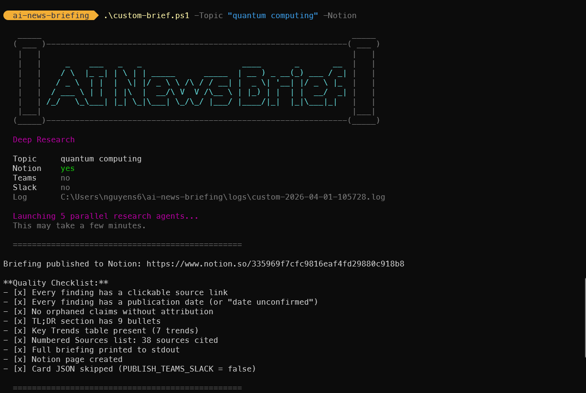
</p>

#### Research Agent Design

Each of the 5 agents receives a targeted search brief and returns findings with source URLs and publication dates. They run in parallel (launched as concurrent Agent tool calls) and cover orthogonal perspectives:

| Agent | Angle | Focus Areas |
|-------|-------|-------------|
| 1 | Breaking News | Product launches, announcements, releases |
| 2 | Technical Analysis | Benchmarks, evaluations, expert commentary |
| 3 | Industry Impact | Market moves, competitive dynamics, funding |
| 4 | Trend Trajectory | Milestones, evolution, future direction |
| 5 | Policy & Ethics | Regulation, legislation, safety concerns |

#### Files Involved

| File | Purpose |
|------|---------|
| `custom-brief.sh` | Bash CLI with `--topic`, `--notion`, `--teams`, `--slack`, `--obsidian` params + REPL mode |
| `custom-brief.ps1` | PowerShell CLI with equivalent `-Topic`, `-Notion`, `-Teams`, `-Slack`, `-Obsidian` params |
| `prompt-custom-brief.md` | Prompt template with `{{TOPIC}}`, `{{DATE}}`, `{{PUBLISH_*}}` placeholders |
| `commands/custom-brief.md` | Claude Code skill for interactive sessions |
| `logs/custom-TIMESTAMP.log` | Execution log |
| `logs/custom-TIMESTAMP-card.json` | Adaptive Card JSON (if Teams/Slack requested) |
| `logs/custom-TIMESTAMP-obsidian.md` | Obsidian markdown with wikilinks (if Obsidian requested) |

#### Prompt Template Variable Injection

The CLI scripts perform string replacement on `prompt-custom-brief.md` before passing it to Claude:

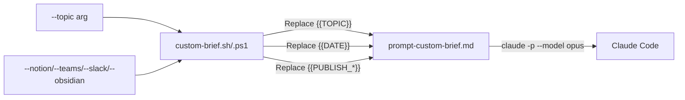

#### Relationship to Daily Briefing

The custom brief reuses the same infrastructure:

| Component | Daily Briefing | Custom Brief |
|-----------|---------------|--------------|
| Notion database | Same (data_source_id) | Same |
| Teams notification | `notify-teams.sh/.ps1` | Same scripts |
| Slack notification | `notify-slack.sh/.ps1` + `teams-to-slack.py` | Same scripts |
| Obsidian publishing | `publish-obsidian.sh/.ps1` | Same scripts |
| Card template | Adaptive Card v1.4 | Same structure, different header |
| Page title | `YYYY-MM-DD - AI Daily Briefing` | `YYYY-MM-DD - Custom Brief: [Topic]` |
| Obsidian file | `logs/YYYY-MM-DD-obsidian.md` | `logs/custom-TIMESTAMP-obsidian.md` |
| Log naming | `logs/YYYY-MM-DD.log` | `logs/custom-YYYY-MM-DD-HHMMSS.log` |
| Deduplication | Yes (covered-stories.txt) | No (standalone) |

### 3.12 Obsidian Publishing Pipeline

Obsidian is a local-first knowledge base that stores notes as plain markdown files in a "vault" directory. Unlike Notion (which requires an API), Obsidian integration works by writing `.md` files directly to the file system. Obsidian's graph view automatically visualizes connections between notes via `[[wikilinks]]`.

#### Architecture Overview

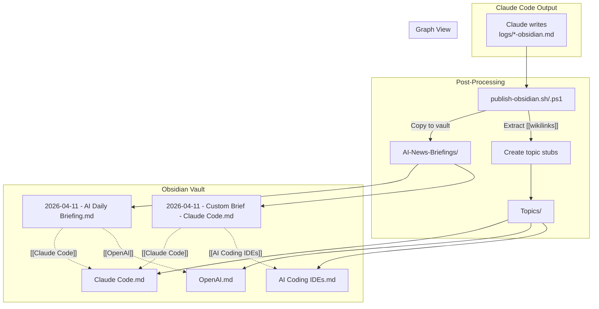

#### Wikilink Strategy

The Obsidian markdown uses `[[wikilinks]]` extensively to create graph connections:

| Element | Wikilink Placement | Graph Effect |
|---------|-------------------|--------------|
| Section headings | `## [[Claude Code]] / [[Anthropic]]` | Briefing → topic edges |
| Related topics line | `Related topics: [[AI Coding]], [[LLMs]], ...` | Cross-topic edges |
| Inline mentions | `...announced by [[OpenAI]] today...` | Entity edges |
| Topic stub pages | `Topics/Claude Code.md` with backlinks | Hub nodes in graph |

#### Topic Stub Pages

The publish script extracts all `[[wikilinks]]` from the briefing markdown and creates stub pages in `Topics/` for any that don't already exist. Each stub has YAML frontmatter:

```yaml
---
type: topic
created: 2026-04-11
---

# Claude Code

> Auto-generated topic page. Briefings mentioning this topic will appear as backlinks.
```

This creates a growing knowledge graph where topics accumulate backlinks from each briefing that mentions them.

#### Files Involved

| File | Purpose |
|------|---------|
| `scripts/publish-obsidian.sh` | Bash: copies markdown to vault, creates topic stubs |
| `scripts/publish-obsidian.ps1` | PowerShell: equivalent Windows implementation |
| `scripts/test-obsidian.sh` | Bash: vault connectivity test (directory, permissions, config) |
| `scripts/test-obsidian.ps1` | PowerShell: equivalent Windows implementation |

#### Environment Variables

| Variable | Required | Description |
|----------|----------|-------------|
| `AI_BRIEFING_OBSIDIAN_VAULT` | Yes | Absolute path to the Obsidian vault root directory |

#### Error Handling

| Condition | Behavior |
|-----------|----------|
| Vault env var not set | Skip publishing silently (opt-in feature) |
| Vault directory missing | Error message, skip publishing, log warning |
| Vault not writable | Error message, skip publishing, log warning |
| Obsidian markdown not generated | Warning message, skip publishing |
| Topic stub already exists | Skip creation, count as existing |
| Publish script missing | Warning message, skip publishing |

### 3.13 Test Suite

201 non-blocking tests across bash and PowerShell verify the entire system without calling external services. Tests cover syntax, structure, argument handling, template substitution, card JSON validation, notification error paths, Obsidian publishing, and cross-platform portability.

#### Test Architecture

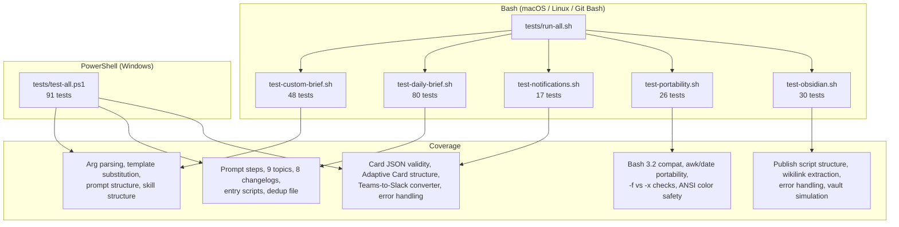

<p align="center">
  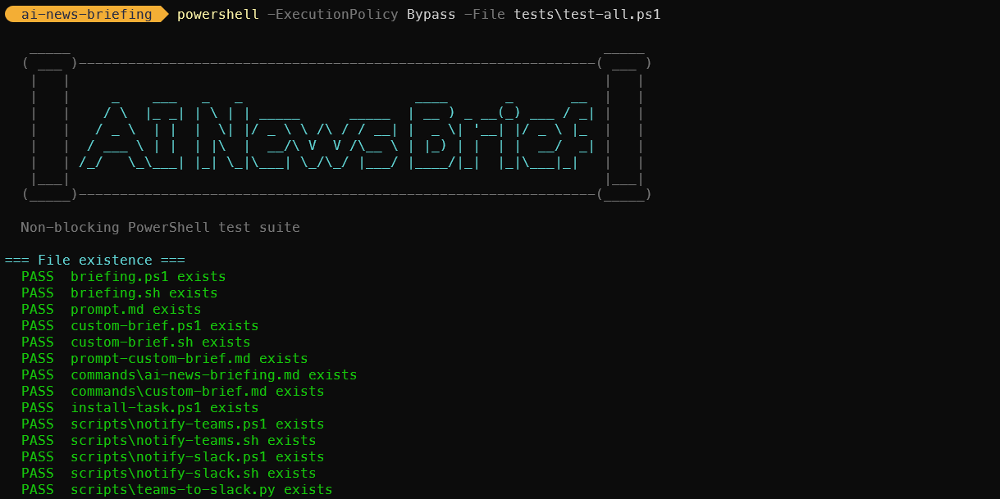
</p>

#### Design Decisions

- **Non-blocking.** No test calls Claude, Notion, Teams, Slack, or any external service. Tests validate contracts, not runtime behavior.
- **No test framework.** Pure bash/PowerShell with simple `pass()`/`fail()` helpers. Zero dependencies.
- **Cross-platform parity.** Bash tests cover macOS/Linux/Git Bash; PowerShell covers Windows. Both verify the same codebase from different angles.
- **Portability verification.** Dedicated suite checks bash 3.2 compatibility (macOS), BSD awk, and ANSI color auto-disable.

#### Files

| File | Tests | Focus |
|---|---|---|
| `tests/run-all.sh` | -- | Runner: executes all `test-*.sh` suites |
| `tests/test-custom-brief.sh` | 48 | Custom brief: args, template, prompt, skill, Obsidian |
| `tests/test-daily-brief.sh` | 80 | Daily brief: prompt, topics, changelogs, scripts, Obsidian |
| `tests/test-notifications.sh` | 17 | Notifications: card JSON, converter, error paths |
| `tests/test-obsidian.sh` | 30 | Obsidian: publish script, wikilinks, vault simulation |
| `tests/test-portability.sh` | 26 | Cross-platform: bash version, awk, date, colors |
| `tests/test-all.ps1` | 91 | PowerShell: syntax, prompts, cards, converter, docs |

Full documentation: [TESTS.md](TESTS.md)

---

## 4. Data Flow

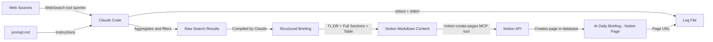

**Data transformation stages:**

| Stage | Input | Output | Actor |
|---|---|---|---|
| Search | Topic definitions from prompt.md | Raw web search results | Claude Code via WebSearch |
| Filter | Raw results from multiple queries | Relevant news from past 24-48 hours | Claude Code (LLM reasoning) |
| Compile | Filtered news items | Two-tier Markdown briefing | Claude Code (LLM generation) |
| Format | Raw Markdown | Notion-flavored Markdown with tables | Claude Code (following prompt rules) |
| Publish | Formatted content + metadata | Notion database page | Claude Code via Notion MCP tool |
| Log | Page URL + status | Date-stamped log entry | Entry point script |

---

## 5. Search Strategy

The prompt defines 9 parallel topic searches. Each topic maps to a domain of AI news, and Claude executes multiple search queries per topic to ensure comprehensive coverage.

### Topic Search Architecture

```mermaid
graph TD
    S[Claude Code Search Phase] --> T1[1. Claude Code / Anthropic]
    S --> T2[2. OpenAI / Codex / ChatGPT]
    S --> T3[3. AI Coding IDEs]
    S --> T4[4. Agentic AI Ecosystem]
    S --> T5[5. AI Industry]
    S --> T6[6. Open Source AI]
    S --> T7[7. AI Startups and Funding]
    S --> T8[8. AI Policy and Regulation]
    S --> T9[9. Dev Tools and Frameworks]

    T1 --> Q1A["'Claude Code news today YYYY-MM-DD'"]
    T1 --> Q1B["'Anthropic announcement this week'"]

    T2 --> Q2A["'OpenAI Codex latest update'"]
    T2 --> Q2B["'ChatGPT new features March 2026'"]

    T3 --> Q3A["'Cursor Windsurf Copilot news today'"]
    T3 --> Q3B["'AI coding IDE update this week'"]

    T4 --> Q4A["'AI agent frameworks MCP news'"]
    T4 --> Q4B["'LangChain CrewAI AutoGen update'"]

    T5 --> Q5A["'AI model release benchmark today'"]
    T5 --> Q5B["'Major AI company announcement'"]

    T6 --> Q6A["'Llama Mistral DeepSeek release'"]
    T6 --> Q6B["'Open source AI model news'"]

    T7 --> Q7A["'AI startup funding round today'"]
    T7 --> Q7B["'AI acquisition announcement'"]

    T8 --> Q8A["'AI regulation policy news'"]
    T8 --> Q8B["'EU AI Act update March 2026'"]

    T9 --> Q9A["'Vercel Next.js AI tools update'"]
    T9 --> Q9B["'Developer tooling AI news today'"]
```

### Topic Coverage Map

| # | Topic | Key Entities Monitored | Typical Queries per Run |
|---|---|---|---|
| 1 | Claude Code / Anthropic | Anthropic, Claude, Claude Code | 2-3 |
| 2 | OpenAI / Codex / ChatGPT | OpenAI, GPT models, Codex, ChatGPT | 2-3 |
| 3 | AI Coding IDEs | Cursor, Windsurf, Copilot, Xcode AI, JetBrains AI, Antigravity | 2-3 |
| 4 | Agentic AI Ecosystem | LangChain, CrewAI, AutoGen, MCP | 2-3 |
| 5 | AI Industry | Major labs, benchmarks, model releases | 2-3 |
| 6 | Open Source AI | Llama, Mistral, DeepSeek, Hugging Face | 2-3 |
| 7 | AI Startups & Funding | Funding rounds, acquisitions, launches | 2-3 |
| 8 | AI Policy & Regulation | EU AI Act, US policy, AI safety | 2-3 |
| 9 | Dev Tools & Frameworks | Vercel, Next.js, React Native, TypeScript | 2-3 |

Claude has discretion over the exact number and phrasing of queries. The prompt provides templates (e.g., `"[topic] news today [current date]"`) but does not rigidly prescribe every query. This allows the model to adapt its search strategy based on what it finds.

---

## 6. Output Format

The briefing follows a two-tier structure designed for different reading depths: a quick scan (Tier 1) and a deep read (Tier 2).

### Briefing Structure

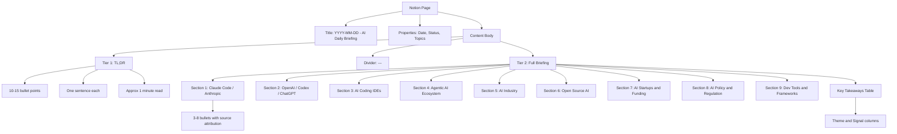

### Notion Formatting Conventions

| Markdown Element | Notion Rendering | Usage |
|---|---|---|
| `##` | Section heading | One per topic in Tier 2 |
| `-` | Bullet point | All news items |
| `**bold**` | Bold text | Company names, emphasis |
| `---` | Horizontal divider | Separates TL;DR from Full Briefing |
| `>` | Block quote | Notable quotes from sources |
| `<table>` | Notion native table | Key Takeaways summary |

### Notion Page Properties

Each page is created with three properties:

- **Date**: The title field, formatted as `"YYYY-MM-DD - AI Daily Briefing"`
- **Status**: Always set to `"Complete"`
- **Topics**: Always set to `9` (the number of topic sections)

The parent database is identified by a hardcoded `data_source_id` in the prompt.

---

## 7. Scheduling Architecture

### Cross-Platform Scheduling Comparison

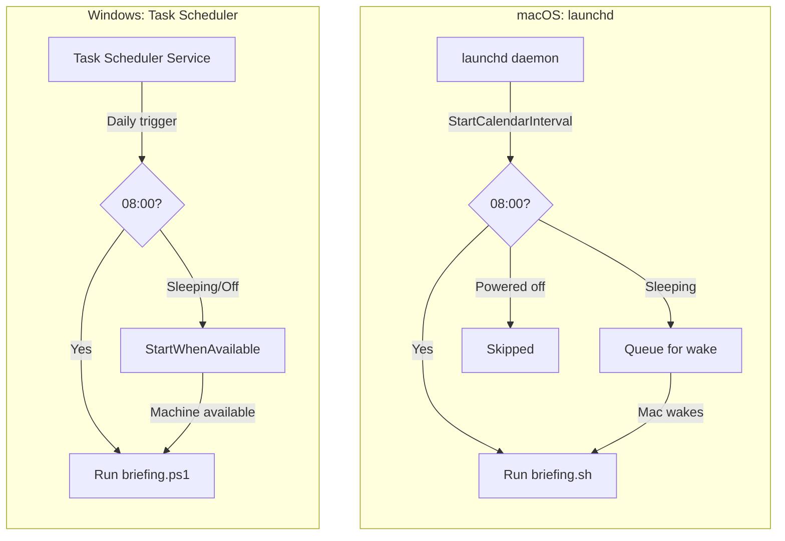

### Machine State Behavior

| Machine State at 08:00 | macOS (launchd) | Windows (Task Scheduler) |
|---|---|---|
| Awake | Job fires immediately | Task fires immediately |
| Sleeping | Fires on next wake | Fires on next wake (`StartWhenAvailable`) |
| Powered off | Skipped entirely | Fires on next login (`StartWhenAvailable`) |
| Job already running | Trigger ignored (single instance) | Governed by `ExecutionTimeLimit` |

**Key difference:** Windows `StartWhenAvailable` recovers from both sleep and cold boot. macOS launchd only recovers from sleep -- a cold boot after a missed interval does not retroactively fire the job.

### Schedule Customization

**macOS:** Edit `StartCalendarInterval` in the plist. For weekday-only, use an array of dicts with `Weekday` keys.

**Windows:** Re-run `install-task.ps1 -Hour <H> -Minute <M>`. The script is idempotent and replaces any existing task.

---

## 8. Error Handling

The system has multiple layers of error handling, from the script level down to the AI execution level. Both platform scripts implement the same error handling strategy.

### Error Path Diagram

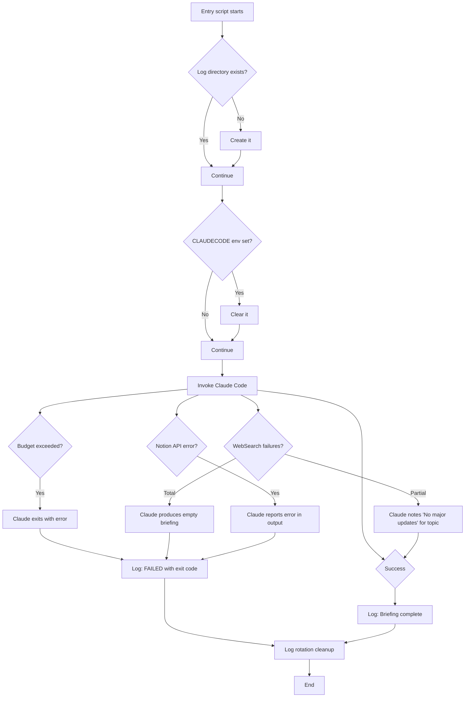

### Error Categories

| Error Type | Detection | Recovery | Impact |
|---|---|---|---|
| Nested Claude session | `CLAUDECODE` env var set | Cleared by entry script | Prevented entirely |
| Budget exceeded ($2.00) | Claude exits with non-zero code | Logged as failure | No briefing for that run |
| WebSearch failure (single topic) | Claude observes empty/error results | Notes "No major updates today" | Partial briefing |
| WebSearch failure (all topics) | Claude cannot gather any news | Empty briefing or failure | Failed run logged |
| Notion API error | MCP tool returns error | Claude reports in stdout | No page created |
| Claude binary not found | Script exits on error | Logged as failure | No briefing |
| Engine not found (fallback mode) | Engine binary missing from PATH | Try next engine in chain | Transparent to user |
| All engines exhausted | No installed engine found | Logged as failure | No briefing |
| Log directory permission error | Directory creation fails | Script exits immediately | No briefing, no log |

### Budget Safety

The `--max-budget-usd 2.00` flag is the primary cost control mechanism. Claude Code tracks cumulative API costs during the run and terminates if the budget is exceeded. Based on observed runs, a typical briefing consumes well under this cap.

### Engine Fallback Chain

When `AI_BRIEFING_CLI` is not set, the entry scripts implement a fallback chain to find a working AI CLI engine:

1. Check if `claude` is on PATH → use Claude Code
2. Check if `codex` is on PATH → use Codex (OpenAI)
3. Check if `gemini` is on PATH → use Gemini (Google)
4. Check if `copilot` is on PATH → use Copilot (GitHub)
5. If none found → exit with error and log failure

When `AI_BRIEFING_CLI` is explicitly set, only that engine is tried. This is useful for CI environments or when you want deterministic engine selection.

Each engine is invoked with equivalent flags for headless mode, model selection, and budget caps. The `AI_BRIEFING_MODEL` env var overrides the default model regardless of which engine is selected.

---

## 9. File System Layout

```mermaid
graph TD
    A["project root/"] --> IDX[index.html]
    A --> W["wiki/"]
    W --> WS[style.css]
    W --> WJ[script.js]
    A --> MK[Makefile]
    A --> SC["scripts/"]
    SC --> SC1["health-check.sh/.ps1"]
    SC --> SC2["log-summary.sh/.ps1"]
    SC --> SC3["dry-run.sh/.ps1"]
    SC --> SC4["topic-edit.sh/.ps1"]
    SC --> SC5["notify-teams.sh/.ps1"]
    SC --> SC8["notify-slack.sh/.ps1"]
    SC --> SC10["publish-obsidian.sh/.ps1"]
    SC --> SC11["test-obsidian.sh/.ps1"]
    SC --> SC9["teams-to-slack.py"]
    SC --> SC6["build-teams-card.py (legacy)"]
    SC --> SC7["+ 8 more pairs"]
    A --> B[briefing.sh]
    A --> B2[briefing.ps1]
    A --> C[prompt.md]
    A --> D[com.ainews.briefing.plist]
    A --> D2[install-task.ps1]
    A --> E[.gitignore]
    A --> F[ARCHITECTURE.md]
    A --> F2[README.md]
    A --> G["logs/"]
    A --> BK["backups/"]

    G --> G1["YYYY-MM-DD.log"]
    G --> G4["YYYY-MM-DD-card.json"]
    G --> G5["YYYY-MM-DD-obsidian.md"]
    G --> G2["launchd-stdout.log (macOS)"]
    G --> G3["launchd-stderr.log (macOS)"]

    H["macOS: ~/Library/LaunchAgents/"] --> I["com.ainews.briefing.plist (copy)"]
    I -.->|References| B

    J["macOS: ~/.local/bin/"] --> K[ai-news]
    K -.->|Kickstarts| I

    L["Windows: Task Scheduler"] --> M[AiNewsBriefing task]
    M -.->|Runs| B2
```

### File Descriptions

| File | Platform | Purpose | Tracked in Git |
|---|---|---|---|
| `index.html` | Shared | Landing page / project wiki | Yes |
| `wiki/style.css` | Shared | Landing page styles | Yes |
| `wiki/script.js` | Shared | Landing page interactions | Yes |
| `Makefile` | Shared | Cross-platform task runner (auto-detects OS) | Yes |
| `briefing.sh` | macOS | Entry point script (bash) | Yes |
| `briefing.ps1` | Windows | Entry point script (PowerShell) | Yes |
| `prompt.md` | Shared | Complete AI instruction set | Yes |
| `com.ainews.briefing.plist` | macOS | launchd job definition | Yes |
| `install-task.ps1` | Windows | Task Scheduler installer | Yes |
| `.gitignore` | Shared | Excludes `logs/`, `*.log`, `.DS_Store` | Yes |
| `ARCHITECTURE.md` | Shared | This document | Yes |
| `README.md` | Shared | User-facing documentation | Yes |
| `scripts/notify-teams.sh` | macOS/Linux | Teams notification entry point (Bash) | Yes |
| `scripts/notify-teams.ps1` | Windows | Teams notification entry point (PowerShell) | Yes |
| `scripts/notify-slack.sh` | macOS/Linux | Slack notification entry point (Bash) | Yes |
| `scripts/notify-slack.ps1` | Windows | Slack notification entry point (PowerShell) | Yes |
| `scripts/publish-obsidian.sh` | macOS/Linux | Obsidian vault publisher (Bash) — copies markdown, creates topic stubs | Yes |
| `scripts/publish-obsidian.ps1` | Windows | Obsidian vault publisher (PowerShell) | Yes |
| `scripts/test-obsidian.sh` | macOS/Linux | Obsidian vault connectivity test (Bash) | Yes |
| `scripts/test-obsidian.ps1` | Windows | Obsidian vault connectivity test (PowerShell) | Yes |
| `scripts/teams-to-slack.py` | Shared | Converts Teams Adaptive Card JSON to Slack Block Kit JSON | Yes |
| `scripts/build-teams-card.py` | Shared | **Legacy.** Old log-parsing card builder. No longer referenced. | Yes |
| `scripts/*.sh` | macOS/Linux | Utility scripts (12 tools) | Yes |
| `scripts/*.ps1` | Windows | Utility scripts (12 tools) | Yes |
| `logs/*.log` | Shared | Daily run logs | No (gitignored) |
| `logs/*-card.json` | Shared | Adaptive Card JSON written by Claude Code (Step 4). POSTed to Teams as-is. | No (gitignored) |
| `logs/*-obsidian.md` | Shared | Obsidian-formatted markdown with `[[wikilinks]]` written by Claude Code (Step 5). Published to vault by `publish-obsidian.sh/.ps1`. | No (gitignored) |
| `backups/` | Shared | Timestamped prompt.md backups | No (gitignored) |
| `~/.local/bin/ai-news` | macOS | Manual trigger CLI script | No (outside repo) |

### Log File Lifecycle

1. **Created**: At the start of each run, the entry script creates (or appends to) `logs/YYYY-MM-DD.log`.
2. **Appended**: Claude Code's full stdout and stderr are appended. Multiple runs on the same day share one log file.
3. **Card JSON**: Claude Code writes `logs/YYYY-MM-DD-card.json` as Step 4 of the briefing skill. This file is the exact Adaptive Card payload sent to Teams and is also the source for the Slack Block Kit conversion.
4. **Obsidian markdown**: Claude Code writes `logs/YYYY-MM-DD-obsidian.md` as Step 5 of the briefing skill. This file contains the full briefing formatted with YAML frontmatter and `[[wikilinks]]` for Obsidian's graph view. The publish script copies it to the vault.
5. **Rotated**: At the end of each run, logs older than 30 days are deleted.
5. **launchd logs** (macOS only): `launchd-stdout.log` and `launchd-stderr.log` capture output from launchd itself. These are not rotated automatically.

---

## 10. Security Considerations

### Permission Model

The `--dangerously-skip-permissions` flag is required for headless (non-interactive) execution of Claude Code. In normal interactive mode, Claude Code prompts the user before executing tools that access external services. In headless mode, this prompt cannot be displayed, so the flag bypasses all permission checks.

**Implications:**

- Claude Code can execute any available tool (WebSearch, Notion MCP, file system operations) without user confirmation.
- This is acceptable in this context because the prompt is fully controlled (not user-supplied) and the tool set is limited to read-only web search and Notion page creation.
- The script should never be modified to accept external or user-supplied prompts without re-evaluating this flag.

### Budget Caps

The `--max-budget-usd 2.00` flag provides a hard financial ceiling per run. This protects against:

- Infinite loops in search or compilation.
- Unexpectedly expensive model calls.
- Prompt injection via malicious web content that attempts to trigger expensive operations.

At a daily budget of $2.00, the maximum monthly cost is approximately $60 (assuming 30 runs).

### Log File Access

Log files contain timestamps, Claude Code's full output (including briefing content and Notion page URLs), and error messages that may reveal system paths. The `logs/` directory is gitignored to prevent accidental publication.

### Notion API Credentials

The Notion MCP tool authenticates via credentials managed by Claude Code's MCP configuration (not stored in this repository). The `data_source_id` in `prompt.md` identifies the target database but is not itself a secret -- it requires authenticated API access to use.

### Environment Variables

No secrets are stored in any tracked file. Claude Code's API key and Notion integration token are managed externally by the Claude Code and MCP runtime. The `AI_BRIEFING_OBSIDIAN_VAULT` variable contains only a local file path and poses no credential risk. The macOS plist explicitly sets `PATH` and `HOME` for deterministic execution; the Windows task inherits the user's environment.

---

## 11. Teams, Slack, and Obsidian Pipelines

See [Section 3.9](#39-teams-notification-pipeline), [Section 3.10](#310-slack-notification-pipeline), and [Section 3.12](#312-obsidian-publishing-pipeline) for full architectural details. See also [NOTIFY_TEAMS.md](NOTIFY_TEAMS.md), [NOTIFY_SLACK.md](NOTIFY_SLACK.md), and `E2E_FLOW.md` for end-to-end walkthroughs and failure modes.

---

## 12. Future Enhancements / Extension Points

### Adding or Modifying Topics

Edit `prompt.md`, Section "Topics to Search". Update the `Topics` property value if the count changes. No changes to entry scripts or scheduler configs are required.

### Changing the AI Model

Set the `AI_BRIEFING_MODEL` environment variable, or change `--model sonnet` in the entry script for your platform. Consider adjusting `--max-budget-usd` accordingly. The model override applies to whichever engine is selected.

### Multi-Engine Support

**Implemented.** Four AI CLI engines are supported: Claude Code, Codex (OpenAI), Gemini (Google), and Copilot (GitHub). The system uses an engine registry pattern with automatic fallback. Set `AI_BRIEFING_CLI` to force a specific engine, or let the fallback chain select the first available. See [Section 8](#8-error-handling) for fallback chain details.

### Custom Topic Research

**Implemented.** See [Section 3.11](#311-custom-topic-briefing-pipeline) and [CUSTOM_BRIEF.md](CUSTOM_BRIEF.md). Run `make custom-brief T="topic" NOTION=1 TEAMS=1` or `./custom-brief.sh --topic "topic" --notion --teams`.

### Adding Notification Channels

| Channel | Status | Implementation Approach |
|---|---|---|
| Microsoft Teams | **Implemented** | Claude Code writes Adaptive Card JSON (Step 4), `notify-teams.sh/.ps1` validates and POSTs to Power Automate webhook. See [Section 3.9](#39-teams-notification-pipeline). |
| Slack | **Implemented** | `notify-slack.sh/.ps1` converts the Teams card JSON to Slack Block Kit using `teams-to-slack.py` and POSTs to Slack webhook. See [Section 3.10](#310-slack-notification-pipeline). |
| Obsidian | **Implemented** | Claude Code writes graph-ready markdown (Step 5) with `[[wikilinks]]` and YAML frontmatter. `publish-obsidian.sh/.ps1` copies to vault and creates topic stub pages. See [Section 3.12](#312-obsidian-publishing-pipeline). |
| macOS notification | Planned | `osascript -e 'display notification ...'` in `briefing.sh` |
| Windows toast | Planned | `New-BurntToastNotification` or `[Windows.UI.Notifications]` in `briefing.ps1` |
| Email | Planned | `mail`/`sendmail` (macOS) or `Send-MailMessage` (Windows) in the entry script |

### Adding Linux Support

The system could be extended to Linux by:

1. Reusing `briefing.sh` as-is (bash is available on Linux).
2. Creating a systemd timer + service unit (analogous to the launchd plist) or a cron entry.
3. No changes to `prompt.md` or the AI engine invocation.

### Adding a Web Dashboard

The log files follow a predictable naming convention (`YYYY-MM-DD.log`) and contain structured output. A lightweight web server could serve a dashboard showing run history, Notion page links, and cost tracking.

---

## Appendix: Quick Reference

### Commands by Platform

| Action | Make (cross-platform) | macOS (native) | Windows (native) |
|---|---|---|---|
| Run manually | `make run` | `ai-news` | `schtasks /run /tn AiNewsBriefing` |
| Run in background | `make run-bg` | `nohup bash briefing.sh &` | `Start-Process powershell briefing.ps1` |
| Custom brief | `make custom-brief T="topic"` | `bash custom-brief.sh --topic "topic"` | `.\custom-brief.ps1 -Topic "topic"` |
| Custom brief + publish | `make custom-brief T="topic" NOTION=1 TEAMS=1 OBSIDIAN=1` | `bash custom-brief.sh -t "topic" -n --teams -o` | `.\custom-brief.ps1 -Topic "topic" -Notion -Teams -Obsidian` |
| Tail live log | `make tail` | `tail -f logs/YYYY-MM-DD.log` | `Get-Content "logs\YYYY-MM-DD.log" -Wait` |
| Check job status | `make status` | `launchctl list \| grep ainews` | `schtasks /query /tn AiNewsBriefing` |
| Install scheduler | `make install` | `launchctl load ~/Library/LaunchAgents/...` | `.\install-task.ps1` |
| Remove scheduler | `make uninstall` | `launchctl unload ~/Library/LaunchAgents/...` | `schtasks /delete /tn AiNewsBriefing /f` |
| View recent logs | `make logs` | `ls -la logs/` | `Get-ChildItem logs\` |
| Validate project | `make validate` | -- | -- |
| Show config | `make info` | -- | -- |
| Health check | -- | `bash scripts/health-check.sh` | `.\scripts\health-check.ps1` |
| Dry run (no Notion) | -- | `bash scripts/dry-run.sh` | `.\scripts\dry-run.ps1` |
| Search logs | -- | `bash scripts/log-search.sh --search "term"` | `.\scripts\log-search.ps1 -Pattern "term"` |
| Cost report | -- | `bash scripts/cost-report.sh` | `.\scripts\cost-report.ps1` |
| Backup prompt | -- | `bash scripts/backup-prompt.sh --backup` | `.\scripts\backup-prompt.ps1 -Action backup` |
| Edit topics | -- | `bash scripts/topic-edit.sh --list` | `.\scripts\topic-edit.ps1 -Action list` |
| Test Teams notify | -- | `bash scripts/notify-teams.sh` | `.\scripts\notify-teams.ps1` |
| Test Slack notify | -- | `bash scripts/notify-slack.sh` | `.\scripts\notify-slack.ps1` |
| Set Teams webhook | -- | `export AI_BRIEFING_TEAMS_WEBHOOK="..."` | `[Environment]::SetEnvironmentVariable("AI_BRIEFING_TEAMS_WEBHOOK", "...", "User")` |
| Set Slack webhook | -- | `export AI_BRIEFING_SLACK_WEBHOOK="..."` | `[Environment]::SetEnvironmentVariable("AI_BRIEFING_SLACK_WEBHOOK", "...", "User")` |

### Environment Requirements

- macOS or Windows 10/11
- Claude Code CLI installed at `~/.local/bin/claude`
- Notion MCP integration configured in Claude Code
- WebSearch tool available in Claude Code
- GNU Make (optional, for Makefile targets -- pre-installed on macOS, `winget install GnuWin32.Make` on Windows)
- Active internet connection at time of execution

---

## Author

**Son Nguyen** &mdash; [github.com/hoangsonww](https://github.com/hoangsonww) &middot; [sonnguyenhoang.com](https://sonnguyenhoang.com)
