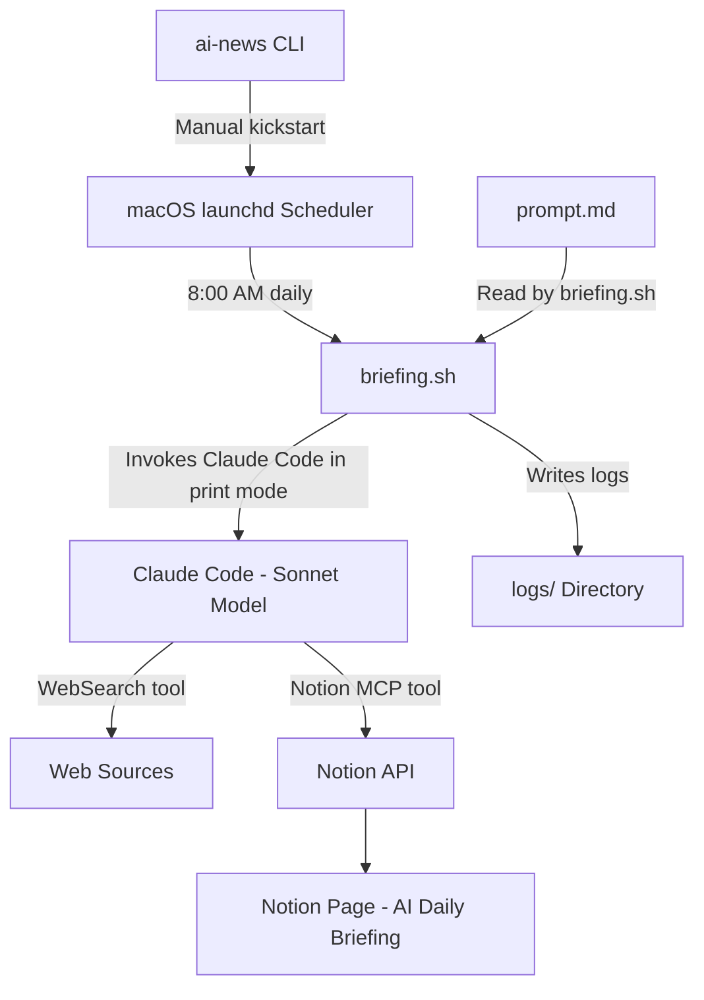
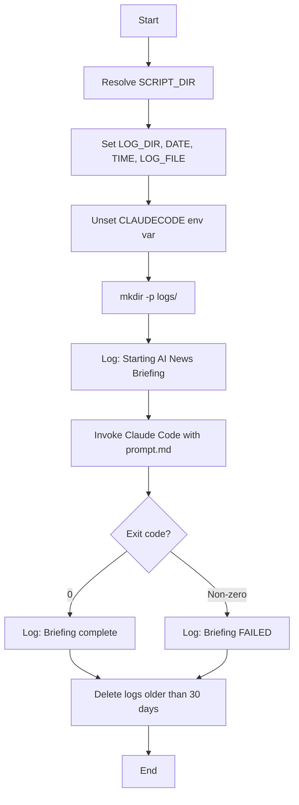
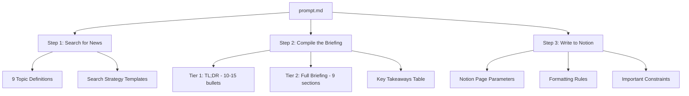
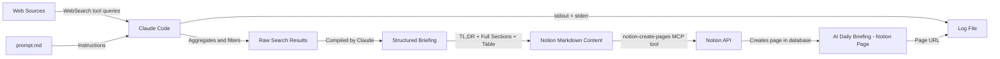
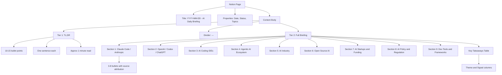
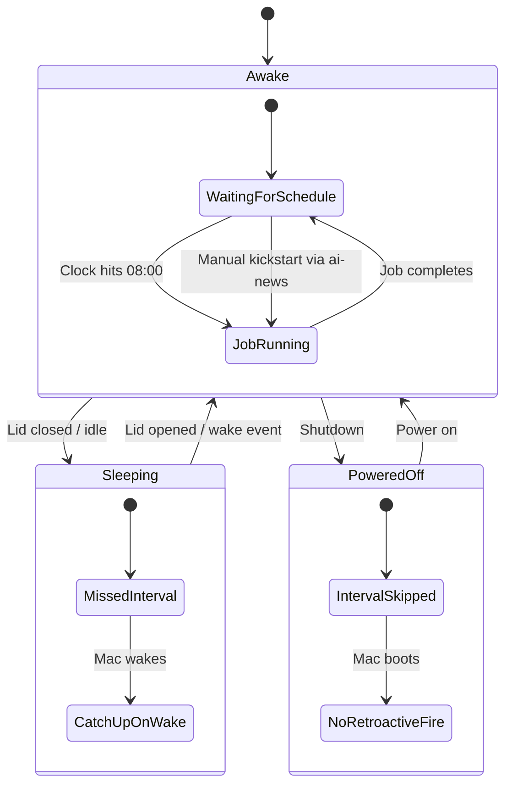
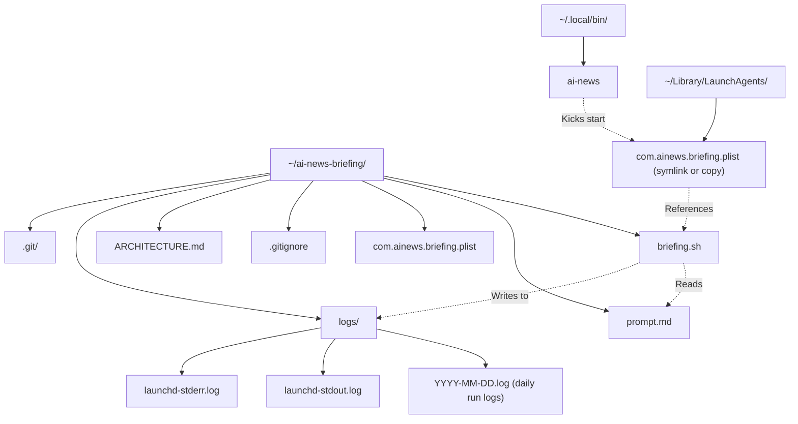

# Architecture: AI News Briefing System

This document describes the architecture, data flow, and design decisions behind the AI News Briefing system -- an automated daily AI news aggregation pipeline that uses Claude Code to search the web, compile a structured briefing, and publish it to Notion.

---

## Table of Contents

1. [System Architecture Overview](#1-system-architecture-overview)
2. [Execution Flow](#2-execution-flow)
3. [Component Details](#3-component-details)
4. [Data Flow](#4-data-flow)
5. [Search Strategy](#5-search-strategy)
6. [Output Format](#6-output-format)
7. [Scheduling Architecture](#7-scheduling-architecture)
8. [Error Handling](#8-error-handling)
9. [File System Layout](#9-file-system-layout)
10. [Security Considerations](#10-security-considerations)
11. [Future Enhancements / Extension Points](#11-future-enhancements--extension-points)

---

## 1. System Architecture Overview

The system is composed of four primary components: a macOS scheduler, a shell entry point, the Claude Code AI engine, and the Notion API as the output destination. A manual CLI trigger provides an alternative entry point.



**Key design principles:**

- **Headless execution.** The entire pipeline runs without user interaction via `claude -p` (print mode).
- **Single responsibility.** Each file has one job: scheduling, orchestration, prompt definition, or manual triggering.
- **Cost containment.** A hard budget cap of $2.00 per run prevents runaway API costs.
- **Observability.** All output (stdout and stderr) is captured in date-stamped log files.

---

## 2. Execution Flow

The system supports two trigger paths that converge on the same execution pipeline.

### Full Lifecycle Sequence

```mermaid
sequenceDiagram
    participant L as launchd
    participant AI as ai-news CLI
    participant B as briefing.sh
    participant C as Claude Code
    participant W as WebSearch Tool
    participant N as Notion MCP Tool
    participant NP as Notion Page

    Note over L: Automatic trigger at 08:00
    L->>B: Execute /bin/bash briefing.sh

    Note over AI: Manual trigger
    AI->>L: launchctl kickstart gui/UID/com.ainews.briefing
    L->>B: Execute /bin/bash briefing.sh

    B->>B: Set up environment, create log dir
    B->>B: Unset CLAUDECODE env var
    B->>B: Read prompt.md into memory
    B->>C: claude -p --model sonnet --max-budget-usd 2.00

    loop For each of 9 topics
        C->>W: WebSearch query for topic
        W-->>C: Search results
    end

    C->>C: Compile TL;DR tier
    C->>C: Compile Full Briefing tier
    C->>C: Build Key Takeaways table

    C->>N: notion-create-pages with parent, properties, content
    N->>NP: Create page in AI Daily Briefing database
    N-->>C: Page URL returned

    C-->>B: Output with page URL
    B->>B: Log success or failure
    B->>B: Clean up logs older than 30 days
```

### Timing

Based on observed log data, a typical run takes approximately 3-5 minutes from start to completion. This covers the full cycle of web searches across 9 topics, content compilation, and Notion page creation.

---

## 3. Component Details

### 3.1 launchd Scheduler (`com.ainews.briefing.plist`)

The plist file is a macOS LaunchAgent that registers the briefing job with the user-level `launchd` daemon.

**Key configuration:**

| Property | Value | Purpose |
|---|---|---|
| `Label` | `com.ainews.briefing` | Unique identifier for the job |
| `ProgramArguments` | `/bin/bash`, `briefing.sh` | Shell and script to execute |
| `StartCalendarInterval` | Hour: 8, Minute: 0 | Trigger at 08:00 daily |
| `StandardOutPath` | `logs/launchd-stdout.log` | Capture stdout from launchd itself |
| `StandardErrorPath` | `logs/launchd-stderr.log` | Capture stderr from launchd itself |
| `EnvironmentVariables` | `PATH`, `HOME` | Ensures Claude and tools are discoverable |

**How `StartCalendarInterval` works:**

- It functions like a cron entry: the job fires when the system clock matches the specified hour and minute.
- If the Mac is asleep at 08:00, launchd fires the job as soon as the machine wakes up (it catches up on missed intervals).
- If the Mac is powered off at 08:00, the job is skipped entirely for that day; launchd does not retroactively execute missed jobs after a cold boot.
- Only one instance runs at a time. If a prior run is still executing, the scheduled trigger is ignored.

**Installation:**

The plist must be placed in (or symlinked from) `~/Library/LaunchAgents/` and loaded with:

```bash
launchctl load ~/Library/LaunchAgents/com.ainews.briefing.plist
```

### 3.2 Entry Point (`briefing.sh`)

This is the orchestration script. It is deliberately minimal -- its only job is to set up the environment and hand off to Claude Code.



**Design decisions:**

- **`set -e`**: The script exits immediately on any command failure, preventing partial or corrupted runs.
- **`unset CLAUDECODE`**: This is critical. If the script is invoked from within a Claude Code session (e.g., during development), the nested session detection would block execution. Unsetting this variable bypasses that guard.
- **Absolute path to Claude**: The `CLAUDE` variable points to `/Users/davidnguyen/.local/bin/claude` rather than relying on `$PATH`, ensuring the correct binary is always used regardless of the shell environment.
- **Log rotation**: The `find` command at the end purges log files older than 30 days, preventing unbounded disk usage. The `|| true` ensures this cleanup never causes a script failure.

### 3.3 AI Prompt (`prompt.md`)

The prompt is a structured Markdown document that serves as the complete instruction set for Claude Code. It follows a three-step sequential pattern.



**How the prompt guides Claude:**

1. **Topic enumeration.** The 9 topics are explicitly listed with examples of what to search for, removing ambiguity about scope.
2. **Search strategy.** Template queries like `"[topic] news today [current date]"` guide Claude toward recent content rather than evergreen articles.
3. **Two-tier output format.** The TL;DR tier provides a scannable summary; the full briefing tier provides depth. This separation is defined in the prompt, not in code.
4. **Exact Notion API parameters.** The `parent` database ID, property schema, and formatting rules are hardcoded in the prompt so Claude produces the correct API call every time.
5. **Guardrails.** Instructions like "Focus on NEWS from the past 24-48 hours only" and "If a topic has no significant news today, say 'No major updates today'" prevent hallucination and filler content.

### 3.4 Manual CLI Trigger (`ai-news`)

Located at `~/.local/bin/ai-news`, this is a convenience script for on-demand execution.

**How it works:**

1. Prints a status message to the terminal.
2. Calls `launchctl kickstart` to trigger the same launchd job that runs automatically at 08:00.
3. Prints instructions for tailing the live log.

**Why `launchctl kickstart` instead of running `briefing.sh` directly:**

- It reuses the exact same execution environment (PATH, HOME) defined in the plist.
- It respects launchd's single-instance guarantee -- if a run is already in progress, the kickstart is a no-op.
- The job appears in `launchctl list` output, making it observable through standard macOS tooling.

---

## 4. Data Flow



**Data transformation stages:**

| Stage | Input | Output | Actor |
|---|---|---|---|
| Search | Topic definitions from prompt.md | Raw web search results | Claude Code via WebSearch |
| Filter | Raw results from multiple queries | Relevant news from past 24-48 hours | Claude Code (LLM reasoning) |
| Compile | Filtered news items | Two-tier Markdown briefing | Claude Code (LLM generation) |
| Format | Raw Markdown | Notion-flavored Markdown with tables | Claude Code (following prompt rules) |
| Publish | Formatted content + metadata | Notion database page | Claude Code via Notion MCP tool |
| Log | Page URL + status | Date-stamped log entry | briefing.sh |

---

## 5. Search Strategy

The prompt defines 9 parallel topic searches. Each topic maps to a domain of AI news, and Claude executes multiple search queries per topic to ensure comprehensive coverage.

### Topic Search Architecture

```mermaid
graph TD
    S[Claude Code Search Phase] --> T1[1. Claude Code / Anthropic]
    S --> T2[2. OpenAI / Codex / ChatGPT]
    S --> T3[3. AI Coding IDEs]
    S --> T4[4. Agentic AI Ecosystem]
    S --> T5[5. AI Industry]
    S --> T6[6. Open Source AI]
    S --> T7[7. AI Startups and Funding]
    S --> T8[8. AI Policy and Regulation]
    S --> T9[9. Dev Tools and Frameworks]

    T1 --> Q1A["'Claude Code news today YYYY-MM-DD'"]
    T1 --> Q1B["'Anthropic announcement this week'"]

    T2 --> Q2A["'OpenAI Codex latest update'"]
    T2 --> Q2B["'ChatGPT new features March 2026'"]

    T3 --> Q3A["'Cursor Windsurf Copilot news today'"]
    T3 --> Q3B["'AI coding IDE update this week'"]

    T4 --> Q4A["'AI agent frameworks MCP news'"]
    T4 --> Q4B["'LangChain CrewAI AutoGen update'"]

    T5 --> Q5A["'AI model release benchmark today'"]
    T5 --> Q5B["'Major AI company announcement'"]

    T6 --> Q6A["'Llama Mistral DeepSeek release'"]
    T6 --> Q6B["'Open source AI model news'"]

    T7 --> Q7A["'AI startup funding round today'"]
    T7 --> Q7B["'AI acquisition announcement'"]

    T8 --> Q8A["'AI regulation policy news'"]
    T8 --> Q8B["'EU AI Act update March 2026'"]

    T9 --> Q9A["'Vercel Next.js AI tools update'"]
    T9 --> Q9B["'Developer tooling AI news today'"]
```



### Topic Coverage Map

| # | Topic | Key Entities Monitored | Typical Queries per Run |
|---|---|---|---|
| 1 | Claude Code / Anthropic | Anthropic, Claude, Claude Code | 2-3 |
| 2 | OpenAI / Codex / ChatGPT | OpenAI, GPT models, Codex, ChatGPT | 2-3 |
| 3 | AI Coding IDEs | Cursor, Windsurf, Copilot, Xcode AI, JetBrains AI, Antigravity | 2-3 |
| 4 | Agentic AI Ecosystem | LangChain, CrewAI, AutoGen, MCP | 2-3 |
| 5 | AI Industry | Major labs, benchmarks, model releases | 2-3 |
| 6 | Open Source AI | Llama, Mistral, DeepSeek, Hugging Face | 2-3 |
| 7 | AI Startups & Funding | Funding rounds, acquisitions, launches | 2-3 |
| 8 | AI Policy & Regulation | EU AI Act, US policy, AI safety | 2-3 |
| 9 | Dev Tools & Frameworks | Vercel, Next.js, React Native, TypeScript | 2-3 |

Claude has discretion over the exact number and phrasing of queries. The prompt provides templates (e.g., `"[topic] news today [current date]"`) but does not rigidly prescribe every query. This allows the model to adapt its search strategy based on what it finds.

---

## 6. Output Format

The briefing follows a two-tier structure designed for different reading depths: a quick scan (Tier 1) and a deep read (Tier 2).

### Briefing Structure



### Notion Formatting Conventions

The prompt specifies a precise formatting vocabulary for the Notion page:

| Markdown Element | Notion Rendering | Usage |
|---|---|---|
| `##` | Section heading | One per topic in Tier 2 |
| `-` | Bullet point | All news items |
| `**bold**` | Bold text | Company names, emphasis |
| `---` | Horizontal divider | Separates TL;DR from Full Briefing |
| `>` | Block quote | Notable quotes from sources |
| `<table>` | Notion native table | Key Takeaways summary |

### Notion Page Properties

Each page is created with three properties:

- **Date**: The title field, formatted as `"YYYY-MM-DD - AI Daily Briefing"`
- **Status**: Always set to `"Complete"`
- **Topics**: Always set to `9` (the number of topic sections)

The parent database is identified by a hardcoded `data_source_id` in the prompt.

---

## 7. Scheduling Architecture

The scheduling layer relies entirely on macOS `launchd`. The system's behavior varies depending on the machine's power state at the scheduled time.

### Mac State Diagram



### Behavior by Mac State

| Mac State at 08:00 | Behavior | Result |
|---|---|---|
| Awake | Job fires immediately at 08:00 | Briefing created on schedule |
| Sleeping | Job fires on next wake | Briefing created late but same day |
| Powered off | Job is skipped | No briefing for that day |
| Job already running | Scheduled trigger is ignored | Single instance enforced |

### Calendar Interval Semantics

The `StartCalendarInterval` with `Hour: 8, Minute: 0` means:

- The job fires once per day when both conditions are met (hour = 8 AND minute = 0).
- Only the `Hour` and `Minute` keys are specified, so it fires every day of the week, every day of the month.
- To change to a weekday-only schedule, add `Weekday` keys (0 = Sunday, 1 = Monday, etc.).

---

## 8. Error Handling

The system has multiple layers of error handling, from the shell script level down to the AI execution level.

### Error Path Diagram

```mermaid
graph TD
    A[briefing.sh starts] --> B{Log directory exists?}
    B -->|No| C[mkdir -p creates it]
    B -->|Yes| D[Continue]
    C --> D

    D --> E[Invoke Claude Code]
    E --> F{CLAUDECODE env set?}
    F -->|Yes| G[Unset prevents nested session crash]
    F -->|No| H[Continue normally]
    G --> H

    H --> I{Claude execution}
    I --> J{Budget exceeded?}
    J -->|Yes| K[Claude exits with error]
    I --> L{WebSearch failures?}
    L -->|Yes| M[Claude skips or retries topic]
    I --> N{Notion API error?}
    N -->|Yes| O[Claude reports error in output]
    I --> P{Success}

    K --> Q[Exit code non-zero]
    M --> P
    O --> Q
    P --> R[Exit code 0]

    Q --> S[Log: Briefing FAILED with exit code]
    R --> T[Log: Briefing complete]

    S --> U[Log rotation cleanup]
    T --> U

    U --> V{find fails?}
    V -->|Yes| W[Suppressed by || true]
    V -->|No| X[Old logs deleted]
    W --> Y[End]
    X --> Y
```

### Error Categories

| Error Type | Detection | Recovery | Impact |
|---|---|---|---|
| Nested Claude session | `CLAUDECODE` env var set | `unset CLAUDECODE` in briefing.sh | Prevented entirely |
| Budget exceeded ($2.00) | Claude exits with non-zero code | Logged as failure; no partial page created | No briefing for that run |
| WebSearch failure (single topic) | Claude observes empty/error results | Claude notes "No major updates today" for that section | Partial briefing, degraded coverage |
| WebSearch failure (all topics) | Claude cannot gather any news | Claude exits or produces empty briefing | Failed run logged |
| Notion API error | MCP tool returns error | Claude reports error in stdout; logged | No page created despite search work |
| Claude binary not found | Shell `set -e` triggers exit | Logged as failure with exit code | No briefing |
| Log directory permission error | `mkdir -p` fails, `set -e` exits | Script exits immediately | No briefing, no log |

### Budget Safety

The `--max-budget-usd 2.00` flag is the primary cost control mechanism. Claude Code tracks cumulative API costs (input tokens, output tokens, tool calls) during the run and terminates if the budget is exceeded. Based on observed runs, a typical briefing consumes well under this cap, leaving headroom for retries and longer search sessions.

---

## 9. File System Layout



### File Descriptions

| File | Purpose | Tracked in Git |
|---|---|---|
| `briefing.sh` | Entry point script; orchestrates the entire pipeline | Yes |
| `prompt.md` | Complete AI instruction set defining search, compilation, and output | Yes |
| `com.ainews.briefing.plist` | macOS launchd job definition for scheduling | Yes |
| `.gitignore` | Excludes `logs/`, `*.log`, `.DS_Store` from version control | Yes |
| `ARCHITECTURE.md` | This document | Yes |
| `logs/*.log` | Daily run logs and launchd output | No (gitignored) |
| `~/.local/bin/ai-news` | Manual trigger CLI script | No (lives outside repo) |

### Log File Lifecycle

1. **Created**: At the start of each run, `briefing.sh` creates (or appends to) `logs/YYYY-MM-DD.log`.
2. **Appended**: Claude Code's full stdout and stderr are appended to the same file. Multiple runs on the same day append to the same log.
3. **Rotated**: At the end of each run, logs older than 30 days are deleted by `find`.
4. **launchd logs**: `launchd-stdout.log` and `launchd-stderr.log` capture output from launchd itself (e.g., job start/stop events). These are not rotated automatically and may grow over time.

---

## 10. Security Considerations

### Permission Model

The `--dangerously-skip-permissions` flag is required for headless (non-interactive) execution of Claude Code. In normal interactive mode, Claude Code prompts the user before executing tools that access external services. In headless mode, this prompt cannot be displayed, so the flag bypasses all permission checks.

**Implications:**

- Claude Code can execute any available tool (WebSearch, Notion MCP, file system operations) without user confirmation.
- This is acceptable in this context because the prompt is fully controlled (not user-supplied) and the tool set is limited to read-only web search and Notion page creation.
- The script should never be modified to accept external or user-supplied prompts without re-evaluating this flag.

### Budget Caps

The `--max-budget-usd 2.00` flag provides a hard financial ceiling per run. This protects against:

- Infinite loops in search or compilation.
- Unexpectedly expensive model calls.
- Prompt injection via malicious web content that attempts to trigger expensive operations.

At a daily budget of $2.00, the maximum monthly cost is approximately $60 (assuming 30 runs).

### Log File Access

Log files contain:

- Timestamps of each run.
- Claude Code's full output, including the briefing content and Notion page URLs.
- Error messages that may reveal system paths or configuration details.

The `logs/` directory is gitignored to prevent accidental publication. Log files inherit the user's file permissions (`umask` dependent) and are not world-readable by default on macOS.

### Notion API Credentials

The Notion MCP tool authenticates via credentials managed by Claude Code's MCP configuration (not stored in this repository). The `data_source_id` in `prompt.md` identifies the target database but is not itself a secret -- it requires authenticated API access to use.

### Environment Variables

The plist explicitly sets `PATH` and `HOME` to ensure deterministic execution. No secrets are stored in the plist or any tracked file. Claude Code's API key and Notion integration token are managed externally by the Claude Code and MCP runtime.

---

## 11. Future Enhancements / Extension Points

### Adding or Modifying Topics

To change the topics covered in the daily briefing:

1. Edit `prompt.md`, Section "Topics to Search".
2. Add, remove, or modify topic entries (currently 9).
3. Update the `Topics` property value in the Notion parameters section if the count changes.
4. No changes to `briefing.sh` or the plist are required.

### Changing the AI Model

The model is specified in `briefing.sh` via `--model sonnet`. To change it:

- Replace `sonnet` with another supported model identifier (e.g., `opus`, `haiku`).
- Consider adjusting `--max-budget-usd` accordingly, as different models have different cost profiles.
- Opus would provide higher quality analysis at higher cost; Haiku would be faster and cheaper but may produce less thorough briefings.

### Adding Notification Channels

The system currently has no push notifications. Potential additions:

| Channel | Implementation Approach |
|---|---|
| macOS notification | Add `osascript -e 'display notification ...'` to `briefing.sh` after successful run |
| Slack | Add a Slack MCP tool call in `prompt.md` Step 3, or a `curl` webhook in `briefing.sh` |
| Email | Add a `mail` or `sendmail` command in `briefing.sh`, or use an email MCP tool |
| SMS | Integrate Twilio API via MCP tool or post-run curl in `briefing.sh` |

### Changing the Schedule

Edit `com.ainews.briefing.plist`:

- **Different time**: Change the `Hour` and `Minute` integer values.
- **Multiple times per day**: Use an array of `StartCalendarInterval` dicts.
- **Weekdays only**: Add `<key>Weekday</key><integer>1</integer>` through `5` as separate dicts in an array.

After editing, reload the job:

```bash
launchctl unload ~/Library/LaunchAgents/com.ainews.briefing.plist
launchctl load ~/Library/LaunchAgents/com.ainews.briefing.plist
```

### Adding a Web Dashboard

The log files follow a predictable naming convention (`YYYY-MM-DD.log`) and contain structured output. A lightweight web server could serve a dashboard showing:

- Run history (success/failure) parsed from log timestamps.
- Links to the Notion pages (URLs are present in log output).
- Cost tracking (would require parsing Claude Code's budget output).

### Adding Source Diversity Controls

Currently, Claude has full discretion over which web sources it consults. To improve source diversity:

- Add explicit source preferences to `prompt.md` (e.g., "Always check TechCrunch, The Verge, Ars Technica").
- Add source exclusions (e.g., "Do not cite social media posts as primary sources").
- Add a requirement for minimum unique sources per section.

---

## Appendix: Quick Reference

### Commands

| Action | Command |
|---|---|
| Run manually | `ai-news` |
| Tail live log | `tail -f ~/ai-news-briefing/logs/$(date +%Y-%m-%d).log` |
| Check job status | `launchctl list \| grep ainews` |
| Load the job | `launchctl load ~/Library/LaunchAgents/com.ainews.briefing.plist` |
| Unload the job | `launchctl unload ~/Library/LaunchAgents/com.ainews.briefing.plist` |
| View recent logs | `ls -la ~/ai-news-briefing/logs/` |

### Environment Requirements

- macOS (launchd is macOS-specific)
- Claude Code CLI installed at `~/.local/bin/claude`
- Notion MCP integration configured in Claude Code
- WebSearch tool available in Claude Code
- Active internet connection at time of execution
