# Architecture: AI News Briefing System


This document describes the architecture, data flow, and design decisions behind the AI News Briefing system -- an automated daily AI news aggregation pipeline that uses Claude Code to search the web, compile a structured briefing, and publish it to Notion.

The system is cross-platform, supporting macOS (launchd) and Windows (Task Scheduler).

---

## Table of Contents

1. [System Architecture Overview](#1-system-architecture-overview)
2. [Execution Flow](#2-execution-flow)
3. [Component Details](#3-component-details)
4. [Data Flow](#4-data-flow)
5. [Search Strategy](#5-search-strategy)
6. [Output Format](#6-output-format)
7. [Scheduling Architecture](#7-scheduling-architecture)
8. [Error Handling](#8-error-handling)
9. [File System Layout](#9-file-system-layout)
10. [Security Considerations](#10-security-considerations)
11. [Teams Notification Pipeline](#11-teams-notification-pipeline)
12. [Future Enhancements / Extension Points](#12-future-enhancements--extension-points)

---

## 1. System Architecture Overview

The system is composed of four primary layers: a platform-native scheduler, a scripted entry point, the Claude Code AI engine, and the Notion API as the output destination. The core logic (prompt, search, compilation, Notion write) is identical across platforms -- only the scheduling and scripting layers differ.

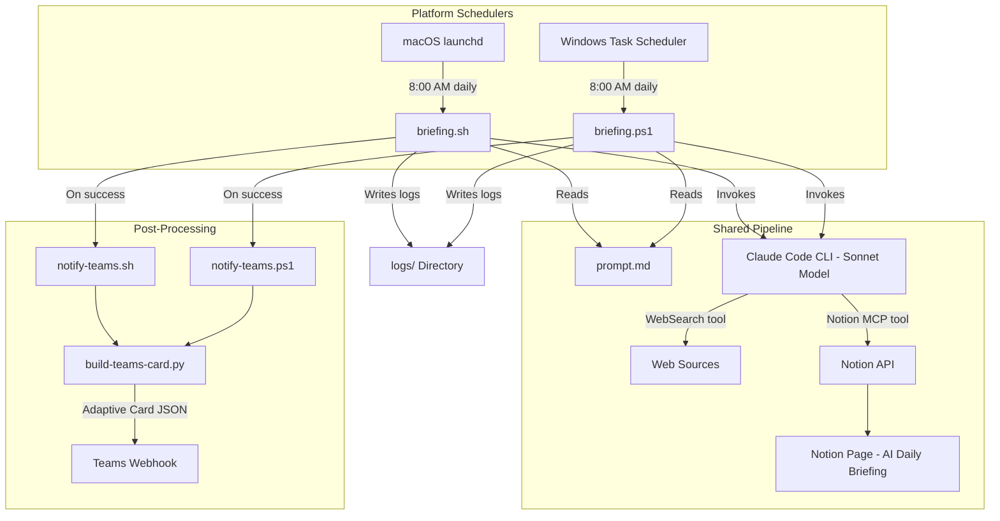

**Key design principles:**

- **Headless execution.** The entire pipeline runs without user interaction via `claude -p` (print mode).
- **Cross-platform.** Platform-specific code is isolated to the entry point scripts and scheduler configs. The prompt, search strategy, and output format are shared.
- **Single responsibility.** Each file has one job: scheduling, orchestration, prompt definition, or installation.
- **Cost containment.** A hard budget cap of $2.00 per run prevents runaway API costs.
- **Observability.** All output (stdout and stderr) is captured in date-stamped log files.
- **Multi-channel delivery.** Briefings publish to Notion and optionally post to Microsoft Teams via webhook.

---

## 2. Execution Flow

The system supports multiple trigger paths that converge on the same execution pipeline.

### Platform Entry Points

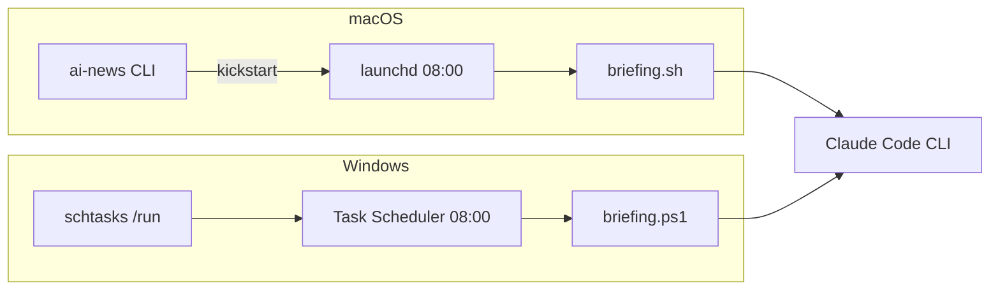

### Full Lifecycle Sequence

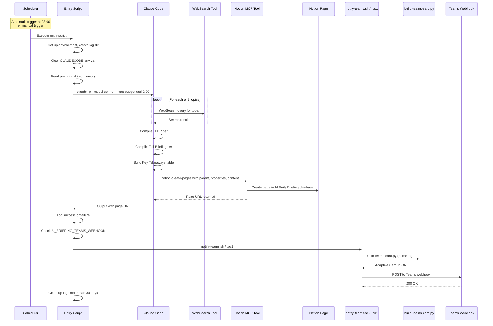

### Timing

Based on observed log data, a typical run takes approximately 3-5 minutes from start to completion. This covers the full cycle of web searches across 9 topics, content compilation, and Notion page creation.

---

## 3. Component Details

### 3.1 Schedulers

The system uses the native scheduler for each platform. Both are configured for identical behavior: fire once daily at 08:00, recover from missed runs when possible.

| Aspect | macOS (launchd) | Windows (Task Scheduler) |
|---|---|---|
| Config file | `com.ainews.briefing.plist` | Created by `install-task.ps1` |
| Task name | `com.ainews.briefing` | `AiNewsBriefing` |
| Default time | 08:00 | 08:00 |
| Missed run recovery | Fires on wake (sleep only) | `StartWhenAvailable` fires on wake or login |
| Powered-off recovery | Skipped for that day | Fires on next login |
| Concurrency guard | Single instance enforced by launchd | `ExecutionTimeLimit` of 30 minutes |
| Manual trigger | `launchctl kickstart` or `ai-news` CLI | `schtasks /run /tn AiNewsBriefing` |

#### macOS plist configuration

| Property | Value | Purpose |
|---|---|---|
| `Label` | `com.ainews.briefing` | Unique identifier for the job |
| `ProgramArguments` | `/bin/bash`, `briefing.sh` | Shell and script to execute |
| `StartCalendarInterval` | Hour: 8, Minute: 0 | Trigger at 08:00 daily |
| `StandardOutPath` | `logs/launchd-stdout.log` | Capture stdout from launchd itself |
| `StandardErrorPath` | `logs/launchd-stderr.log` | Capture stderr from launchd itself |
| `EnvironmentVariables` | `PATH`, `HOME` | Ensures Claude and tools are discoverable |

#### Windows Task Scheduler settings

| Setting | Value | Purpose |
|---|---|---|
| `AllowStartIfOnBatteries` | True | Run even on battery power (laptops) |
| `DontStopIfGoingOnBatteries` | True | Don't kill the task if AC is unplugged mid-run |
| `StartWhenAvailable` | True | Catch up on missed runs after sleep/shutdown |
| `ExecutionTimeLimit` | 30 minutes | Kill runaway tasks |
| `RunLevel` | Limited | No admin elevation required |

### 3.2 Entry Point Scripts

Both scripts are deliberately minimal -- their only job is to set up the environment and hand off to Claude Code. They share the same logic in platform-native languages.

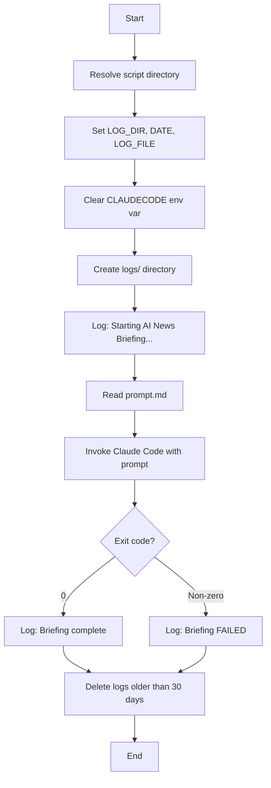

#### `briefing.sh` (macOS)

- **Language:** Bash with `set -e` (exit on error)
- **Claude path:** `$HOME/.local/bin/claude` (portable across users)
- **Log rotation:** `find` with `-mtime +30 -delete`
- **Error suppression:** `|| true` on cleanup to prevent script failure

#### `briefing.ps1` (Windows)

- **Language:** PowerShell 5.1+ with `Set-StrictMode` and `$ErrorActionPreference = "Stop"`
- **Claude path:** `$env:USERPROFILE\.local\bin\claude.exe`
- **Log rotation:** `Get-ChildItem` with `Where-Object` filtering by `LastWriteTime`
- **Error handling:** `try/catch` block captures Claude execution failures

**Shared design decisions:**

- **`unset CLAUDECODE` / `$env:CLAUDECODE = $null`**: Prevents nested session detection if the script is invoked from within a Claude Code terminal.
- **Log to file, not stdout:** All output is captured in date-stamped log files for observability without requiring a terminal.
- **30-day log rotation:** Prevents unbounded disk usage on both platforms.

### 3.3 Task Installer (`install-task.ps1`, Windows only)

A PowerShell script that registers (or re-registers) the Windows Task Scheduler task. Accepts `-Hour` and `-Minute` parameters for schedule customization. Removes any existing task with the same name before creating a new one, making it idempotent.

### 3.4 AI Prompt (`prompt.md`)

The prompt is a structured Markdown document that serves as the complete instruction set for Claude Code. It is shared across both platforms with no platform-specific content.

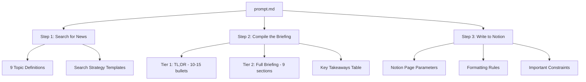

**How the prompt guides Claude:**

1. **Topic enumeration.** The 9 topics are explicitly listed with examples of what to search for, removing ambiguity about scope.
2. **Search strategy.** Template queries like `"[topic] news today [current date]"` guide Claude toward recent content rather than evergreen articles.
3. **Two-tier output format.** The TL;DR tier provides a scannable summary; the full briefing tier provides depth. This separation is defined in the prompt, not in code.
4. **Exact Notion API parameters.** The `parent` database ID, property schema, and formatting rules are hardcoded in the prompt so Claude produces the correct API call every time.
5. **Guardrails.** Instructions like "Focus on NEWS from the past 24-48 hours only" and "If a topic has no significant news today, say 'No major updates today'" prevent hallucination and filler content.

### 3.5 Makefile (Cross-Platform Task Runner)

The `Makefile` provides a unified command interface across macOS, Windows (Git Bash / MSYS2), and Linux. It auto-detects the platform at invocation and routes commands to the correct native tools.

**Design decisions:**

- **Platform detection.** Uses `uname -s` output to classify the environment as `macos`, `windows`, or `linux`. Handles MINGW, MSYS, and CYGWIN variants for Windows Git Bash environments.
- **Prerequisite gating.** The `check` target validates the Claude CLI binary exists before `run` or `install` execute, providing a clear error message instead of a cryptic failure.
- **Validation.** The `validate` target checks that all project files exist and that `prompt.md` contains the expected step structure (Step 0 through Step 3).
- **No dependencies beyond Make.** The Makefile uses only POSIX shell commands and platform-native tools. No additional packages are required.

**Target categories:**

| Category | Targets | Purpose |
|---|---|---|
| Execution | `run`, `run-bg`, `run-scheduled` | Trigger the briefing pipeline |
| Logs | `tail`, `log`, `logs`, `log-date`, `clean-logs`, `purge-logs` | View and manage log files |
| Scheduler | `install`, `uninstall`, `status` | Manage the platform scheduler |
| Validation | `check`, `validate` | Verify environment and project health |
| Info | `help`, `info`, `prompt` | Display configuration and documentation |

### 3.7 Utility Scripts (`scripts/`)

The `scripts/` directory contains 12 paired utility scripts (`.sh` + `.ps1`) that support system management, diagnostics, and maintenance. Each pair implements identical functionality in platform-native languages.

**Design decisions:**

- **Cross-platform parity.** Every script exists as both a Bash and PowerShell variant. The two versions produce the same output and accept equivalent parameters.
- **Auto-backup on mutation.** Scripts that modify `prompt.md` (`topic-edit`, `backup-prompt`) automatically create a timestamped backup before writing.
- **Read-only by default.** Most scripts are diagnostic (health-check, log-summary, cost-report). Only `topic-edit`, `backup-prompt`, `update-schedule`, `uninstall`, and `export-logs` perform writes.
- **No external dependencies.** All scripts use only built-in OS utilities (bash, PowerShell, grep, sed, Get-Content, Select-String).

**Script categories:**

| Category | Scripts | Purpose |
|---|---|---|
| Diagnostics | `health-check`, `log-summary`, `log-search`, `cost-report` | Inspect system health, run history, and spending |
| Testing | `dry-run`, `test-notion` | Validate pipeline and MCP connectivity without side effects |
| Data Management | `export-logs`, `backup-prompt` | Archive logs and version prompt.md |
| Configuration | `topic-edit`, `update-schedule` | Modify topics and scheduler timing |
| Lifecycle | `notify`, `uninstall` | Post-run notifications and full system removal |

**Interaction with other components:**

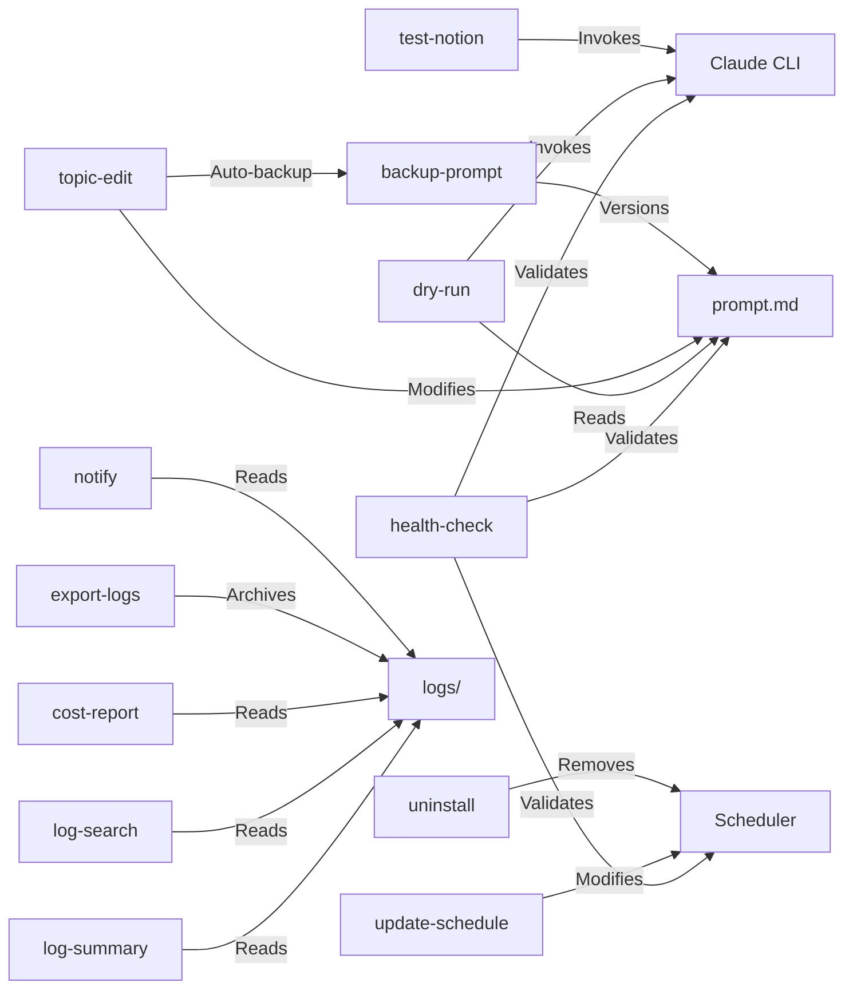

### 3.8 Manual CLI Trigger (macOS: `ai-news`)

Located at `~/.local/bin/ai-news` on macOS, this is a convenience script for on-demand execution. It calls `launchctl kickstart` to trigger the same launchd job, reusing the exact execution environment defined in the plist.

On Windows, the equivalent is `schtasks /run /tn AiNewsBriefing`, or simply `make run` on either platform.

### 3.9 Teams Notification Pipeline

After a successful briefing run, the system can optionally post a summary to a Microsoft Teams channel via a Power Automate webhook. The notification pipeline uses a three-file architecture: a platform-native shell script dispatches to a shared Python builder, which produces an Adaptive Card JSON payload for the webhook.

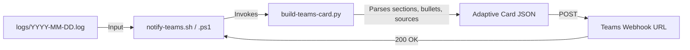

#### Files Involved

| File | Language | Purpose |
|---|---|---|
| `scripts/notify-teams.sh` | Bash | macOS/Linux entry point. Validates log, checks webhook env var, calls Python builder, POSTs via `curl`. |
| `scripts/notify-teams.ps1` | PowerShell | Windows entry point. Same logic as the Bash variant using `Invoke-RestMethod`. |
| `scripts/build-teams-card.py` | Python 3 | Shared card builder. Parses the log file and emits an Adaptive Card JSON payload to stdout. |

#### Adaptive Card Structure

The card is built as an [Adaptive Card v1.4](https://adaptivecards.io/) with the following layout:

1. **Header banner.** An accent-styled container with a newspaper icon, the title "AI Daily Briefing", the date, and a story/topic count.
2. **Section blocks.** Each briefing topic gets a separator, an icon (matched via `ICON_MAP` keyword lookup), a bold header, and its bullet points.
3. **Sources.** If the log contains `[title](url)` links, they are collected into a collapsible sources section at the bottom.
4. **Full-width rendering.** The card sets `"msteams": {"width": "Full"}` to use the entire channel width instead of the narrow default.

The card is wrapped in the Teams message envelope:

```json
{
  "type": "message",
  "attachments": [{
    "contentType": "application/vnd.microsoft.card.adaptive",
    "content": { "type": "AdaptiveCard", "version": "1.4", "msteams": {"width": "Full"}, "body": [...] }
  }]
}
```

#### Environment Variable Setup

The webhook URL is read from the `AI_BRIEFING_TEAMS_WEBHOOK` environment variable. If the variable is not set, the notification step is skipped silently.

**macOS / Linux:**

```bash
# Add to ~/.zshrc or ~/.bashrc
export AI_BRIEFING_TEAMS_WEBHOOK="https://prod-XX.westus.logic.azure.com:443/workflows/..."
```

**Windows (PowerShell):**

```powershell
[Environment]::SetEnvironmentVariable("AI_BRIEFING_TEAMS_WEBHOOK", "https://prod-XX.westus.logic.azure.com:443/workflows/...", "User")
```

Both scripts also accept command-line overrides (`--webhook-url` / `-WebhookUrl`) for testing without modifying the environment.

---

## 4. Data Flow

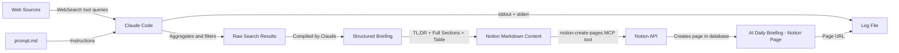

**Data transformation stages:**

| Stage | Input | Output | Actor |
|---|---|---|---|
| Search | Topic definitions from prompt.md | Raw web search results | Claude Code via WebSearch |
| Filter | Raw results from multiple queries | Relevant news from past 24-48 hours | Claude Code (LLM reasoning) |
| Compile | Filtered news items | Two-tier Markdown briefing | Claude Code (LLM generation) |
| Format | Raw Markdown | Notion-flavored Markdown with tables | Claude Code (following prompt rules) |
| Publish | Formatted content + metadata | Notion database page | Claude Code via Notion MCP tool |
| Log | Page URL + status | Date-stamped log entry | Entry point script |

---

## 5. Search Strategy

The prompt defines 9 parallel topic searches. Each topic maps to a domain of AI news, and Claude executes multiple search queries per topic to ensure comprehensive coverage.

### Topic Search Architecture

```mermaid
graph TD
    S[Claude Code Search Phase] --> T1[1. Claude Code / Anthropic]
    S --> T2[2. OpenAI / Codex / ChatGPT]
    S --> T3[3. AI Coding IDEs]
    S --> T4[4. Agentic AI Ecosystem]
    S --> T5[5. AI Industry]
    S --> T6[6. Open Source AI]
    S --> T7[7. AI Startups and Funding]
    S --> T8[8. AI Policy and Regulation]
    S --> T9[9. Dev Tools and Frameworks]

    T1 --> Q1A["'Claude Code news today YYYY-MM-DD'"]
    T1 --> Q1B["'Anthropic announcement this week'"]

    T2 --> Q2A["'OpenAI Codex latest update'"]
    T2 --> Q2B["'ChatGPT new features March 2026'"]

    T3 --> Q3A["'Cursor Windsurf Copilot news today'"]
    T3 --> Q3B["'AI coding IDE update this week'"]

    T4 --> Q4A["'AI agent frameworks MCP news'"]
    T4 --> Q4B["'LangChain CrewAI AutoGen update'"]

    T5 --> Q5A["'AI model release benchmark today'"]
    T5 --> Q5B["'Major AI company announcement'"]

    T6 --> Q6A["'Llama Mistral DeepSeek release'"]
    T6 --> Q6B["'Open source AI model news'"]

    T7 --> Q7A["'AI startup funding round today'"]
    T7 --> Q7B["'AI acquisition announcement'"]

    T8 --> Q8A["'AI regulation policy news'"]
    T8 --> Q8B["'EU AI Act update March 2026'"]

    T9 --> Q9A["'Vercel Next.js AI tools update'"]
    T9 --> Q9B["'Developer tooling AI news today'"]
```

### Topic Coverage Map

| # | Topic | Key Entities Monitored | Typical Queries per Run |
|---|---|---|---|
| 1 | Claude Code / Anthropic | Anthropic, Claude, Claude Code | 2-3 |
| 2 | OpenAI / Codex / ChatGPT | OpenAI, GPT models, Codex, ChatGPT | 2-3 |
| 3 | AI Coding IDEs | Cursor, Windsurf, Copilot, Xcode AI, JetBrains AI, Antigravity | 2-3 |
| 4 | Agentic AI Ecosystem | LangChain, CrewAI, AutoGen, MCP | 2-3 |
| 5 | AI Industry | Major labs, benchmarks, model releases | 2-3 |
| 6 | Open Source AI | Llama, Mistral, DeepSeek, Hugging Face | 2-3 |
| 7 | AI Startups & Funding | Funding rounds, acquisitions, launches | 2-3 |
| 8 | AI Policy & Regulation | EU AI Act, US policy, AI safety | 2-3 |
| 9 | Dev Tools & Frameworks | Vercel, Next.js, React Native, TypeScript | 2-3 |

Claude has discretion over the exact number and phrasing of queries. The prompt provides templates (e.g., `"[topic] news today [current date]"`) but does not rigidly prescribe every query. This allows the model to adapt its search strategy based on what it finds.

---

## 6. Output Format

The briefing follows a two-tier structure designed for different reading depths: a quick scan (Tier 1) and a deep read (Tier 2).

### Briefing Structure

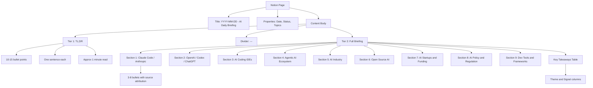

### Notion Formatting Conventions

| Markdown Element | Notion Rendering | Usage |
|---|---|---|
| `##` | Section heading | One per topic in Tier 2 |
| `-` | Bullet point | All news items |
| `**bold**` | Bold text | Company names, emphasis |
| `---` | Horizontal divider | Separates TL;DR from Full Briefing |
| `>` | Block quote | Notable quotes from sources |
| `<table>` | Notion native table | Key Takeaways summary |

### Notion Page Properties

Each page is created with three properties:

- **Date**: The title field, formatted as `"YYYY-MM-DD - AI Daily Briefing"`
- **Status**: Always set to `"Complete"`
- **Topics**: Always set to `9` (the number of topic sections)

The parent database is identified by a hardcoded `data_source_id` in the prompt.

---

## 7. Scheduling Architecture

### Cross-Platform Scheduling Comparison

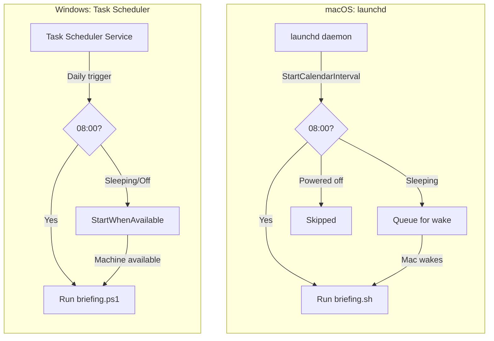

### Machine State Behavior

| Machine State at 08:00 | macOS (launchd) | Windows (Task Scheduler) |
|---|---|---|
| Awake | Job fires immediately | Task fires immediately |
| Sleeping | Fires on next wake | Fires on next wake (`StartWhenAvailable`) |
| Powered off | Skipped entirely | Fires on next login (`StartWhenAvailable`) |
| Job already running | Trigger ignored (single instance) | Governed by `ExecutionTimeLimit` |

**Key difference:** Windows `StartWhenAvailable` recovers from both sleep and cold boot. macOS launchd only recovers from sleep -- a cold boot after a missed interval does not retroactively fire the job.

### Schedule Customization

**macOS:** Edit `StartCalendarInterval` in the plist. For weekday-only, use an array of dicts with `Weekday` keys.

**Windows:** Re-run `install-task.ps1 -Hour <H> -Minute <M>`. The script is idempotent and replaces any existing task.

---

## 8. Error Handling

The system has multiple layers of error handling, from the script level down to the AI execution level. Both platform scripts implement the same error handling strategy.

### Error Path Diagram

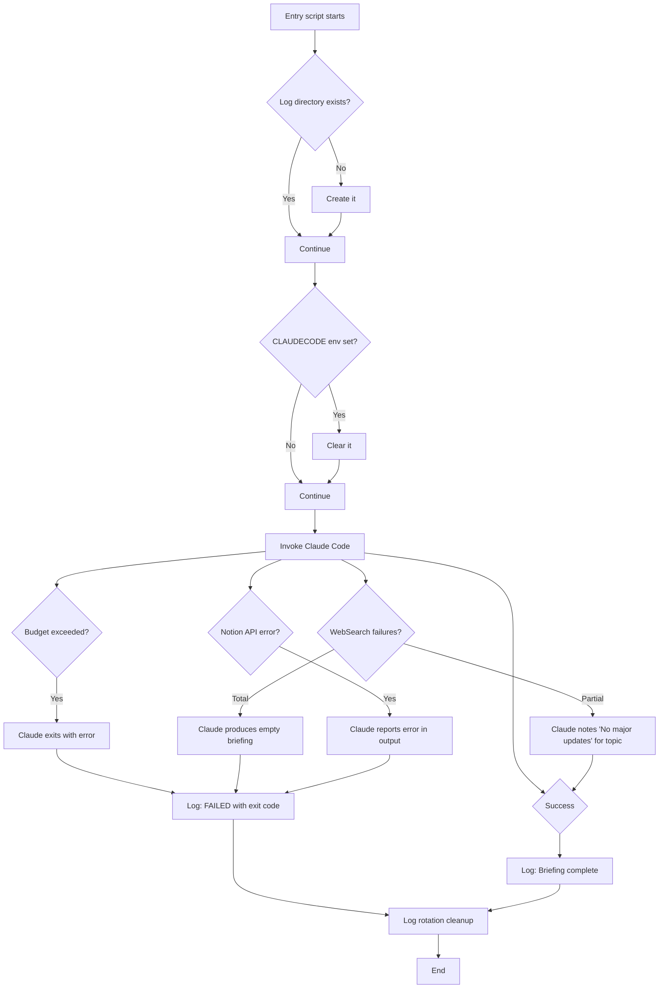

### Error Categories

| Error Type | Detection | Recovery | Impact |
|---|---|---|---|
| Nested Claude session | `CLAUDECODE` env var set | Cleared by entry script | Prevented entirely |
| Budget exceeded ($2.00) | Claude exits with non-zero code | Logged as failure | No briefing for that run |
| WebSearch failure (single topic) | Claude observes empty/error results | Notes "No major updates today" | Partial briefing |
| WebSearch failure (all topics) | Claude cannot gather any news | Empty briefing or failure | Failed run logged |
| Notion API error | MCP tool returns error | Claude reports in stdout | No page created |
| Claude binary not found | Script exits on error | Logged as failure | No briefing |
| Log directory permission error | Directory creation fails | Script exits immediately | No briefing, no log |

### Budget Safety

The `--max-budget-usd 2.00` flag is the primary cost control mechanism. Claude Code tracks cumulative API costs during the run and terminates if the budget is exceeded. Based on observed runs, a typical briefing consumes well under this cap.

---

## 9. File System Layout

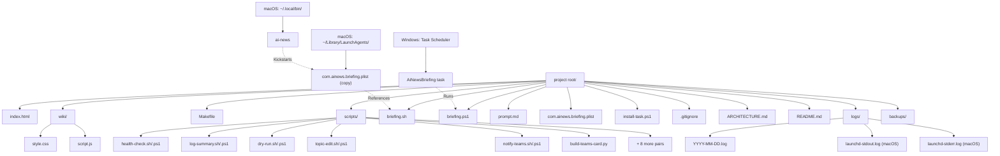

### File Descriptions

| File | Platform | Purpose | Tracked in Git |
|---|---|---|---|
| `index.html` | Shared | Landing page / project wiki | Yes |
| `wiki/style.css` | Shared | Landing page styles | Yes |
| `wiki/script.js` | Shared | Landing page interactions | Yes |
| `Makefile` | Shared | Cross-platform task runner (auto-detects OS) | Yes |
| `briefing.sh` | macOS | Entry point script (bash) | Yes |
| `briefing.ps1` | Windows | Entry point script (PowerShell) | Yes |
| `prompt.md` | Shared | Complete AI instruction set | Yes |
| `com.ainews.briefing.plist` | macOS | launchd job definition | Yes |
| `install-task.ps1` | Windows | Task Scheduler installer | Yes |
| `.gitignore` | Shared | Excludes `logs/`, `*.log`, `.DS_Store` | Yes |
| `ARCHITECTURE.md` | Shared | This document | Yes |
| `README.md` | Shared | User-facing documentation | Yes |
| `scripts/notify-teams.sh` | macOS/Linux | Teams notification entry point (Bash) | Yes |
| `scripts/notify-teams.ps1` | Windows | Teams notification entry point (PowerShell) | Yes |
| `scripts/build-teams-card.py` | Shared | Adaptive Card JSON builder (Python 3) | Yes |
| `scripts/*.sh` | macOS/Linux | Utility scripts (12 tools) | Yes |
| `scripts/*.ps1` | Windows | Utility scripts (12 tools) | Yes |
| `logs/*.log` | Shared | Daily run logs | No (gitignored) |
| `backups/` | Shared | Timestamped prompt.md backups | No (gitignored) |
| `~/.local/bin/ai-news` | macOS | Manual trigger CLI script | No (outside repo) |

### Log File Lifecycle

1. **Created**: At the start of each run, the entry script creates (or appends to) `logs/YYYY-MM-DD.log`.
2. **Appended**: Claude Code's full stdout and stderr are appended. Multiple runs on the same day share one log file.
3. **Rotated**: At the end of each run, logs older than 30 days are deleted.
4. **launchd logs** (macOS only): `launchd-stdout.log` and `launchd-stderr.log` capture output from launchd itself. These are not rotated automatically.

---

## 10. Security Considerations

### Permission Model

The `--dangerously-skip-permissions` flag is required for headless (non-interactive) execution of Claude Code. In normal interactive mode, Claude Code prompts the user before executing tools that access external services. In headless mode, this prompt cannot be displayed, so the flag bypasses all permission checks.

**Implications:**

- Claude Code can execute any available tool (WebSearch, Notion MCP, file system operations) without user confirmation.
- This is acceptable in this context because the prompt is fully controlled (not user-supplied) and the tool set is limited to read-only web search and Notion page creation.
- The script should never be modified to accept external or user-supplied prompts without re-evaluating this flag.

### Budget Caps

The `--max-budget-usd 2.00` flag provides a hard financial ceiling per run. This protects against:

- Infinite loops in search or compilation.
- Unexpectedly expensive model calls.
- Prompt injection via malicious web content that attempts to trigger expensive operations.

At a daily budget of $2.00, the maximum monthly cost is approximately $60 (assuming 30 runs).

### Log File Access

Log files contain timestamps, Claude Code's full output (including briefing content and Notion page URLs), and error messages that may reveal system paths. The `logs/` directory is gitignored to prevent accidental publication.

### Notion API Credentials

The Notion MCP tool authenticates via credentials managed by Claude Code's MCP configuration (not stored in this repository). The `data_source_id` in `prompt.md` identifies the target database but is not itself a secret -- it requires authenticated API access to use.

### Environment Variables

No secrets are stored in any tracked file. Claude Code's API key and Notion integration token are managed externally by the Claude Code and MCP runtime. The macOS plist explicitly sets `PATH` and `HOME` for deterministic execution; the Windows task inherits the user's environment.

---

## 11. Teams Notification Pipeline

See [Section 3.9](#39-teams-notification-pipeline) for full architectural details.

---

## 12. Future Enhancements / Extension Points

### Adding or Modifying Topics

Edit `prompt.md`, Section "Topics to Search". Update the `Topics` property value if the count changes. No changes to entry scripts or scheduler configs are required.

### Changing the AI Model

Change `--model sonnet` in the entry script for your platform. Consider adjusting `--max-budget-usd` accordingly.

### Adding Notification Channels

| Channel | Status | Implementation Approach |
|---|---|---|
| Microsoft Teams | **Implemented** | Power Automate webhook + Adaptive Card via `notify-teams.sh/.ps1` and `build-teams-card.py`. See [Section 3.9](#39-teams-notification-pipeline). |
| macOS notification | Planned | `osascript -e 'display notification ...'` in `briefing.sh` |
| Windows toast | Planned | `New-BurntToastNotification` or `[Windows.UI.Notifications]` in `briefing.ps1` |
| Slack | Planned | Slack MCP tool call in `prompt.md` or webhook `curl`/`Invoke-RestMethod` in the entry script |
| Email | Planned | `mail`/`sendmail` (macOS) or `Send-MailMessage` (Windows) in the entry script |

### Adding Linux Support

The system could be extended to Linux by:

1. Reusing `briefing.sh` as-is (bash is available on Linux).
2. Creating a systemd timer + service unit (analogous to the launchd plist) or a cron entry.
3. No changes to `prompt.md` or the Claude Code invocation.

### Adding a Web Dashboard

The log files follow a predictable naming convention (`YYYY-MM-DD.log`) and contain structured output. A lightweight web server could serve a dashboard showing run history, Notion page links, and cost tracking.

---

## Appendix: Quick Reference

### Commands by Platform

| Action | Make (cross-platform) | macOS (native) | Windows (native) |
|---|---|---|---|
| Run manually | `make run` | `ai-news` | `schtasks /run /tn AiNewsBriefing` |
| Run in background | `make run-bg` | `nohup bash briefing.sh &` | `Start-Process powershell briefing.ps1` |
| Tail live log | `make tail` | `tail -f logs/YYYY-MM-DD.log` | `Get-Content "logs\YYYY-MM-DD.log" -Wait` |
| Check job status | `make status` | `launchctl list \| grep ainews` | `schtasks /query /tn AiNewsBriefing` |
| Install scheduler | `make install` | `launchctl load ~/Library/LaunchAgents/...` | `.\install-task.ps1` |
| Remove scheduler | `make uninstall` | `launchctl unload ~/Library/LaunchAgents/...` | `schtasks /delete /tn AiNewsBriefing /f` |
| View recent logs | `make logs` | `ls -la logs/` | `Get-ChildItem logs\` |
| Validate project | `make validate` | -- | -- |
| Show config | `make info` | -- | -- |
| Health check | -- | `bash scripts/health-check.sh` | `.\scripts\health-check.ps1` |
| Dry run (no Notion) | -- | `bash scripts/dry-run.sh` | `.\scripts\dry-run.ps1` |
| Search logs | -- | `bash scripts/log-search.sh --search "term"` | `.\scripts\log-search.ps1 -Pattern "term"` |
| Cost report | -- | `bash scripts/cost-report.sh` | `.\scripts\cost-report.ps1` |
| Backup prompt | -- | `bash scripts/backup-prompt.sh --backup` | `.\scripts\backup-prompt.ps1 -Action backup` |
| Edit topics | -- | `bash scripts/topic-edit.sh --list` | `.\scripts\topic-edit.ps1 -Action list` |
| Test Teams notify | -- | `bash scripts/notify-teams.sh` | `.\scripts\notify-teams.ps1` |
| Set Teams webhook | -- | `export AI_BRIEFING_TEAMS_WEBHOOK="..."` | `[Environment]::SetEnvironmentVariable("AI_BRIEFING_TEAMS_WEBHOOK", "...", "User")` |

### Environment Requirements

- macOS or Windows 10/11
- Claude Code CLI installed at `~/.local/bin/claude`
- Notion MCP integration configured in Claude Code
- WebSearch tool available in Claude Code
- GNU Make (optional, for Makefile targets -- pre-installed on macOS, `winget install GnuWin32.Make` on Windows)
- Active internet connection at time of execution

---

## Author

**Son Nguyen** &mdash; [github.com/hoangsonww](https://github.com/hoangsonww) &middot; [sonnguyenhoang.com](https://sonnguyenhoang.com)
