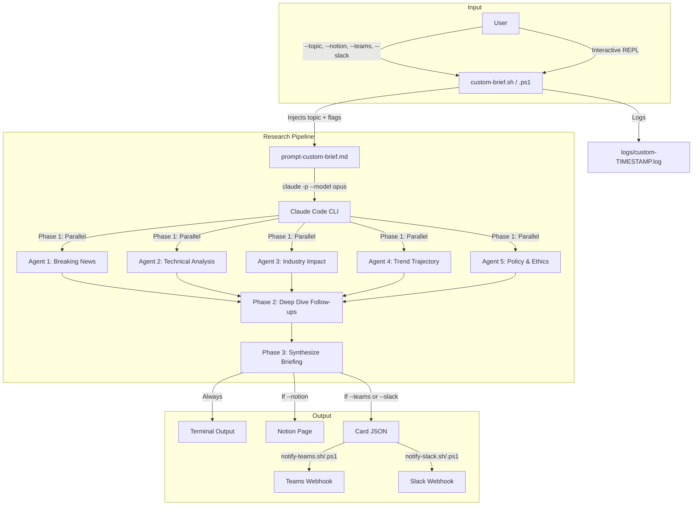
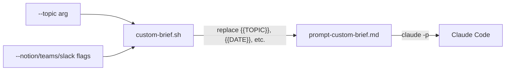

# Custom Brief: Deep Topic Research

Deep-research any topic and produce a comprehensive news-focused briefing with linked citations and publication dates. Publishes to Notion, Microsoft Teams, and/or Slack -- or just prints to the terminal.

This feature complements the daily AI news briefing by letting you go deep on a specific subject whenever you need it, rather than covering 9 broad categories on a daily schedule.

---

## How It Works

The custom brief runs a multi-phase research pipeline powered by Claude Code in headless mode. It spawns 5 parallel research agents, each covering a distinct angle, then synthesizes their findings into a structured briefing.



### Research Phases

| Phase | What happens | Output |
|-------|-------------|--------|
| **1. Broad Discovery** | 5 parallel agents search breaking news, technical analysis, industry impact, trend context, and policy angles | Raw findings with URLs and dates |
| **2. Deep Dive** | Top 5-8 findings get follow-up verification against primary sources | Verified facts with specific data points |
| **3. Synthesis** | Findings organized by theme into TL;DR + detailed sections + trends table | Structured briefing with full citations |
| **4. Publish** | Conditional: Notion page, Teams card, Slack card | Delivered to selected channels |

---

## Usage

### CLI (non-interactive)

```bash
# All destinations
./custom-brief.sh --topic "AI in healthcare" --notion --teams --slack

# Notion only
./custom-brief.sh --topic "quantum computing breakthroughs" --notion

# Terminal only (no publishing)
./custom-brief.sh --topic "open source LLMs 2026"

# Short flags
./custom-brief.sh -t "AI regulation EU" -n
```

**PowerShell:**

```powershell
.\custom-brief.ps1 -Topic "AI in healthcare" -Notion -Teams -Slack
.\custom-brief.ps1 -Topic "quantum computing" -Notion
```

**Make:**

```bash
make custom-brief T="AI in healthcare" NOTION=1 TEAMS=1
make custom-brief T="quantum computing" NOTION=1
make custom-brief-bg T="open source LLMs" NOTION=1  # background
```

### Interactive REPL

Run without arguments to enter interactive mode:

```bash
./custom-brief.sh
```

```
  Custom Brief -- Interactive Mode
  ================================

  Topic: AI in drug discovery

  Publish to Notion? [y/N]: y
  Publish to Teams?  [y/N]: y
  Publish to Slack?  [y/N]: n
```

### Claude Code Skill

Inside a Claude Code session, use the slash command:

```
/custom-brief
```

Claude will ask for the topic and destinations, then run the research pipeline interactively.

---

## CLI Parameters

### Bash (`custom-brief.sh`)

| Flag | Description |
|------|-------------|
| `--topic`, `-t` | Topic to research (required in non-interactive mode) |
| `--notion`, `-n` | Publish briefing to Notion |
| `--teams` | Send Adaptive Card to Teams |
| `--slack` | Send Block Kit message to Slack |
| `--help`, `-h` | Show usage help |

### PowerShell (`custom-brief.ps1`)

| Parameter | Description |
|-----------|-------------|
| `-Topic` | Topic to research (required in non-interactive mode) |
| `-Notion` | Publish briefing to Notion |
| `-Teams` | Send Adaptive Card to Teams |
| `-Slack` | Send Block Kit message to Slack |

### Make

| Variable | Description |
|----------|-------------|
| `T` | Topic (required) |
| `NOTION` | Set to `1` to publish to Notion |
| `TEAMS` | Set to `1` to send to Teams |
| `SLACK` | Set to `1` to send to Slack |

---

## Output Format

### Terminal Output (always)

The full briefing is printed to stdout and includes:

- **TL;DR** -- 5-10 bullet points with key findings
- **Thematic sections** (3-6) -- organized by topic, not by research agent
- **Key Trends & Outlook** -- table of trends, signals, and implications
- **Sources** -- numbered list of every URL cited

Every finding includes a clickable source link and publication date.

### Notion Page (optional)

Created in the same database as daily briefings with the title format:

```
YYYY-MM-DD - Custom Brief: [Topic]
```

### Teams Adaptive Card (optional)

Written to `logs/custom-YYYY-MM-DD-HHMMSS-card.json`, then POSTed by `notify-teams.sh/.ps1`. Same card structure as the daily briefing, with the header showing the custom topic.

### Slack Message (optional)

The Teams card is automatically converted to Slack Block Kit format by `teams-to-slack.py` and POSTed by `notify-slack.sh/.ps1`.

---

## File Layout

```
ai-news-briefing/
  custom-brief.sh              # Bash CLI entry point
  custom-brief.ps1             # PowerShell CLI entry point
  prompt-custom-brief.md       # Research prompt template
  commands/custom-brief.md     # Claude Code interactive skill
  logs/
    custom-YYYY-MM-DD-HHMMSS.log       # Execution log
    custom-YYYY-MM-DD-HHMMSS-card.json # Adaptive Card (if generated)
```

---

## Comparison: Daily Briefing vs Custom Brief

| Aspect | Daily Briefing | Custom Brief |
|--------|---------------|--------------|
| **Trigger** | Scheduled (8:00 AM daily) | On-demand |
| **Scope** | 9 fixed AI topics | Any user-defined topic |
| **Research depth** | Broad scan (1 search per topic) | Deep (5 parallel agents + follow-ups) |
| **Deduplication** | Yes (covered-stories.txt) | No (each brief is standalone) |
| **Notion title** | `YYYY-MM-DD - AI Daily Briefing` | `YYYY-MM-DD - Custom Brief: [Topic]` |
| **Card filename** | `logs/YYYY-MM-DD-card.json` | `logs/custom-YYYY-MM-DD-HHMMSS-card.json` |
| **CLI output** | Logged to file only | Printed to terminal + logged |

---

## Prompt Architecture

The research prompt (`prompt-custom-brief.md`) uses template variables that the CLI scripts inject at runtime:



| Variable | Source | Example |
|----------|--------|---------|
| `{{TOPIC}}` | `--topic` argument | `AI in healthcare` |
| `{{DATE}}` | System date | `2026-04-01` |
| `{{TIMESTAMP}}` | System timestamp | `2026-04-01-093000` |
| `{{PUBLISH_NOTION}}` | `--notion` flag | `true` or `false` |
| `{{PUBLISH_TEAMS_SLACK}}` | `--teams` or `--slack` flag | `true` or `false` |

---

## Prerequisites

Same as the daily briefing:

- Claude Code CLI installed at `~/.local/bin/claude`
- Notion MCP configured (for `--notion`)
- `AI_BRIEFING_TEAMS_WEBHOOK` env var set (for `--teams`)
- `AI_BRIEFING_SLACK_WEBHOOK` env var set (for `--slack`)
- Python 3.x (for Slack conversion via `teams-to-slack.py`)

See [SETUP.md](SETUP.md) for full installation instructions.

---

## Troubleshooting

**"Topic cannot be empty"** -- Pass `--topic` or enter a topic in interactive mode.

**"Card file not found"** -- Claude did not generate card JSON. Check the log file for errors during Phase 6.

**"Webhook not set"** -- Set `AI_BRIEFING_TEAMS_WEBHOOK` or `AI_BRIEFING_SLACK_WEBHOOK` environment variable.

**Briefing has no citations** -- This is a prompt adherence issue. The prompt explicitly requires citations; if Claude skips them, re-run or check if the topic is too niche for web results.

**Research agents return thin results** -- Try a more specific topic or broaden the scope. Very narrow topics may not have enough web coverage.
