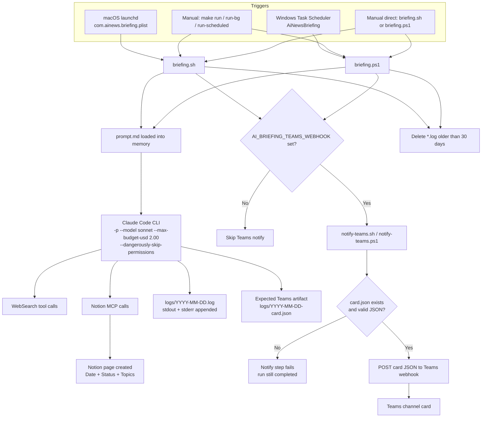
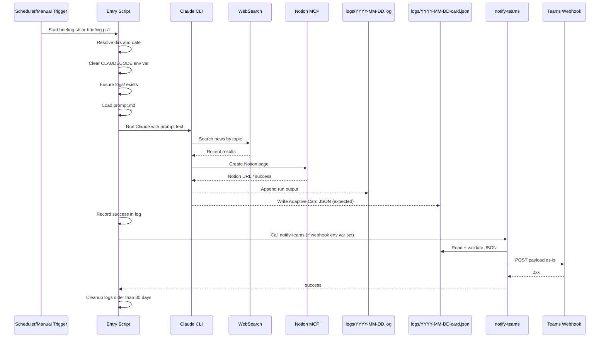
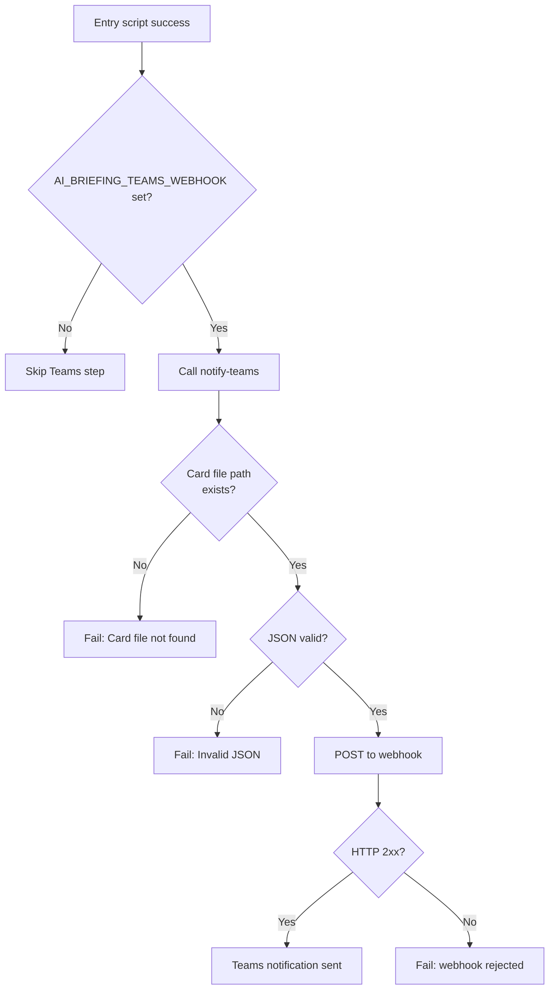
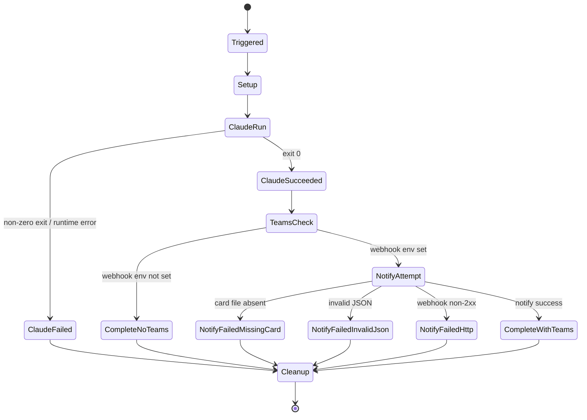

# End-to-End Flow: AI News Briefing Pipeline

This document describes the real runtime flow of this repository as of March 17, 2026.
It is based on the current implementation in:

- `briefing.sh`
- `briefing.ps1`
- `prompt.md`
- `scripts/notify-teams.sh`
- `scripts/notify-teams.ps1`
- `scripts/build-teams-card.py` (legacy reference)
- `Makefile`

---

## 1. System Topology

---

## 2. Runtime Sequence (Successful Path)

---

## 3. Stage-by-Stage Contracts

### Stage A: Trigger and Entry

| Area | macOS path | Windows path |
|---|---|---|
| Scheduler | `com.ainews.briefing.plist` | Task `AiNewsBriefing` via `install-task.ps1` |
| Entry script | `briefing.sh` | `briefing.ps1` |
| Default schedule | 08:00 daily | 08:00 daily |
| Manual trigger | `make run`, `make run-bg`, `make run-scheduled` | same Make targets, or `schtasks /run /tn AiNewsBriefing` |

Entry scripts do the same core setup:

1. Compute `DATE`, `LOG_DIR`, `LOG_FILE`.
2. Clear `CLAUDECODE` to avoid nested-session failures.
3. Create `logs/` if missing.
4. Read `prompt.md` as one string.
5. Invoke Claude CLI with model and budget cap.
6. Append output to `logs/YYYY-MM-DD.log`.
7. Attempt Teams notify only when webhook env var is present.
8. Delete only old `*.log` files (>30 days).

### Stage B: Date Override / Backfill Path

Both entry scripts support backfill:

- Bash: `briefing.sh YYYY-MM-DD`
- PowerShell: `briefing.ps1 -BriefingDate YYYY-MM-DD`
- Make wrapper: `make run D=YYYY-MM-DD`

When date override is used, scripts prepend a runtime instruction block to the prompt:

- Search relative to override date, not current day.
- Use override date in Notion title.
- Use override date in card filename (`logs/<date>-card.json`).

### Stage C: AI Execution Logic

`prompt.md` defines the internal flow:

1. Step 0: fetch previous briefing from Notion for de-duplication.
2. Step 1: search 9 topic areas for past-24-hour updates.
3. Step 2: compile TLDR + full briefing sections with dates.
4. Step 3: write a new Notion page with fixed parent `data_source_id` and properties.
5. Step 4: currently instructs model to print structured stdout for parsing.

### Stage D: Teams Delivery

Current notifier scripts are intentionally thin:

- Find card file (default `logs/<today>-card.json`, or passed `--card-file` / `-CardFile`).
- Validate JSON (`python3 -m json.tool` on shell, `ConvertFrom-Json` on PowerShell).
- POST payload directly to webhook.

They do **not** build cards from logs.

---

## 4. Teams Notification Decision Graph

---

## 5. Current Divergence: Prompt vs Runtime Expectations

There is a material mismatch in the repo right now:

| Component | What it expects |
|---|---|
| `prompt.md` Step 4 | AI prints strict stdout format for a parser |
| `scripts/notify-teams.sh/.ps1` | A prebuilt `logs/YYYY-MM-DD-card.json` exists |
| `scripts/build-teams-card.py` | Parser exists but is legacy and not called by entry scripts |

Practical impact:

- If Claude follows `prompt.md` literally and does **not** write `-card.json`, Teams notify fails with `Card file not found`.
- If a separate local skill or custom command makes Claude write `-card.json`, notify succeeds.

This is the most important operational risk in the current E2E path.

---

## 6. Failure-State Diagram

Notes:

- Teams notification failure does not currently mark the whole run as failed at the script level.
- Log cleanup only targets `*.log`; old `*-card.json` files are not rotated by current scripts.

---

## 7. Artifacts and Ownership

| Artifact | Producer | Consumer | Required for success |
|---|---|---|---|
| `logs/YYYY-MM-DD.log` | entry scripts + Claude stdout/stderr | humans, diagnostic scripts | No (diagnostic) |
| Notion page | Claude via Notion MCP | Notion workspace | Yes |
| `logs/YYYY-MM-DD-card.json` | Claude (expected) | notify-teams scripts | Yes for Teams path |
| Teams message | notify-teams scripts | Teams channel | Optional |

---

## 8. Operational Checklist

1. Ensure Claude CLI path exists (`~/.local/bin/claude` or `.exe`).
2. Ensure Notion MCP is configured and has DB access.
3. Ensure `prompt.md` and Teams pipeline are aligned on card generation strategy.
4. If Teams is enabled, verify `AI_BRIEFING_TEAMS_WEBHOOK` and card file creation.
5. Use `make tail` / `make log` to inspect run outcomes.

---

## 9. Suggested Alignment Work (High Priority)

To eliminate ambiguity and make E2E deterministic, choose one canonical path:

### Option A (recommended): Direct card JSON path

- Update `prompt.md` Step 4 to require writing `logs/YYYY-MM-DD-card.json`.
- Keep `notify-teams.sh/.ps1` as-is (thin validator/sender).
- Keep `build-teams-card.py` as archival or remove it.

### Option B: Parser path

- Keep stdout-format Step 4 in prompt.
- Reintroduce parser call (`build-teams-card.py`) in entry scripts before notify.
- Notify scripts can continue posting file output from parser.

Until one option is standardized end-to-end, Teams delivery remains environment-dependent.
