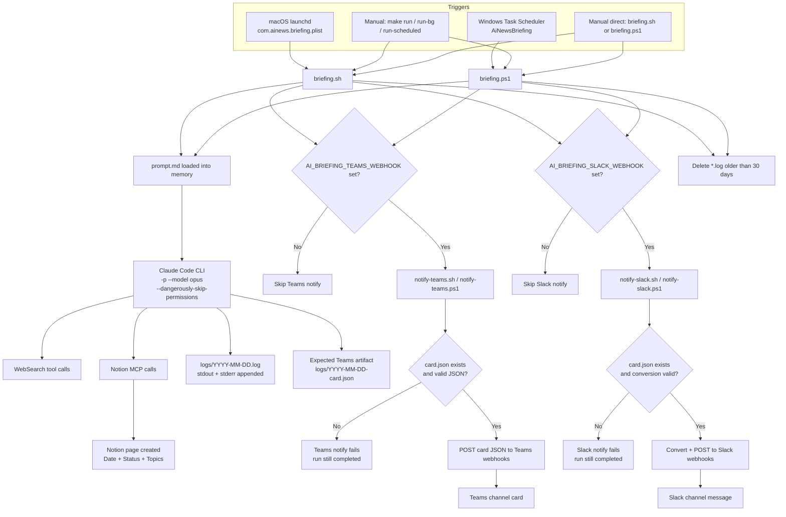
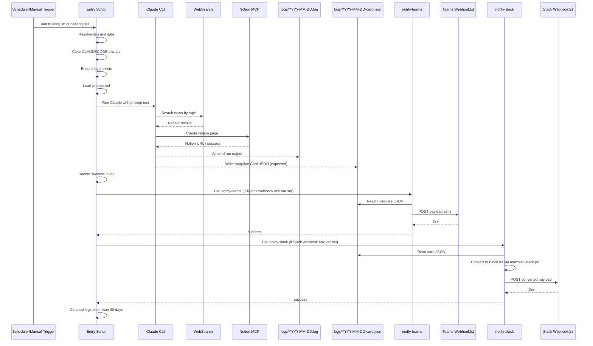
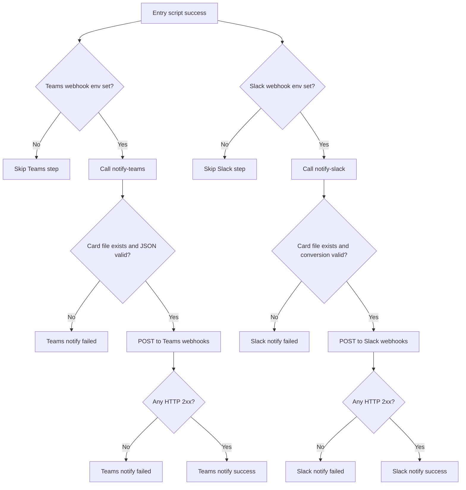
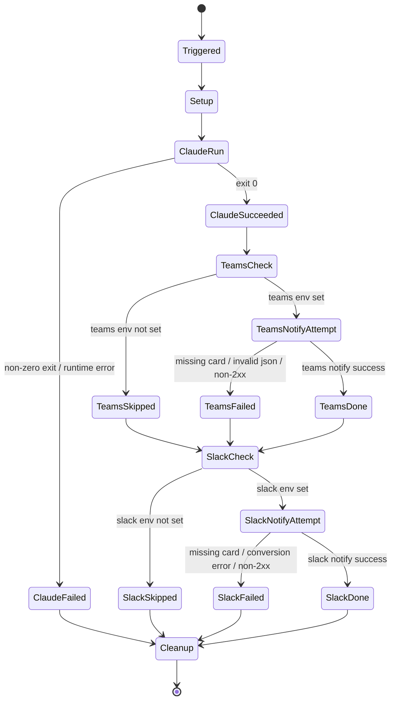

# End-to-End Flow: AI News Briefing Pipeline

This document describes the real runtime flow of this repository as of March 24, 2026.
It is based on the current implementation in:

- `briefing.sh`
- `briefing.ps1`
- `prompt.md`
- `scripts/notify-teams.sh`
- `scripts/notify-teams.ps1`
- `scripts/notify-slack.sh`
- `scripts/notify-slack.ps1`
- `scripts/teams-to-slack.py`
- `scripts/build-teams-card.py` (legacy reference)
- `Makefile`

---

## 1. System Topology

---

## 2. Runtime Sequence (Successful Path)

---

## 3. Stage-by-Stage Contracts

### Stage A: Trigger and Entry

| Area | macOS path | Windows path |
|---|---|---|
| Scheduler | `com.ainews.briefing.plist` | Task `AiNewsBriefing` via `install-task.ps1` |
| Entry script | `briefing.sh` | `briefing.ps1` |
| Default schedule | 08:00 daily | 08:00 daily |
| Manual trigger | `make run`, `make run-bg`, `make run-scheduled` | same Make targets, or `schtasks /run /tn AiNewsBriefing` |

Entry scripts do the same core setup:

1. Compute `DATE`, `LOG_DIR`, `LOG_FILE`.
2. Clear `CLAUDECODE` to avoid nested-session failures.
3. Create `logs/` if missing.
4. Read `prompt.md` as one string.
5. Invoke Claude CLI with the configured model (`opus` in current scripts).
6. Append output to `logs/YYYY-MM-DD.log`.
7. Attempt Teams notify when Teams webhook env var is present.
8. Attempt Slack notify when Slack webhook env var is present.
9. Delete only old `*.log` files (>30 days).

### Stage B: Date Override / Backfill Path

Both entry scripts support backfill:

- Bash: `briefing.sh YYYY-MM-DD`
- PowerShell: `briefing.ps1 -BriefingDate YYYY-MM-DD`
- Make wrapper: `make run D=YYYY-MM-DD`

When date override is used, scripts prepend a runtime instruction block to the prompt:

- Search relative to override date, not current day.
- Use override date in Notion title.
- Use override date in card filename (`logs/<date>-card.json`).

### Stage C: AI Execution Logic

`prompt.md` defines the internal flow:

1. Step 0a: load `logs/covered-stories.txt` for deduplication.
2. Step 0b: search Notion for existing "AI Daily Briefing" pages. If today's page exists, record its page ID (`PAGE_EXISTS = true`). Read the most recent page for additional dedup context.
3. Step 1: search 9 topic areas for past-24-hour updates. Check official changelogs.
4. Step 2: compile TL;DR + full briefing sections with dates.
5. Step 3: if `PAGE_EXISTS = true`, update the existing Notion page. Otherwise, create a new page. This prevents duplicate pages on re-runs.
6. Step 4: write Adaptive Card JSON to `logs/YYYY-MM-DD-card.json`.
7. Step 5: append today's headlines to `logs/covered-stories.txt`.

### Stage D: Teams & Slack Delivery

**Teams** notifier scripts are intentionally thin:

- Find card file (default `logs/<today>-card.json`, or passed `--card-file` / `-CardFile`).
- Validate JSON (`python3 -m json.tool` on shell, `ConvertFrom-Json` on PowerShell).
- Resolve target URLs from `AI_BRIEFING_TEAMS_WEBHOOK` (semicolon-separated). By default only the first URL is used; pass `--all` / `-All` to post to all.
- POST payload directly to webhooks.

**Slack** notifier scripts follow the same pattern but add a conversion step:

- Read the Teams card JSON file.
- Convert to Slack Block Kit format using `scripts/teams-to-slack.py` (pure Python stdlib, no external deps).
- Resolve target URLs from `AI_BRIEFING_SLACK_WEBHOOK` (same semicolon / `--all` pattern).
- POST converted payload to webhooks.

Neither builds cards from logs. Both are resilient to individual webhook failures.

---

## 4. Notification Decision Graph (Teams + Slack)

---

## 5. Alignment Status

The prompt and runtime pipeline are aligned on a shared card artifact and dual-channel notify paths:

| Component | Behavior |
|---|---|
| `prompt.md` Step 4 | AI writes `logs/YYYY-MM-DD-card.json` directly |
| `scripts/notify-teams.sh/.ps1` | Validates and POSTs the prebuilt card JSON |
| `scripts/notify-slack.sh/.ps1` | Converts prebuilt card JSON to Block Kit and POSTs it |
| `scripts/teams-to-slack.py` | Conversion layer from Teams Adaptive Card schema to Slack Block Kit |
| `scripts/build-teams-card.py` | Legacy parser, not called by any active script |

Additionally, `prompt.md` Step 3 now prevents duplicate Notion pages by checking for an existing page during Step 0b and updating rather than creating when one is found.
Current `briefing.sh` and `briefing.ps1` invoke both notifiers in all-URL mode (`--all` / `-All`) when the corresponding env vars are set.

---

## 6. Failure-State Diagram

Notes:

- Teams and Slack notification failures do not currently mark the whole run as failed at the script level.
- Log cleanup only targets `*.log`; old `*-card.json` files are not rotated by current scripts.

---

## 7. Artifacts and Ownership

| Artifact | Producer | Consumer | Required for success |
|---|---|---|---|
| `logs/YYYY-MM-DD.log` | entry scripts + Claude stdout/stderr | humans, diagnostic scripts | No (diagnostic) |
| Notion page | Claude via Notion MCP | Notion workspace | Yes |
| `logs/YYYY-MM-DD-card.json` | Claude (expected) | notify-teams scripts, notify-slack scripts, teams-to-slack.py | Yes for Teams and Slack paths |
| Converted Slack payload (temp) | notify-slack scripts | Slack webhook endpoint | Yes for Slack path |
| Teams message | notify-teams scripts | Teams channel | Optional |
| Slack message | notify-slack scripts | Slack channel | Optional |

---

## 8. Operational Checklist

1. Ensure Claude CLI path exists (`~/.local/bin/claude` or `.exe`).
2. Ensure Notion MCP is configured and has DB access.
3. Ensure `prompt.md` Step 4 still writes `logs/YYYY-MM-DD-card.json`.
4. If Teams is enabled, verify `AI_BRIEFING_TEAMS_WEBHOOK` and direct `notify-teams` test.
5. If Slack is enabled, verify `AI_BRIEFING_SLACK_WEBHOOK`, Python availability, and direct `notify-slack` test.
6. Use `make tail` / `make log` to inspect run outcomes.

---

## 9. Recent Changes

- **Duplicate Notion page prevention:** Step 0b now captures `PAGE_EXISTS` and the page ID. Step 3 updates the existing page when one is found, and only creates a new page otherwise. The agent no longer re-queries Notion in Step 3.
- **Multiple webhook support:** Both `AI_BRIEFING_TEAMS_WEBHOOK` and `AI_BRIEFING_SLACK_WEBHOOK` accept semicolon-separated URLs. By default only the first URL is used. Pass `--all` (bash) or `-All` (PowerShell) to post to all configured URLs.
- **Slack integration:** `notify-slack.sh/.ps1` converts the Teams card JSON to Slack Block Kit format using `teams-to-slack.py` and POSTs it to Slack webhooks. No separate card generation needed — reuses the Teams card.
- **Prompt/runtime alignment:** `prompt.md` Step 4 now writes `logs/YYYY-MM-DD-card.json` directly. The legacy `build-teams-card.py` parser is no longer part of the active pipeline.
