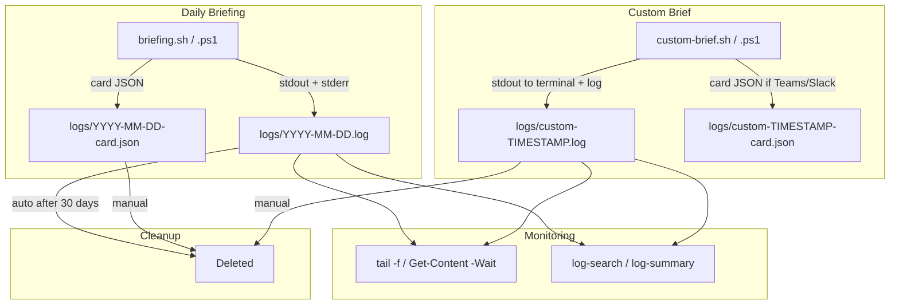

# Tailing & Reading Logs

Complete guide to monitoring, searching, and managing logs for both the daily automated briefing and custom topic briefs.

---

## Log File Naming

| Run type | Filename pattern | Example |
|---|---|---|
| Daily briefing | `logs/YYYY-MM-DD.log` | `logs/2026-04-01.log` |
| Custom brief | `logs/custom-YYYY-MM-DD-HHMMSS.log` | `logs/custom-2026-04-01-105728.log` |
| Teams card JSON | `logs/YYYY-MM-DD-card.json` | `logs/2026-04-01-card.json` |
| Custom brief card | `logs/custom-YYYY-MM-DD-HHMMSS-card.json` | `logs/custom-2026-04-01-105728-card.json` |
| Dedup tracker | `logs/covered-stories.txt` | (single file, appended daily) |
| launchd stdout | `logs/launchd-stdout.log` | (macOS only, single file) |
| launchd stderr | `logs/launchd-stderr.log` | (macOS only, single file) |

---

## Tail a Running Briefing (Live)

Use these commands to watch a briefing as it runs. Output streams in real time until you press `Ctrl+C`.

### Daily Briefing

The daily briefing logs to `logs/YYYY-MM-DD.log` using today's date.

**macOS / Linux:**

```bash
tail -f ~/ai-news-briefing/logs/$(date +%Y-%m-%d).log
```

**Windows (PowerShell):**

```powershell
Get-Content "$env:USERPROFILE\ai-news-briefing\logs\$(Get-Date -Format 'yyyy-MM-dd').log" -Wait
```

**Make (cross-platform):**

```bash
make tail
```

### Custom Brief

Custom brief logs include a timestamp, so you need to know the exact filename. The script prints the log path when it starts:

```
  Log       /home/user/ai-news-briefing/logs/custom-2026-04-01-105728.log
```

**macOS / Linux:**

```bash
# Tail a specific custom brief log
tail -f ~/ai-news-briefing/logs/custom-2026-04-01-105728.log

# Tail the most recent custom brief log (any date)
tail -f "$(ls -t ~/ai-news-briefing/logs/custom-*.log | head -1)"
```

**Windows (PowerShell):**

```powershell
# Tail a specific custom brief log
Get-Content "$env:USERPROFILE\ai-news-briefing\logs\custom-2026-04-01-105728.log" -Wait

# Tail the most recent custom brief log
Get-Content (Get-ChildItem "$env:USERPROFILE\ai-news-briefing\logs\custom-*.log" | Sort-Object LastWriteTime -Descending | Select-Object -First 1) -Wait
```

> **Note:** Custom briefs also print the full research output directly to your terminal when run interactively, so you only need to tail the log if running in the background.

---

## Read a Completed Log

### Print the Full Log

**macOS / Linux:**

```bash
# Today's daily briefing
cat ~/ai-news-briefing/logs/$(date +%Y-%m-%d).log

# A specific date
cat ~/ai-news-briefing/logs/2026-03-31.log

# A custom brief
cat ~/ai-news-briefing/logs/custom-2026-04-01-105728.log
```

**Windows (PowerShell):**

```powershell
# Today's daily briefing
Get-Content "$env:USERPROFILE\ai-news-briefing\logs\$(Get-Date -Format 'yyyy-MM-dd').log"

# A specific date
Get-Content "$env:USERPROFILE\ai-news-briefing\logs\2026-03-31.log"

# A custom brief
Get-Content "$env:USERPROFILE\ai-news-briefing\logs\custom-2026-04-01-105728.log"
```

**Make:**

```bash
make log                    # Today's daily briefing
make log-date D=2026-03-31  # Specific date
```

### Print Just the Last N Lines

**macOS / Linux:**

```bash
tail -n 20 ~/ai-news-briefing/logs/2026-04-01.log
```

**Windows (PowerShell):**

```powershell
Get-Content "$env:USERPROFILE\ai-news-briefing\logs\2026-04-01.log" -Tail 20
```

---

## List All Logs

**macOS / Linux:**

```bash
ls -lh ~/ai-news-briefing/logs/*.log
```

**Windows (PowerShell):**

```powershell
Get-ChildItem "$env:USERPROFILE\ai-news-briefing\logs\*.log" | Sort-Object LastWriteTime -Descending | Format-Table Name, Length, LastWriteTime
```

**Make:**

```bash
make logs
```

### List Only Custom Brief Logs

**macOS / Linux:**

```bash
ls -lht ~/ai-news-briefing/logs/custom-*.log
```

**Windows (PowerShell):**

```powershell
Get-ChildItem "$env:USERPROFILE\ai-news-briefing\logs\custom-*.log" | Sort-Object LastWriteTime -Descending | Format-Table Name, Length, LastWriteTime
```

---

## Search Across Logs

Use the `log-search` utility script to find keywords across all log files with surrounding context.

**macOS / Linux:**

```bash
# Search for a keyword
bash scripts/log-search.sh --search "Anthropic"

# With context lines
bash scripts/log-search.sh --search "FAILED" --context 3

# Search custom brief logs only
grep -rn "FAILED" ~/ai-news-briefing/logs/custom-*.log
```

**Windows (PowerShell):**

```powershell
# Search for a keyword
.\scripts\log-search.ps1 -Pattern "Anthropic"

# With context
.\scripts\log-search.ps1 -Pattern "FAILED" -Context 3

# Search custom brief logs only
Select-String -Path "$env:USERPROFILE\ai-news-briefing\logs\custom-*.log" -Pattern "FAILED"
```

---

## Summarize Recent Runs

The `log-summary` utility shows a tabular overview of recent runs with status and file size.

**macOS / Linux:**

```bash
# Last 7 days (default)
bash scripts/log-summary.sh

# Last 14 days
bash scripts/log-summary.sh 14
```

**Windows (PowerShell):**

```powershell
.\scripts\log-summary.ps1
.\scripts\log-summary.ps1 -Days 14
```

---

## Check if a Run Succeeded or Failed

Every log ends with a status line. Quick ways to check:

**macOS / Linux:**

```bash
# Check today's daily briefing
tail -1 ~/ai-news-briefing/logs/$(date +%Y-%m-%d).log

# Check all recent runs for failures
grep "FAILED" ~/ai-news-briefing/logs/*.log
```

**Windows (PowerShell):**

```powershell
# Check today's daily briefing
Get-Content "$env:USERPROFILE\ai-news-briefing\logs\$(Get-Date -Format 'yyyy-MM-dd').log" -Tail 1

# Check all recent runs for failures
Select-String -Path "$env:USERPROFILE\ai-news-briefing\logs\*.log" -Pattern "FAILED"
```

**What to look for:**

| Log line | Meaning |
|---|---|
| `Briefing complete. Check Notion for today's report.` | Daily briefing succeeded |
| `Custom brief complete.` | Custom brief succeeded |
| `Briefing FAILED with exit code N` | Daily briefing failed |
| `Custom brief FAILED with exit code N` | Custom brief failed |
| `Teams notification sent.` | Teams delivery succeeded |
| `Slack notification sent.` | Slack delivery succeeded |
| `Teams notification failed` | Teams delivery failed (check webhook) |
| `Slack notification failed` | Slack delivery failed (check webhook) |

---

## Export & Archive Logs

**macOS / Linux:**

```bash
# Export a date range to tar.gz
bash scripts/export-logs.sh --from 2026-03-01 --to 2026-03-31

# Export all logs
bash scripts/export-logs.sh
```

**Windows (PowerShell):**

```powershell
.\scripts\export-logs.ps1 -From "2026-03-01" -To "2026-03-31"
```

---

## Clean Up Old Logs

Logs older than 30 days are automatically deleted at the end of each daily briefing run. To clean manually:

**macOS / Linux:**

```bash
# Delete logs older than 30 days
bash -c 'find ~/ai-news-briefing/logs -name "*.log" -mtime +30 -delete'

# Or via Make
make clean-logs
```

**Windows (PowerShell):**

```powershell
Get-ChildItem "$env:USERPROFILE\ai-news-briefing\logs\*.log" |
    Where-Object { $_.LastWriteTime -lt (Get-Date).AddDays(-30) } |
    Remove-Item -Force
```

**Delete all logs:**

```bash
make purge-logs
```

---

## Log Flow Diagram



---

## Quick Reference

| Task | macOS / Linux | Windows (PowerShell) | Make |
|---|---|---|---|
| Tail daily (live) | `tail -f logs/$(date +%Y-%m-%d).log` | `Get-Content logs\$(Get-Date -Format 'yyyy-MM-dd').log -Wait` | `make tail` |
| Tail latest custom | `tail -f "$(ls -t logs/custom-*.log \| head -1)"` | `Get-Content (gci logs\custom-*.log \| sort LastWriteTime -Desc \| select -First 1) -Wait` | -- |
| Read today's log | `cat logs/$(date +%Y-%m-%d).log` | `Get-Content logs\$(Get-Date -Format 'yyyy-MM-dd').log` | `make log` |
| Read specific date | `cat logs/2026-03-31.log` | `Get-Content logs\2026-03-31.log` | `make log-date D=2026-03-31` |
| List all logs | `ls -lh logs/*.log` | `gci logs\*.log` | `make logs` |
| Search logs | `bash scripts/log-search.sh --search "term"` | `.\scripts\log-search.ps1 -Pattern "term"` | -- |
| Summary | `bash scripts/log-summary.sh 14` | `.\scripts\log-summary.ps1 -Days 14` | -- |
| Check for failures | `grep FAILED logs/*.log` | `Select-String -Path logs\*.log -Pattern FAILED` | -- |
| Clean old logs | `find logs -name "*.log" -mtime +30 -delete` | `gci logs\*.log \| ? {$_.LastWriteTime -lt (Get-Date).AddDays(-30)} \| rm` | `make clean-logs` |
| Purge all logs | `rm logs/*.log` | `Remove-Item logs\*.log` | `make purge-logs` |
