# Slack Integration: Block Kit Notifications


This document describes the Slack notification feature: an optional post-run step that converts the generated Teams Adaptive Card JSON into Slack Block Kit JSON and posts it to one or more Slack incoming webhooks.

---

## Table of Contents

1. [Overview](#1-overview)
2. [Prerequisites](#2-prerequisites)
3. [Setup: Create a Slack Incoming Webhook](#3-setup-create-a-slack-incoming-webhook)
4. [Set the Environment Variable](#4-set-the-environment-variable)
5. [How It Works](#5-how-it-works)
6. [Testing](#6-testing)
7. [Slack Payload Format](#7-slack-payload-format)
8. [Troubleshooting](#8-troubleshooting)
9. [Files Involved](#9-files-involved)
10. [Operational Notes and Best Practices](#10-operational-notes-and-best-practices)

---

## 1. Overview

During each successful briefing run:

1. Claude writes `logs/YYYY-MM-DD-card.json` in Teams Adaptive Card format (Step 4 in `prompt.md`).
2. `briefing.sh` (macOS/Linux) or `briefing.ps1` (Windows) optionally calls Slack notify scripts.
3. `scripts/notify-slack.sh` or `scripts/notify-slack.ps1` reads the card file.
4. The notify script calls `scripts/teams-to-slack.py` to convert the card to Slack Block Kit.
5. The converted payload is posted to Slack incoming webhook URL(s).

No second card generation step is required. Slack reuses the same card artifact that Teams uses.

### Why this design exists

- One source of truth: only one generated card file per run (`logs/YYYY-MM-DD-card.json`).
- Consistent summaries across channels: Notion, Teams, and Slack all reflect the same run.
- Lower maintenance: formatting logic for Slack is centralized in `teams-to-slack.py`.

---

## 2. Prerequisites

| Requirement | Details |
|---|---|
| Slack workspace | You need permission to create/manage apps or incoming webhooks |
| Incoming webhook URL | At least one Slack webhook URL for your target channel |
| Python 3 | Required by `scripts/teams-to-slack.py` during conversion |
| Completed briefing run | Slack notify expects `logs/YYYY-MM-DD-card.json` to exist |
| Optional multi-channel fan-out | Multiple Slack URLs are supported via semicolon-separated env var |

---

## 3. Setup: Create a Slack Incoming Webhook

### Option A: Create from a new Slack app

1. Open https://api.slack.com/apps
2. Click **Create New App**.
3. Choose **From scratch**.
4. Name the app (for example `AI News Briefing Bot`) and choose your workspace.
5. In the app settings, open **Incoming Webhooks**.
6. Enable **Activate Incoming Webhooks**.
7. Click **Add New Webhook to Workspace**.
8. Choose the target channel and allow permissions.
9. Copy the webhook URL (`https://hooks.slack.com/services/...`).

### Option B: Reuse an existing app

If your workspace already has an app for operational notifications:

1. Open the existing app in Slack API dashboard.
2. Navigate to **Incoming Webhooks**.
3. Add a webhook for the desired channel.
4. Copy the generated URL.

### Verify webhook independently

Before wiring into this project, send a minimal payload:

```bash
curl -X POST "<your-slack-webhook-url>" \
  -H "Content-Type: application/json" \
  -d '{"text":"Slack webhook is working."}'
```

PowerShell:

```powershell
$body = @{ text = "Slack webhook is working." } | ConvertTo-Json
Invoke-RestMethod -Uri "<your-slack-webhook-url>" -Method Post -ContentType "application/json" -Body $body
```

If successful, you should see the message in your target channel.

---

## 4. Set the Environment Variable

Slack notify scripts read URLs from `AI_BRIEFING_SLACK_WEBHOOK`.

### Single webhook

macOS / Linux:

```bash
export AI_BRIEFING_SLACK_WEBHOOK="https://hooks.slack.com/services/T.../B.../..."
```

Persist by adding to `~/.zshrc` or `~/.bashrc`.

Windows (PowerShell):

```powershell
[Environment]::SetEnvironmentVariable("AI_BRIEFING_SLACK_WEBHOOK", "https://hooks.slack.com/services/T.../B.../...", "User")
```

### Multiple webhooks

Use semicolon-separated URLs:

```bash
export AI_BRIEFING_SLACK_WEBHOOK="https://hooks.slack.com/services/T.../B.../one;https://hooks.slack.com/services/T.../B.../two"
```

```powershell
[Environment]::SetEnvironmentVariable("AI_BRIEFING_SLACK_WEBHOOK", "https://hooks.slack.com/services/T.../B.../one;https://hooks.slack.com/services/T.../B.../two", "User")
```

### First URL vs all URLs

- Default behavior of notify scripts: post only to the first URL.
- `--all` (bash) or `-All` (PowerShell): post to every URL.
- Current entry scripts (`briefing.sh` and `briefing.ps1`) call Slack notify with all URLs.

```bash
bash scripts/notify-slack.sh --all
```

```powershell
.\scripts\notify-slack.ps1 -All
```

---

## 5. How It Works

### End-to-end sequence

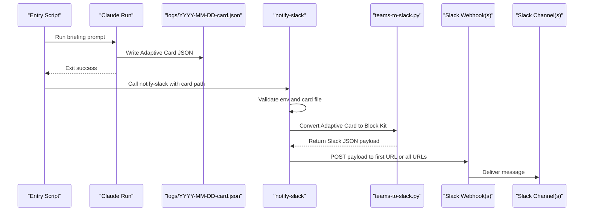

### Pipeline overview

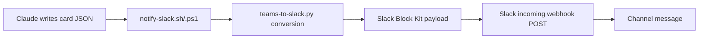

### Converter mapping path

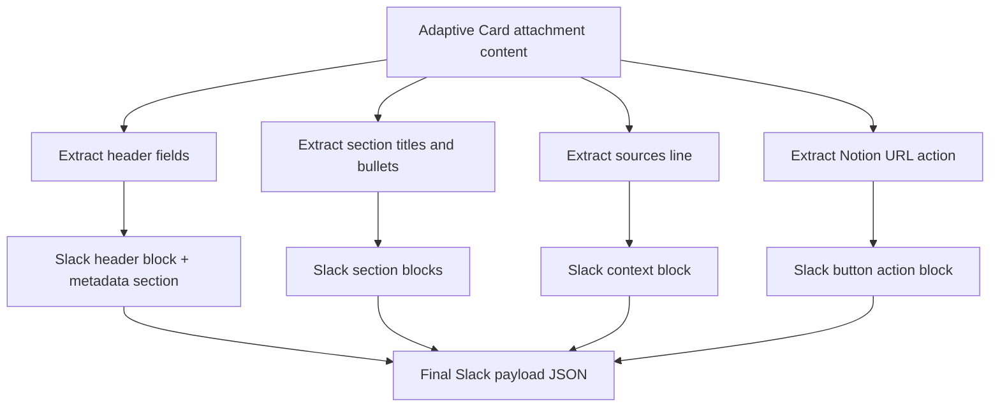

### Multi-webhook fan-out behavior

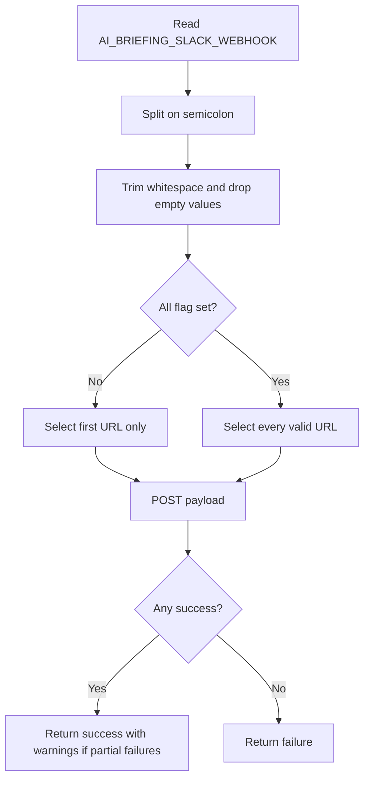

### Runtime decision point in entry scripts

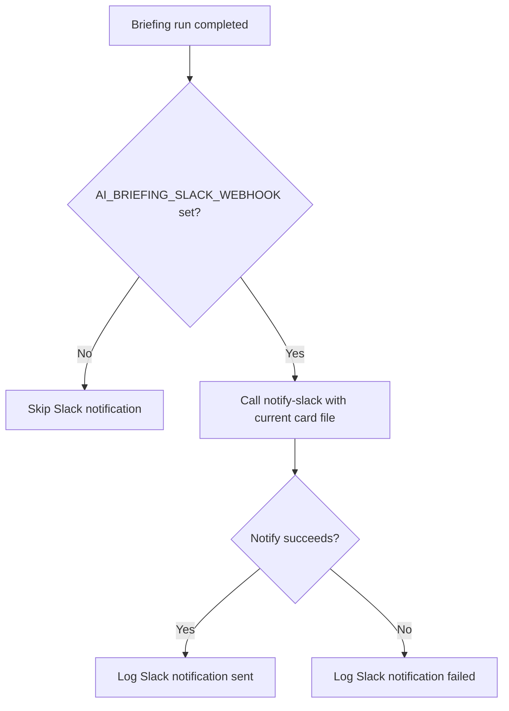

---

## 6. Testing

You can test Slack notification independently from a full briefing run.

### A. Test with explicit webhook URL and explicit card file

macOS / Linux:

```bash
bash scripts/notify-slack.sh \
  --webhook-url "https://hooks.slack.com/services/T.../B.../..." \
  --card-file logs/2026-03-24-card.json
```

Windows:

```powershell
.\scripts\notify-slack.ps1 `
  -WebhookUrl "https://hooks.slack.com/services/T.../B.../..." `
  -CardFile .\logs\2026-03-24-card.json
```

### B. Test with env var and all configured URLs

macOS / Linux:

```bash
bash scripts/notify-slack.sh --all --card-file logs/2026-03-24-card.json
```

Windows:

```powershell
.\scripts\notify-slack.ps1 -All -CardFile .\logs\2026-03-24-card.json
```

### C. Dry-run converter only

macOS / Linux:

```bash
python3 scripts/teams-to-slack.py logs/2026-03-24-card.json > /tmp/slack-payload.json
python3 -m json.tool /tmp/slack-payload.json
```

Windows:

```powershell
python3 .\scripts\teams-to-slack.py .\logs\2026-03-24-card.json .\logs\2026-03-24-slack.json
Get-Content .\logs\2026-03-24-slack.json -Raw | ConvertFrom-Json | Out-Null
```

### Expected outcomes

- Script reports `Slack notification sent (HTTP 2xx).`
- Message appears in channel with:
  - header,
  - date + counts,
  - topic sections,
  - source links,
  - `Open Full Briefing in Notion` button.

### Common operator checks

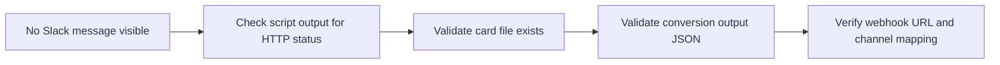

---

## 7. Slack Payload Format

`teams-to-slack.py` produces:

- top-level `text` fallback string,
- `blocks` array with Block Kit structures.

### Block order

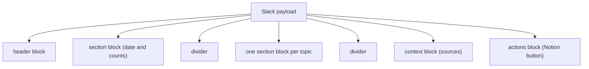

### Teams-to-Slack mapping

| Teams card concept | Slack Block Kit output |
|---|---|
| Accent header title | `header` block text |
| Date + counts | `section` block mrkdwn |
| Topic section title + bullets | `section` block mrkdwn |
| Sources emphasis container | `context` block with links |
| `Action.OpenUrl` Notion link | `actions` block with button |

### Link transformation behavior

- Markdown links `[title](url)` become Slack links `<url|title>`.
- `**bold**` gets converted to Slack `*bold*`.
- Source list is trimmed to fit Slack context limits.

### Size constraints enforced in converter

- Section text trimmed around Slack section limits.
- Context text trimmed around Slack context limits.
- Output always serialized as valid JSON (`ensure_ascii=True`).

---

## 8. Troubleshooting

### 1) `No webhook URL` error

Cause:
- `AI_BRIEFING_SLACK_WEBHOOK` not set, and no `--webhook-url` / `-WebhookUrl` supplied.

Fix:
- Set env var (Section 4), or pass explicit URL in command.

### 2) `Card file not found` error

Cause:
- Missing `logs/YYYY-MM-DD-card.json`.

Fix:
1. Confirm run date and file path.
2. Re-run briefing to regenerate card.
3. Pass `--card-file` / `-CardFile` explicitly.

### 3) Conversion fails (`Failed to convert card to Slack format`)

Cause:
- Python not available.
- Input card structure does not match expected shape.
- Converter script path missing.

Fix:
1. Verify Python: `python3 --version`.
2. Run converter directly to capture detail:
   - `python3 scripts/teams-to-slack.py logs/YYYY-MM-DD-card.json`
3. Ensure `scripts/teams-to-slack.py` exists.

### 4) HTTP non-2xx from Slack webhook

Cause:
- Invalid/rotated webhook URL.
- Revoked app permissions.
- Payload rejected by webhook endpoint.

Fix:
1. Re-issue webhook URL from Slack app config.
2. Post a minimal payload (`{"text":"test"}`) to verify endpoint.
3. Re-run notify script after URL update.

### 5) Partial success with multiple URLs

Cause:
- One or more channels/webhooks failed, others succeeded.

Behavior:
- Script exits success if at least one URL succeeds.
- Warnings are printed for each failed URL.

Fix:
- Rotate or remove failed webhook URLs from env var.

### 6) Script works manually but not in scheduler

Cause:
- Scheduler environment missing updated variables.

Fix:
- On Windows, `briefing.ps1` refreshes webhook vars from user registry at runtime.
- On macOS/Linux, ensure env var is available in the scheduled context.
- Test with a direct scheduled-equivalent shell command.

### 7) Message appears but formatting is odd

Cause:
- Source text too long, unusual markdown patterns, or edge-case card content.

Fix:
1. Inspect converted payload JSON.
2. Validate in Slack Block Kit Builder (paste the `blocks` array).
3. Adjust card text volume in prompt if needed.

### Troubleshooting decision tree

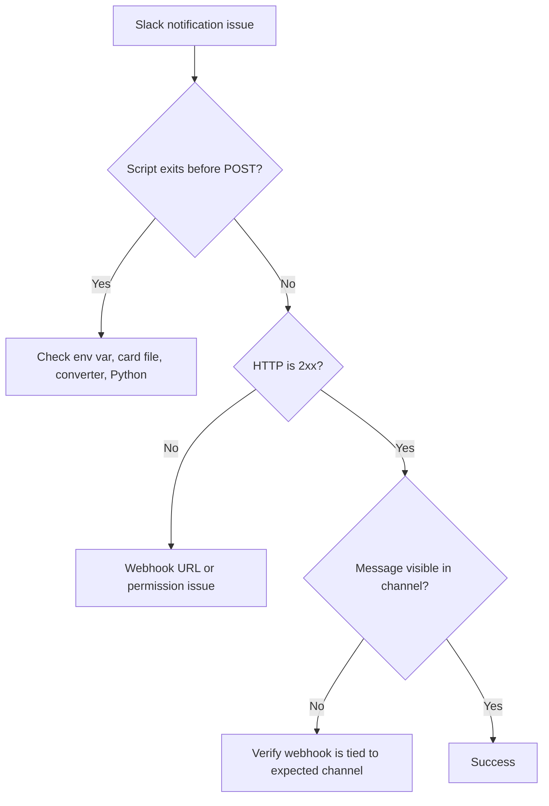

### Failure state model

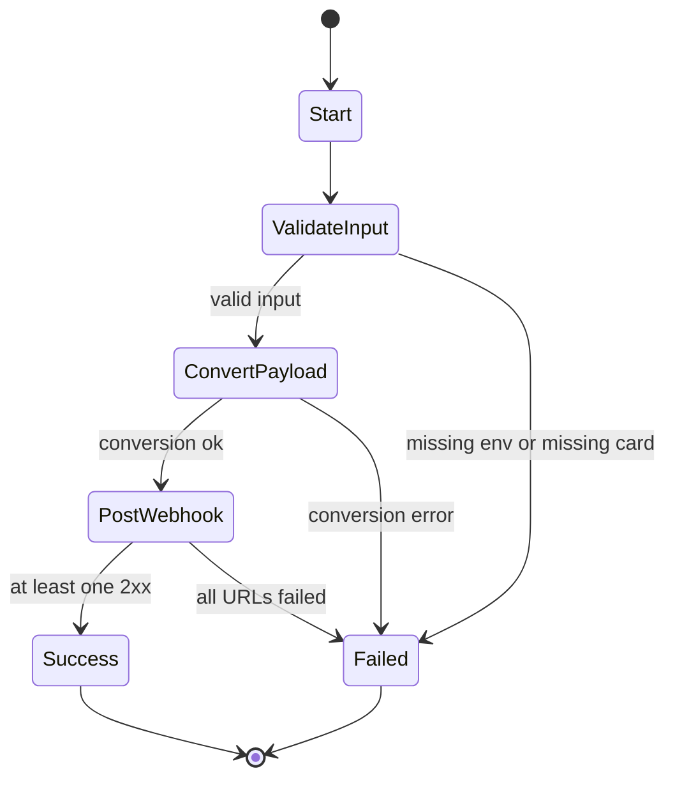

---

## 9. Files Involved

| File | Platform | Purpose |
|---|---|---|
| `scripts/notify-slack.sh` | macOS / Linux | Converts card JSON to Slack payload and POSTs via `curl` |
| `scripts/notify-slack.ps1` | Windows | Same flow in PowerShell with `Invoke-WebRequest` |
| `scripts/teams-to-slack.py` | Shared | Converts Teams Adaptive Card JSON to Slack Block Kit JSON |
| `logs/YYYY-MM-DD-card.json` | Shared | Input card generated by Claude in Step 4 |
| `briefing.sh` | macOS / Linux | Entry script that conditionally calls Slack notify |
| `briefing.ps1` | Windows | Entry script that conditionally calls Slack notify |

### Integration point

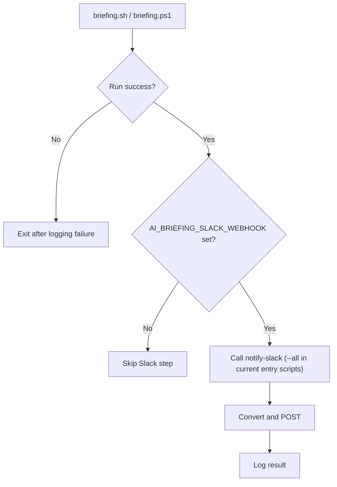

---

## 10. Operational Notes and Best Practices

1. Keep webhook URLs in environment variables only. Do not commit them to Git.
2. Prefer semicolon-separated URLs for controlled fan-out across channels.
3. Keep card content concise so converted Slack blocks remain readable.
4. Test with explicit `--card-file` when replaying a historical run.
5. Monitor logs for partial failures when using multiple webhooks.
6. If Slack delivery is business-critical, consider alerting on notify failures.

### Suggested runbook checks

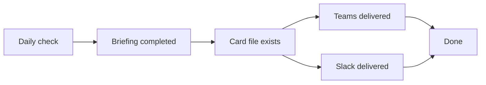

---

## Related Documentation

- [README.md](README.md)
- [ARCHITECTURE.md](ARCHITECTURE.md)
- [E2E_FLOW.md](E2E_FLOW.md)
- [NOTIFY_TEAMS.md](NOTIFY_TEAMS.md)

