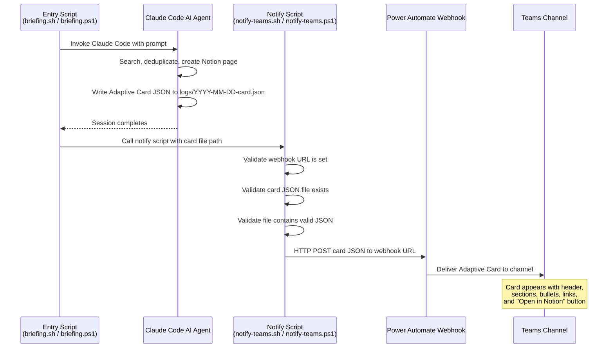
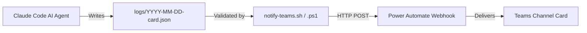
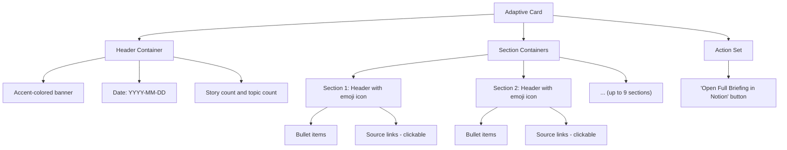
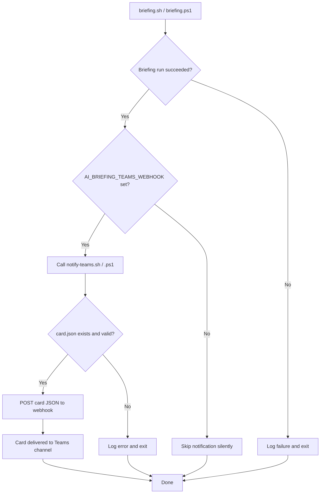

# Microsoft Teams Integration: Adaptive Card Notifications


This document describes the Microsoft Teams notification feature -- an optional post-run step that sends a rich Adaptive Card summary of the daily briefing to a Teams channel via a Power Automate webhook.

---

## Table of Contents

1. [Overview](#1-overview)
2. [Prerequisites](#2-prerequisites)
3. [Setup: Creating the Webhook in Teams](#3-setup-creating-the-webhook-in-teams)
4. [Setting the Environment Variable](#4-setting-the-environment-variable)
5. [How It Works](#5-how-it-works)
6. [Testing](#6-testing)
7. [Adaptive Card Format](#7-adaptive-card-format)
8. [Troubleshooting](#8-troubleshooting)
9. [Files Involved](#9-files-involved)

---

## 1. Overview

During the briefing run, the Claude Code AI agent writes a fully-formed Adaptive Card JSON file directly to `logs/YYYY-MM-DD-card.json`. After the run completes, the entry point scripts (`briefing.sh` on macOS, `briefing.ps1` on Windows) call a platform-native notification script (`notify-teams.sh` or `notify-teams.ps1`). Those scripts validate that the card file exists and contains valid JSON, then POST it as-is to a Power Automate webhook URL. No Python. No log parsing. No intermediate transformation.

The result is a rich, interactive summary card delivered directly to your Teams channel -- giving the team immediate visibility into the daily briefing without opening Notion.

### Why it exists

Not everyone on a team checks Notion first thing in the morning. Teams is where conversations happen, so pushing a structured summary there ensures the briefing reaches people where they already are. The Adaptive Card format provides a scannable overview with clickable source links and a direct button to the full briefing in Notion.

---

## 2. Prerequisites

| Requirement | Details |
|---|---|
| **Microsoft Teams** | A Teams workspace where you have permission to add workflows to a channel |
| **Power Automate** | Access to the Workflows app in Teams (included with most Microsoft 365 plans) |
| **Webhook URL** | A Power Automate webhook URL for your target Teams channel (setup instructions below) |
| **A completed briefing run** | The notification reads a card JSON file, so at least one successful run must exist in `logs/` |

---

## 3. Setup: Creating the Webhook in Teams

> [!IMPORTANT]
> **Important:** The legacy "Incoming Webhook" connector in Teams is deprecated and will stop working. Use the Power Automate Workflows approach described below instead.

There are two ways to create the webhook. Both produce the same result -- a URL that accepts HTTP POST requests and delivers an Adaptive Card to your channel.

### Option A: From the Channel Context Menu (Recommended)

This is the fastest path if you just want alerts in a specific channel.

1. In Microsoft Teams, navigate to the channel where you want notifications.
2. Click the **ellipsis (...)** next to the channel name to open the context menu.
3. Select **Workflows**.
4. Search for and select the **"Post to a channel when a webhook request is received"** template.
5. Give the workflow a name (e.g., `AI Briefing Notification`).
6. Confirm the target channel.
7. Click **Add workflow**.
8. Copy the webhook URL that is displayed -- you will need this for the environment variable.

### Option B: From Scratch in the Workflows App

Use this approach if the template is not available in your tenant or you want more control over the flow.

1. Open the **Workflows** app in Teams (click the Apps icon in the left sidebar, search for "Workflows").
2. Click **Create** to build a new flow from scratch.
3. **Trigger:** Search for and select **"When a Teams webhook request is received"**.
4. **Action:** Add the action **"Post card in a chat or channel"**.
   - **Post as:** Flow bot
   - **Post in:** Channel
   - **Team:** Select your team
   - **Channel:** Select the target channel
   - **Adaptive Card:** Use the dynamic content from the trigger (the body of the incoming webhook request)
5. Save the flow.
6. Return to the trigger step and copy the generated **HTTP POST URL** -- this is your webhook URL.

### Verifying the Webhook

You can verify the webhook is working with a minimal test before configuring the full integration:

**macOS / Linux:**

```bash
curl -X POST "<your-webhook-url>" \
  -H "Content-Type: application/json" \
  -d '{
    "type": "message",
    "attachments": [{
      "contentType": "application/vnd.microsoft.card.adaptive",
      "content": {
        "type": "AdaptiveCard",
        "$schema": "http://adaptivecards.io/schemas/adaptive-card.json",
        "version": "1.4",
        "body": [{
          "type": "TextBlock",
          "text": "Webhook is working!",
          "weight": "Bolder",
          "size": "Large"
        }]
      }
    }]
  }'
```

**Windows (PowerShell):**

```powershell
$body = @{
    type = "message"
    attachments = @(@{
        contentType = "application/vnd.microsoft.card.adaptive"
        content = @{
            type = "AdaptiveCard"
            '$schema' = "http://adaptivecards.io/schemas/adaptive-card.json"
            version = "1.4"
            body = @(@{
                type = "TextBlock"
                text = "Webhook is working!"
                weight = "Bolder"
                size = "Large"
            })
        }
    })
} | ConvertTo-Json -Depth 10

Invoke-RestMethod -Uri "<your-webhook-url>" -Method Post -ContentType "application/json" -Body $body
```

If the webhook is correctly configured, you should see a card with "Webhook is working!" appear in your Teams channel.

---

## 4. Setting the Environment Variable

The webhook URL is stored in the `AI_BRIEFING_TEAMS_WEBHOOK` environment variable. Set it persistently so it survives terminal restarts and system reboots.

### macOS / Linux

Add the export to your shell profile:

```bash
echo 'export AI_BRIEFING_TEAMS_WEBHOOK="https://prod-XX.westus.logic.azure.com:443/workflows/..."' >> ~/.zshrc
```

If you use bash instead of zsh, replace `~/.zshrc` with `~/.bash_profile`.

Reload the profile:

```bash
source ~/.zshrc
```

**Verify:**

```bash
echo $AI_BRIEFING_TEAMS_WEBHOOK
```

### Windows

Set a persistent user-level environment variable in PowerShell:

```powershell
[Environment]::SetEnvironmentVariable("AI_BRIEFING_TEAMS_WEBHOOK", "https://prod-XX.westus.logic.azure.com:443/workflows/...", "User")
```

Close and reopen your terminal for the change to take effect.

**Verify:**

```powershell
[Environment]::GetEnvironmentVariable("AI_BRIEFING_TEAMS_WEBHOOK", "User")
```

> [!NOTE]
> **Note:** Do not commit the webhook URL to version control. The `AI_BRIEFING_TEAMS_WEBHOOK` variable is read at runtime by the notification scripts and is never written to any tracked file.

---

## 5. How It Works

### Data Flow



### Pipeline Overview



### Step-by-Step

1. **Card generation.** During the briefing run, the Claude Code AI agent writes the final Adaptive Card JSON directly to `logs/YYYY-MM-DD-card.json` as the last step of its session. This is the exact payload that Teams will receive -- no intermediate format, no transformation.
2. **Trigger.** After the Claude Code session completes, the entry script (`briefing.sh` or `briefing.ps1`) calls the platform-native notify script.
3. **Validation.** The notify script checks that the `AI_BRIEFING_TEAMS_WEBHOOK` environment variable is set and that the card JSON file for the current run exists. If either is missing, it exits silently (notifications are optional -- a missing webhook does not fail the run). It then validates that the file contains well-formed JSON.
4. **Delivery.** The notify script POSTs the card JSON file as-is to the Power Automate webhook URL using `curl` (macOS/Linux) or `Invoke-RestMethod` (Windows). Power Automate receives the payload and delivers the Adaptive Card to the configured Teams channel.

---

## 6. Testing

You can test the Teams notification independently of a full briefing run by calling the notify scripts directly with explicit arguments.

### macOS / Linux

```bash
./scripts/notify-teams.sh \
  --webhook-url "https://prod-XX.westus.logic.azure.com:443/workflows/..." \
  --card-file ./logs/2026-03-13-card.json
```

### Windows (PowerShell)

```powershell
.\scripts\notify-teams.ps1 `
  -WebhookUrl "https://prod-XX.westus.logic.azure.com:443/workflows/..." `
  -CardFile .\logs\2026-03-13-card.json
```

### What to Expect

- If the webhook URL and card file are valid, you should see a card appear in your Teams channel within a few seconds.
- The script prints the HTTP response status code to stdout. A `200` or `202` indicates success.
- If you do not have a card file from a real run, you can craft a test card JSON following the format in [Section 7](#7-adaptive-card-format) or use an existing one from the `logs/` directory.

### Inspecting a Card File

> [!NOTE]
> To verify a card file is valid JSON before sending:

```bash
python3 -m json.tool ./logs/2026-03-13-card.json
```

You can also paste the `content` object (inside `attachments[0].content`) into the [Adaptive Card Designer](https://adaptivecards.io/designer/) to preview how it will render in Teams.

---

## 7. Adaptive Card Format

The Adaptive Card is generated directly by the Claude Code AI agent during the briefing run and written to `logs/YYYY-MM-DD-card.json`. There is no separate parser or builder -- the AI writes the final JSON payload following the [Microsoft Adaptive Card schema v1.4](https://adaptivecards.io/explorer/). The skill prompt enforces the structure, size limits, and encoding rules described below.

### Card Structure



### Card Elements

| Element | Description |
|---|---|
| **Full-width layout** | The card uses `"msteams": { "width": "Full" }` to span the entire width of the Teams message pane, maximizing readability |
| **Accent header banner** | A `Container` with `"style": "accent"` background containing the briefing date, story count, and topic count in bold text |
| **Section headers** | Each of the 9 topic sections gets a `TextBlock` header with an emoji icon prefix (e.g., "🤖 Claude Code / Anthropic", "🏛️ AI Policy & Regulation") |
| **Bullet items** | Each news item within a section is rendered as a `TextBlock` with a bullet character prefix, using `"wrap": true` for proper text flow |
| **Source links** | URLs extracted from the briefing are rendered as clickable inline links within the bullet text |
| **Action button** | An `Action.OpenUrl` button labeled "Open Full Briefing in Notion" links directly to the Notion page URL extracted from the log |

### Example Card Layout

```
┌──────────────────────────────────────────────────────┐
│  ██████████████████████████████████████████████████  │
│  📰 AI Daily Briefing — 2026-03-13                   │
│  12 stories · 9 topics                               │
│  ██████████████████████████████████████████████████  │
│                                                      │
│  🤖 Claude Code / Anthropic                          │
│  • Claude Code ships multi-file editing in v2.8      │
│  • Anthropic publishes new safety benchmarks         │
│                                                      │
│  🧠 OpenAI / Codex / ChatGPT                         │
│  • OpenAI announces Codex integration with VS Code   │
│  • ChatGPT adds real-time web browsing in free tier  │
│                                                      │
│  ... (remaining sections) ...                        │
│                                                      │
│  ┌──────────────────────────────────────────────┐    │
│  │       Open Full Briefing in Notion           │    │
│  └──────────────────────────────────────────────┘    │
└──────────────────────────────────────────────────────┘
```

---

## 8. Troubleshooting

### HTTP 400 Bad Request

**Cause:** The Adaptive Card JSON payload is malformed or does not conform to the schema expected by Power Automate.

**Fix:**

1. Inspect the card file: `python3 -m json.tool ./logs/2026-03-13-card.json`
2. Validate the output against the [Adaptive Card Designer](https://adaptivecards.io/designer/) by pasting the `attachments[0].content` object.
3. Common causes: unescaped special characters in news text, missing required fields (`type`, `version`), or payload exceeding the 28 KB size limit for Teams cards.

### HTTP 401 or 403

**Cause:** The webhook URL is invalid, expired, or the Power Automate flow has been turned off.

**Fix:**

1. Verify the flow is still active in the Workflows app in Teams.
2. If the flow was deleted or recreated, you will need to update `AI_BRIEFING_TEAMS_WEBHOOK` with the new URL.

### Card File Not Found

**Symptom:** The notify script exits with "Card file not found" and no card appears in Teams.

**Cause:** The Claude Code AI agent did not write the card JSON file during the briefing run. This can happen if the session ended early, hit a budget limit, or the skill prompt's Step 4 was not reached.

**Fix:**

1. Check the log file (`logs/YYYY-MM-DD.log`) to see how far the AI session progressed.
2. Re-run the briefing. The skill prompt explicitly requires Step 4 (Write Teams Card JSON).
3. If the problem persists, verify the skill prompt in `~/.claude/commands/ai-news-briefing.md` still includes the card-writing step.

### Card File Is Not Valid JSON

**Symptom:** The notify script exits with "not valid JSON" and no card appears in Teams.

**Cause:** The AI wrote malformed JSON to the card file. This is rare but can happen if the session was interrupted or the AI produced truncated output.

**Fix:**

1. Inspect the file: `python3 -m json.tool ./logs/YYYY-MM-DD-card.json` -- the error message will indicate where the JSON is malformed.
2. If the fix is minor (e.g., a trailing comma or missing brace), edit the file and re-run the notify script directly.
3. If the file is severely malformed, delete it and re-run the briefing.

### Environment Variable Not Set

**Symptom:** The notify script exits silently and no card appears in Teams. The briefing itself completes normally.

**Fix:**

1. Confirm the variable is set:
   - macOS: `echo $AI_BRIEFING_TEAMS_WEBHOOK`
   - Windows: `[Environment]::GetEnvironmentVariable("AI_BRIEFING_TEAMS_WEBHOOK", "User")`
2. If empty, follow the setup instructions in [Section 4](#4-setting-the-environment-variable).
3. If you set it in the current session but the scheduled task does not pick it up, restart the terminal or (on Windows) log out and back in. Scheduled tasks inherit the environment at session start.

### Power Automate Template Not Found

**Symptom:** The "Post to a channel when a webhook request is received" template does not appear in the Workflows menu.

**Fix:**

1. Your Microsoft 365 plan may not include Power Automate, or your tenant admin may have restricted flow creation. Check with your IT admin.
2. Use [Option B](#option-b-from-scratch-in-the-workflows-app) to create the flow manually from the Workflows app.
3. If the Workflows app itself is not available, ask your admin to enable it or use the [Power Automate web portal](https://make.powerautomate.com/) to build the flow.

### Card Appears But Is Empty or Truncated

**Cause:** The AI wrote a structurally valid card but with incomplete content. This can happen if the briefing run hit a budget limit mid-way through card generation or if it was a slow news day with very few stories.

**Fix:**

1. Inspect the card file: `python3 -m json.tool ./logs/YYYY-MM-DD-card.json` and check if it contains the expected sections and bullets.
2. If the card is truncated, re-run the briefing. The AI will generate a fresh card from the new run.
3. The "Open Full Briefing in Notion" button provides access to the complete content even if the card itself is abbreviated.

### Card Exceeds Size Limit

**Cause:** Adaptive Cards in Teams have a ~28 KB payload limit. An unusually long briefing can exceed this.

**Fix:** The AI skill prompt enforces a 26 KB limit on the card JSON. If the card still exceeds the limit, trim bullet text in the card file and re-run the notify script. The "Open Full Briefing in Notion" button provides access to the complete content.

---

## 9. Files Involved

| File | Platform | Purpose |
|---|---|---|
| `scripts/notify-teams.sh` | macOS / Linux | Shell wrapper -- validates card JSON file, POSTs it to the webhook |
| `scripts/notify-teams.ps1` | Windows | PowerShell wrapper -- same logic as the shell variant using `Invoke-RestMethod` |
| `scripts/build-teams-card.py` | Shared | **Legacy.** Old log parser that extracted briefing content from log files. Kept in repo but no longer referenced by any active script |
| `logs/YYYY-MM-DD-card.json` | Shared | Adaptive Card JSON payload written directly by the Claude Code AI agent during the briefing run. This is the file that gets POSTed to Teams |
| `briefing.sh` | macOS | Entry point that calls `notify-teams.sh` after a successful run |
| `briefing.ps1` | Windows | Entry point that calls `notify-teams.ps1` after a successful run |

### Integration Point

The notification scripts are called at the end of the entry point scripts, after the Claude Code run completes and the log file is written. The call is conditional -- if `AI_BRIEFING_TEAMS_WEBHOOK` is not set, the notify script exits immediately with no error, making the entire Teams integration opt-in.



---

## Author

**Son Nguyen** &mdash; [github.com/hoangsonww](https://github.com/hoangsonww) &middot; [sonnguyenhoang.com](https://sonnguyenhoang.com)
