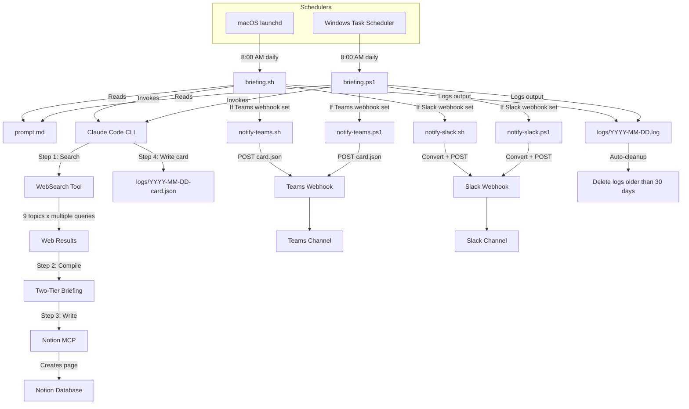
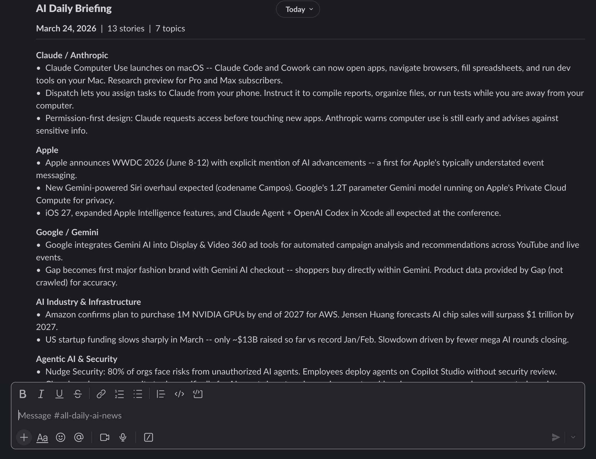

# AI News Briefing


Automated daily AI news research agent that searches the web, compiles a structured briefing, publishes it to Notion, and delivers a styled summary to Microsoft Teams -- powered by Claude Code CLI. Supports both macOS (launchd) and Windows (Task Scheduler). Fully automated pipeline with zero manual intervention required after setup.

> [!NOTE]
> **Live Notion page:** [https://hoangsonw.notion.site/9c34d052d9354beda82a3423e2d2f404?v=d43c53fe405c4896bfd95ad0cc22246f](https://hoangsonw.notion.site/9c34d052d9354beda82a3423e2d2f404?v=d43c53fe405c4896bfd95ad0cc22246f)

## Overview

AI News Briefing is a fully automated pipeline that runs every morning on your machine. It uses Claude Code in headless mode to act as a news research agent: searching the web across 9 AI-related topics, compiling the results into a two-tier briefing (TL;DR + full report), writing the finished page directly to a Notion database, and optionally posting a styled Adaptive Card summary to Microsoft Teams.

The entire process -- from triggering to publishing -- requires zero human intervention. You wake up, open Notion (or Teams), and your daily AI briefing is already there.

### Why it exists

Keeping up with AI news across models, tools, policy, funding, and open source is a full-time job. This project compresses that into an automated daily digest that covers 9 topic areas in a consistent format, delivered to your Notion workspace before you start your workday.

## Architecture



**Data flow summary:**

1. The platform scheduler fires the entry point script (`briefing.sh` on macOS, `briefing.ps1` on Windows) at the configured time each day.
2. The script reads the prompt from `prompt.md` and passes it to the Claude Code CLI in print mode.
3. Claude Code executes the prompt as an agentic task -- performing web searches, compiling results, and calling the Notion MCP tool.
4. Notion receives the finished briefing as a new database page.
5. If the `AI_BRIEFING_TEAMS_WEBHOOK` environment variable is set, the entry point script calls `notify-teams.sh` / `notify-teams.ps1`, which validates and POSTs the pre-built `logs/YYYY-MM-DD-card.json` file (written by Claude in Step 4) to the configured Teams webhook.
6. If the `AI_BRIEFING_SLACK_WEBHOOK` environment variable is set, the entry point script calls `notify-slack.sh` / `notify-slack.ps1`, which converts the Teams card to Slack Block Kit format and POSTs it to the configured Slack webhook.
7. Logs are written to a date-stamped file and automatically pruned after 30 days.

## Prerequisites

| Requirement | Details |
|---|---|
| **OS** | macOS or Windows 10/11 |
| **Claude Code CLI** | Installed at `~/.local/bin/claude` with a valid Anthropic API key or Max subscription |
| **Notion MCP** | The Notion MCP server must be configured in Claude Code's MCP settings with access to your workspace |
| **WebSearch tool** | Available by default in Claude Code (no extra setup needed) |
| **Python 3.x** | Optional (legacy card builder only, not used in current flow) |
| **Make** (optional) | GNU Make for using the Makefile task runner (`winget install GnuWin32.Make` on Windows, pre-installed on macOS) |

## Installation

### 1. Clone the project

```bash
git clone https://github.com/hoangsonww/AI-News-Briefing
cd AI-News-Briefing
```

### 2. Platform-specific setup

#### macOS (launchd)

```bash
# Make the shell script executable
chmod +x ~/ai-news-briefing/briefing.sh

# Install the launchd plist
cp ~/ai-news-briefing/com.ainews.briefing.plist ~/Library/LaunchAgents/
launchctl load ~/Library/LaunchAgents/com.ainews.briefing.plist

# Verify the agent is registered
launchctl list | grep ainews
```

Optionally, set up the manual trigger command:

```bash
mkdir -p ~/.local/bin
cat > ~/.local/bin/ai-news << 'EOF'
#!/bin/bash
echo "Starting AI News Briefing..."
launchctl kickstart "gui/$(id -u)/com.ainews.briefing"
echo "Running. Check Notion or: tail -f ~/ai-news-briefing/logs/$(date +%Y-%m-%d).log"
EOF
chmod +x ~/.local/bin/ai-news
```

Make sure `~/.local/bin` is in your `PATH` (add `export PATH="$HOME/.local/bin:$PATH"` to your `~/.zshrc` if needed).

#### Windows (Task Scheduler)

Open PowerShell and run the installer script:

```powershell
cd $env:USERPROFILE\ai-news-briefing
.\install-task.ps1
```

This registers a Task Scheduler task named `AiNewsBriefing` that runs daily at 8:00 AM under the current user account.

To customize the time:

```powershell
.\install-task.ps1 -Hour 7 -Minute 30
```

## Configuration

### Change the schedule

**macOS:** Edit `com.ainews.briefing.plist` and modify the `StartCalendarInterval` section, then reload:

```bash
launchctl unload ~/Library/LaunchAgents/com.ainews.briefing.plist
launchctl load ~/Library/LaunchAgents/com.ainews.briefing.plist
```

**Windows:** Re-run the installer with new time parameters:

```powershell
.\install-task.ps1 -Hour 9 -Minute 0
```

### Change the model

Edit the entry point script for your platform:

- **macOS:** `briefing.sh` -- change the `--model sonnet` flag
- **Windows:** `briefing.ps1` -- change the `--model sonnet` argument

**Model trade-offs:**

| Model | Speed | Cost | Quality |
|---|---|---|---|
| `haiku` | Fastest | Lowest | Good for basic summaries |
| `sonnet` | Balanced | Moderate | Recommended default |
| `opus` | Slowest | Highest | Best for deep analysis |

### Change the budget cap

Edit the `--max-budget-usd` value in `briefing.sh` (macOS) or `briefing.ps1` (Windows). The default is `2.00` (USD per run). This acts as a safety cap -- if the agent's token usage would exceed this amount, the run stops.

### Change the topics

Edit `prompt.md` and modify the "Topics to Search" list. You can add, remove, or rename topics. If you change the number of topics, also update the `"Topics": 9` value in the Notion properties section at the bottom of the prompt.

## Usage

### Automatic (scheduled)

Once installed, the briefing runs automatically every day at the scheduled time (default: 8:00 AM). No action needed.

### Manual trigger

**Using Make (recommended, cross-platform):**

```bash
make run            # Run in foreground
make run-bg         # Run in background
make run-scheduled  # Trigger via OS scheduler
```

**Platform-native:**

```bash
# macOS
ai-news
# or: launchctl kickstart "gui/$(id -u)/com.ainews.briefing"

# Windows (PowerShell or cmd)
schtasks /run /tn AiNewsBriefing
```

### Watch the progress

```bash
make tail           # Cross-platform: tail today's log
```

Or platform-native:

```bash
# macOS
tail -f ~/ai-news-briefing/logs/$(date +%Y-%m-%d).log

# Windows (PowerShell)
Get-Content "$env:USERPROFILE\ai-news-briefing\logs\$(Get-Date -Format 'yyyy-MM-dd').log" -Wait
```

A typical successful run takes 2-4 minutes and ends with a message like:

```
2026-03-09 14:08:08 Briefing complete. Check Notion for today's report.
```

### Makefile Reference

The project includes a cross-platform `Makefile` that auto-detects your OS and routes commands to the correct platform tools. Requires GNU Make.

| Target | Description |
|---|---|
| `make help` | Show all targets with descriptions |
| `make run` | Run briefing in foreground |
| `make run-bg` | Run briefing in background |
| `make run-scheduled` | Trigger via OS scheduler |
| `make tail` | Tail today's log live |
| `make log` | Print today's log |
| `make logs` | List all log files with sizes |
| `make log-date D=YYYY-MM-DD` | Print log for a specific date |
| `make clean-logs` | Delete logs older than 30 days |
| `make purge-logs` | Delete all logs |
| `make install` | Install platform scheduler |
| `make uninstall` | Remove platform scheduler |
| `make status` | Show scheduler status |
| `make check` | Verify Claude CLI is installed |
| `make validate` | Validate all project files and prompt structure |
| `make prompt` | Print the current prompt |
| `make info` | Show config summary (model, budget, paths) |

### Utility Scripts Reference

The `scripts/` directory contains 13 utility script pairs (`.sh` for macOS/Linux, `.ps1` for Windows) for managing and troubleshooting the system.

| Script | Description | Example Usage |
|---|---|---|
| `health-check` | Verify full setup (CLI, files, prompt structure, scheduler) | `bash scripts/health-check.sh` |
| `log-summary` | Tabular summary of recent runs with status and size | `bash scripts/log-summary.sh 14` |
| `log-search` | Search across all logs by keyword with context | `bash scripts/log-search.sh --search "Anthropic" --context 3` |
| `dry-run` | Run the full pipeline without writing to Notion | `bash scripts/dry-run.sh --model haiku --budget 1.00` |
| `test-notion` | Quick Notion MCP connectivity test | `bash scripts/test-notion.sh` |
| `cost-report` | Estimate API costs from log history | `bash scripts/cost-report.sh --month 2026-03` |
| `export-logs` | Archive logs to tar.gz (Unix) or zip (Windows) | `bash scripts/export-logs.sh --from 2026-03-01 --to 2026-03-09` |
| `backup-prompt` | Version prompt.md with timestamped backups | `bash scripts/backup-prompt.sh --list` |
| `topic-edit` | Add, remove, or list topics in prompt.md | `bash scripts/topic-edit.sh --add "AI Hardware" "GPU news"` |
| `update-schedule` | Change daily run time | `bash scripts/update-schedule.sh --hour 7 --minute 30` |
| `notify` | Send native OS notification for briefing status | `bash scripts/notify.sh` |
| `notify-teams` | Validate and POST pre-built `card.json` to Microsoft Teams webhook(s) | `bash scripts/notify-teams.sh` or `--all` for multiple |
| `notify-slack` | Convert Teams card to Slack Block Kit and POST to Slack webhook(s) | `bash scripts/notify-slack.sh` or `--all` for multiple |
| `uninstall` | Remove scheduler; `--all` also removes logs and backups | `bash scripts/uninstall.sh --all` |

**Windows equivalents** use the same names with `.ps1` extension and PowerShell parameter syntax (e.g., `.\scripts\health-check.ps1`, `.\scripts\topic-edit.ps1 -Action add -Name "AI Hardware" -Description "GPU news"`).

## Notion Setup

### Database schema

The prompt expects a Notion database with at least these properties:

| Property | Type | Example Value |
|---|---|---|
| `Date` | Title | `2026-03-09 - AI Daily Briefing` |
| `Status` | Select or Text | `Complete` |
| `Topics` | Number | `9` |

You can add additional properties to the database (tags, priority, etc.), but the three above are what the agent writes to.

### Data source ID

The prompt references a specific Notion data source ID:

```
856794cc-d871-4a95-be2d-2a1600920a19
```

To use your own database, replace this value in `prompt.md` (in the Step 3 section). To find your data source ID:

1. Open Claude Code and ensure the Notion MCP is connected.
2. Ask Claude: "List my Notion data sources" or use the `notion-search` MCP tool.
3. Copy the `data_source_id` for the database you want to use.
4. Replace the ID in `prompt.md`.

### Page format

Each generated page contains:

- **TL;DR** -- 10-15 bullet points covering the biggest stories (roughly a 1-minute read)
- **Divider**
- **Full Briefing** -- 9 sections (one per topic), each with 3-8 detailed bullet points and source attribution
- **Key Takeaways table** -- a summary table of major trends and signals

## Teams Integration

The pipeline can optionally post a styled [Adaptive Card](https://adaptivecards.io/) with the full briefing to a Microsoft Teams channel via an incoming webhook. The AI generates the Adaptive Card JSON directly during the briefing run (Step 4), writing it to `logs/YYYY-MM-DD-card.json`. The notify script validates the JSON and POSTs it to the webhook as-is -- no intermediate parsing or transformation. See [E2E_FLOW.md](E2E_FLOW.md) for the full technical walkthrough.

## Slack Integration

The pipeline can also post a formatted briefing to Slack channels. The `notify-slack` script reads the same Teams card JSON (`logs/YYYY-MM-DD-card.json`), converts it to Slack [Block Kit](https://api.slack.com/block-kit) format using `scripts/teams-to-slack.py`, and POSTs it to a Slack incoming webhook.

### Slack setup

1. Create a Slack app with an incoming webhook at [api.slack.com/apps](https://api.slack.com/apps).
2. Set the `AI_BRIEFING_SLACK_WEBHOOK` environment variable to the webhook URL.
3. The next briefing run will automatically post to Slack.

**macOS / Linux:**

```bash
export AI_BRIEFING_SLACK_WEBHOOK="https://hooks.slack.com/services/T.../B.../..."
```

**Windows (PowerShell):**

```powershell
[Environment]::SetEnvironmentVariable("AI_BRIEFING_SLACK_WEBHOOK", "https://hooks.slack.com/services/T.../B.../...", "User")
```

Multiple webhook URLs work the same as Teams -- semicolon-separated, first URL by default, `--all` for all:

```bash
bash scripts/notify-slack.sh --all
```

### Quick setup

1. Create an incoming webhook in your Teams channel (see [NOTIFY_TEAMS.md](NOTIFY_TEAMS.md) for the full walkthrough).
2. Set the `AI_BRIEFING_TEAMS_WEBHOOK` environment variable to the webhook URL.
3. The next briefing run will automatically detect the variable and post to Teams.

### Set the webhook URL persistently

**macOS / Linux:**

```bash
# Add to ~/.zshrc (or ~/.bashrc)
export AI_BRIEFING_TEAMS_WEBHOOK="<url>"
```

**Windows (PowerShell):**

```powershell
[Environment]::SetEnvironmentVariable("AI_BRIEFING_TEAMS_WEBHOOK", "<url>", "User")
```

### Multiple webhook URLs

You can configure multiple webhook URLs by separating them with semicolons. By default, only the **first** URL is used. Pass `--all` (bash) or `-All` (PowerShell) to post to all of them.

```bash
# Set multiple URLs (semicolon-separated)
export AI_BRIEFING_TEAMS_WEBHOOK="https://first-webhook;https://second-webhook"

# Post to first URL only (default)
bash scripts/notify-teams.sh

# Post to all URLs
bash scripts/notify-teams.sh --all
```

### Test the integration

**macOS / Linux:**

```bash
bash scripts/notify-teams.sh
```

**Windows:**

```powershell
.\scripts\notify-teams.ps1
```

For detailed setup instructions, troubleshooting, and card customization, see [NOTIFY_TEAMS.md](NOTIFY_TEAMS.md).

## How the Prompt Works

The prompt (`prompt.md`) instructs Claude to execute four sequential steps within a single agentic session:

### Step 1: Search for News

Claude uses the WebSearch tool to perform multiple searches per topic, targeting news from the past 24-48 hours. The search strategy includes date-qualified queries like `"[topic] news today 2026-03-09"` and company-specific queries.

### Step 2: Compile the Briefing

Search results are synthesized into a two-tier format:

- **Tier 1 (TL;DR):** 10-15 one-sentence bullet points covering the top stories across all topics. Designed as a quick-scan summary.
- **Tier 2 (Full Briefing):** 9 sections with detailed coverage, source attribution, and a closing Key Takeaways table.

### Step 3: Write to Notion

Claude checks whether a page for today already exists (captured during Step 0b). If one exists, it updates the page in place. If not, it creates a new page in the target database. This prevents duplicate pages when the briefing runs multiple times in a day.

### Step 4: Generate Teams Card JSON

Claude writes a complete Adaptive Card JSON payload to `logs/YYYY-MM-DD-card.json`. This is the exact file that gets POSTed to the Teams webhook -- no parser or transformation sits between the AI output and Teams. The card includes a styled header, TL;DR bullets, topic sections, and an action button linking to the full Notion page.

Here is what a card looks like in Teams:

<p align="center">
  
</p>

And in Slack:

<p align="center">
  
</p>

## Topic Coverage

| # | Topic | What It Covers |
|---|---|---|
| 1 | Claude Code / Anthropic | New features, releases, Anthropic announcements, blog posts |
| 2 | OpenAI / Codex / ChatGPT | Model updates, Codex features, ChatGPT capabilities, API changes |
| 3 | AI Coding IDEs | Cursor, Windsurf, GitHub Copilot, Xcode AI, JetBrains AI, Google Antigravity |
| 4 | Agentic AI Ecosystem | Agent frameworks (LangChain, CrewAI, AutoGen), MCP updates, new agent products |
| 5 | AI Industry | New model releases, benchmarks, major company announcements |
| 6 | Open Source AI | Llama, Mistral, DeepSeek, Hugging Face, open-weight model releases |
| 7 | AI Startups & Funding | Funding rounds, acquisitions, notable startup launches |
| 8 | AI Policy & Regulation | Government policy, EU AI Act, state laws, AI safety developments |
| 9 | Dev Tools & Frameworks | Vercel, Next.js, React Native, TypeScript, AI-related developer tooling |

## Logs

### Location

All logs are stored in the `logs/` directory within the project:

| File | Contents |
|---|---|
| `YYYY-MM-DD.log` | Full output from each run (timestamps, Claude output, success/failure) |
| `launchd-stdout.log` | (macOS only) Standard output captured by launchd |
| `launchd-stderr.log` | (macOS only) Standard error captured by launchd |

Additionally, the `logs/YYYY-MM-DD-card.json` file contains the raw Adaptive Card JSON generated by Claude for Teams notifications.

### Reading logs

**macOS:**

```bash
cat ~/ai-news-briefing/logs/$(date +%Y-%m-%d).log
tail -f ~/ai-news-briefing/logs/$(date +%Y-%m-%d).log
```

**Windows:**

```powershell
Get-Content "$env:USERPROFILE\ai-news-briefing\logs\$(Get-Date -Format 'yyyy-MM-dd').log"
Get-Content "$env:USERPROFILE\ai-news-briefing\logs\$(Get-Date -Format 'yyyy-MM-dd').log" -Wait
```

### Auto-cleanup

Logs older than 30 days are automatically deleted at the end of each run on both platforms. The macOS-specific `launchd-stdout.log` and `launchd-stderr.log` files are not date-stamped and may need periodic manual cleanup.

## Troubleshooting

### "Claude Code cannot be launched inside another Claude Code session"

This error occurs when the `CLAUDECODE` environment variable is set, which happens if you trigger the script from inside a Claude Code terminal session. Both `briefing.sh` and `briefing.ps1` unset this variable automatically, but if you see this error:

- Make sure you are running the briefing from a regular terminal, not from within Claude Code.
- Verify the entry point script contains the `unset CLAUDECODE` / `$env:CLAUDECODE = $null` line.

### Scheduled task does not run at the expected time

**macOS (launchd):**

- **Mac was asleep:** launchd will run the job when the Mac wakes up if the scheduled time was missed. If Power Nap is disabled or the lid was closed, the job may not fire until the next login.
- **Powered off at scheduled time:** The job is skipped entirely for that day.
- **Agent not loaded:** Verify with `launchctl list | grep ainews`. If missing, reload the plist.
- **Path issues:** The plist sets a custom `PATH` and `HOME`. If Claude is installed in a non-standard location, update the `PATH` in the plist.

**Windows (Task Scheduler):**

- **Machine was off/asleep:** `StartWhenAvailable` is enabled, so the task runs as soon as the machine wakes or the user logs in.
- **Task not registered:** Verify with `schtasks /query /tn AiNewsBriefing`. If missing, re-run `install-task.ps1`.
- **Execution policy:** The task action uses `-ExecutionPolicy Bypass`. If this is overridden by group policy, contact your IT admin or run `briefing.ps1` manually.

### Run succeeds but no Notion page appears

- Check that the Notion MCP is configured in Claude Code's MCP settings.
- Verify the data source ID in `prompt.md` matches a database your Notion integration has access to.
- Look at the log output -- Claude typically prints a Notion URL on success.

### Budget exceeded

If the log shows the run stopped mid-way, the `--max-budget-usd` cap may have been reached. Increase the budget in the entry point script or switch to a cheaper model.

### Multiple runs in the same day

Running the briefing multiple times in a day updates the existing Notion page rather than creating a duplicate. The agent checks for an existing page during Step 0b and updates it if found. Logs append to the same date-stamped file, so all runs for a given day are captured in one log.

## Cost Estimate

With the default configuration (`opus` model, 9 topics):

| Component | Estimated Cost per Run |
|---|---|
| Input tokens (prompt + search results) | ~$0.30-0.60 |
| Output tokens (briefing + tool calls) | ~$0.20-0.40 |
| WebSearch tool calls (~15-25 searches) | ~$0.15-0.40 |
| **Total per run** | **~$0.70-1.40** |
| **Monthly (daily runs)** | **~$21-42** |

Actual costs vary based on the volume of news, number of search queries, and briefing length. The `--max-budget-usd 2.00` cap ensures no single run exceeds $2.00.

## Project Structure

```
ai-news-briefing/
├── index.html                   # Landing page / project wiki
├── wiki/                        # Landing page assets
│   ├── style.css                # Styles
│   └── script.js                # Interactions
├── Makefile                     # Cross-platform task runner
├── scripts/                     # Utility scripts (sh + ps1 pairs)
│   ├── health-check.sh/.ps1     # Verify full setup
│   ├── log-summary.sh/.ps1      # Summarize recent runs
│   ├── log-search.sh/.ps1       # Search across all logs
│   ├── dry-run.sh/.ps1          # Test without writing to Notion
│   ├── test-notion.sh/.ps1      # Test Notion MCP connectivity
│   ├── cost-report.sh/.ps1      # Estimate API costs from logs
│   ├── export-logs.sh/.ps1      # Archive logs to tar.gz/zip
│   ├── backup-prompt.sh/.ps1    # Version and restore prompt.md
│   ├── topic-edit.sh/.ps1       # Add/remove/list topics
│   ├── update-schedule.sh/.ps1  # Change daily run time
│   ├── notify.sh/.ps1           # Send native OS notifications
│   ├── notify-teams.sh/.ps1     # Post briefing to Microsoft Teams
│   ├── notify-slack.sh/.ps1     # Post briefing to Slack
│   ├── teams-to-slack.py        # Convert Teams Adaptive Card JSON to Slack Block Kit
│   ├── build-teams-card.py      # Legacy card builder (not used in current flow)
│   └── uninstall.sh/.ps1        # Full cleanup and removal
├── briefing.sh                  # macOS entry point (bash)
├── briefing.ps1                 # Windows entry point (PowerShell)
├── prompt.md                    # Agent prompt (shared across platforms)
├── com.ainews.briefing.plist    # macOS launchd schedule definition
├── install-task.ps1             # Windows Task Scheduler installer
├── logs/                        # Run logs (git-ignored)
├── backups/                     # Prompt backups (git-ignored)
├── .gitignore
├── ARCHITECTURE.md              # Detailed architecture documentation
├── E2E_FLOW.md                  # End-to-end pipeline walkthrough
├── NOTIFY_TEAMS.md              # Teams integration setup guide
└── README.md                    # This file
```

## Author

Created by [Son Nguyen](https://sonnguyenhoang.com) -- AI researcher and developer focused on building tools that empower people to harness the power of AI in their daily lives.

---

Thanks for checking out the project! If you have any questions, suggestions, or want to contribute, feel free to open an issue or submit a pull request.
