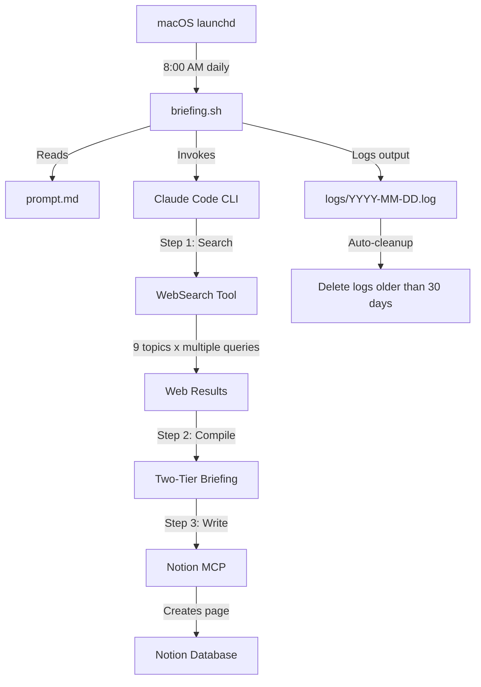

# AI News Briefing

Automated daily AI news research agent that searches the web, compiles a structured briefing, and publishes it to Notion -- powered by Claude Code CLI and macOS launchd.

## Overview

AI News Briefing is a fully automated pipeline that runs every morning on your Mac. It uses Claude Code in headless mode to act as a news research agent: searching the web across 9 AI-related topics, compiling the results into a two-tier briefing (TL;DR + full report), and writing the finished page directly to a Notion database.

The entire process -- from triggering to publishing -- requires zero human intervention. You wake up, open Notion, and your daily AI briefing is already there.

### Why it exists

Keeping up with AI news across models, tools, policy, funding, and open source is a full-time job. This project compresses that into an automated daily digest that covers 9 topic areas in a consistent format, delivered to your Notion workspace before you start your workday.

## Architecture



**Data flow summary:**

1. **launchd** fires `briefing.sh` at the scheduled time each day.
2. **briefing.sh** reads the prompt from `prompt.md` and passes it to the Claude Code CLI in print mode.
3. **Claude Code** executes the prompt as an agentic task -- performing web searches, compiling results, and calling the Notion MCP tool.
4. **Notion** receives the finished briefing as a new database page.
5. **Logs** are written to a date-stamped file and automatically pruned after 30 days.

## Prerequisites

| Requirement | Details |
|---|---|
| **macOS** | launchd is macOS-only; the plist scheduler will not work on Linux |
| **Claude Code CLI** | Installed at `~/.local/bin/claude` with a valid Anthropic API key or Max subscription |
| **Notion MCP** | The Notion MCP server must be configured in Claude Code's MCP settings with access to your workspace |
| **WebSearch tool** | Available by default in Claude Code (no extra setup needed) |

## Installation

### 1. Clone or copy the project

```bash
git clone <your-repo-url> ~/ai-news-briefing
cd ~/ai-news-briefing
```

### 2. Make the shell script executable

```bash
chmod +x ~/ai-news-briefing/briefing.sh
```

### 3. Set up the manual trigger command

Copy the convenience script to your local bin:

```bash
mkdir -p ~/.local/bin
cp ~/.local/bin/ai-news ~/.local/bin/ai-news   # already in place if cloned
chmod +x ~/.local/bin/ai-news
```

Or create it manually:

```bash
cat > ~/.local/bin/ai-news << 'EOF'
#!/bin/bash
echo "Starting AI News Briefing..."
launchctl kickstart "gui/$(id -u)/com.ainews.briefing"
echo "Running. Check Notion or: tail -f ~/ai-news-briefing/logs/$(date +%Y-%m-%d).log"
EOF
chmod +x ~/.local/bin/ai-news
```

Make sure `~/.local/bin` is in your `PATH` (add `export PATH="$HOME/.local/bin:$PATH"` to your `~/.zshrc` if needed).

### 4. Install the launchd plist

```bash
cp ~/ai-news-briefing/com.ainews.briefing.plist ~/Library/LaunchAgents/
launchctl load ~/Library/LaunchAgents/com.ainews.briefing.plist
```

### 5. Verify the agent is registered

```bash
launchctl list | grep ainews
```

You should see a line containing `com.ainews.briefing`.

## Configuration

### Change the schedule

Edit `com.ainews.briefing.plist` and modify the `StartCalendarInterval` section:

```xml
<key>StartCalendarInterval</key>
<dict>
    <key>Hour</key>
    <integer>8</integer>    <!-- Change this (0-23) -->
    <key>Minute</key>
    <integer>0</integer>    <!-- Change this (0-59) -->
</dict>
```

After editing, reload the agent:

```bash
launchctl unload ~/Library/LaunchAgents/com.ainews.briefing.plist
launchctl load ~/Library/LaunchAgents/com.ainews.briefing.plist
```

### Change the model

Edit `briefing.sh` and change the `--model` flag:

```bash
"$CLAUDE" -p \
  --model sonnet \          # Change to: opus, haiku, sonnet, etc.
  --dangerously-skip-permissions \
  --max-budget-usd 2.00 \
  "$(cat "$SCRIPT_DIR/prompt.md")"
```

**Model trade-offs:**

| Model | Speed | Cost | Quality |
|---|---|---|---|
| `haiku` | Fastest | Lowest | Good for basic summaries |
| `sonnet` | Balanced | Moderate | Recommended default |
| `opus` | Slowest | Highest | Best for deep analysis |

### Change the budget cap

Edit the `--max-budget-usd` value in `briefing.sh`. The default is `2.00` (USD per run). This acts as a safety cap -- if the agent's token usage would exceed this amount, the run stops.

### Change the topics

Edit `prompt.md` and modify the "Topics to Search" list. You can add, remove, or rename topics. If you change the number of topics, also update the `"Topics": 9` value in the Notion properties section at the bottom of the prompt.

## Usage

### Automatic (launchd)

Once installed, the briefing runs automatically every day at the scheduled time (default: 8:00 AM). No action needed.

### Manual trigger

Run the briefing on demand from any terminal:

```bash
ai-news
```

This uses `launchctl kickstart` to trigger the same launchd job, so it behaves identically to the scheduled run.

### Watch the progress

```bash
tail -f ~/ai-news-briefing/logs/$(date +%Y-%m-%d).log
```

A typical successful run takes 2-4 minutes and ends with a message like:

```
[2026-03-09 13:47:33] Briefing complete. Check Notion for today's report.
```

## Notion Setup

### Database schema

The prompt expects a Notion database with at least these properties:

| Property | Type | Example Value |
|---|---|---|
| `Date` | Title | `2026-03-09 - AI Daily Briefing` |
| `Status` | Select or Text | `Complete` |
| `Topics` | Number | `9` |

You can add additional properties to the database (tags, priority, etc.), but the three above are what the agent writes to.

### Data source ID

The prompt references a specific Notion data source ID:

```
856794cc-d871-4a95-be2d-2a1600920a19
```

To use your own database, you need to replace this value in `prompt.md` (in the Step 3 section). To find your data source ID:

1. Open Claude Code and ensure the Notion MCP is connected.
2. Ask Claude: "List my Notion data sources" or use the `notion-search` MCP tool.
3. Copy the `data_source_id` for the database you want to use.
4. Replace the ID in `prompt.md`.

### Page format

Each generated page contains:

- **TL;DR** -- 10-15 bullet points covering the biggest stories (roughly a 1-minute read)
- **Divider**
- **Full Briefing** -- 9 sections (one per topic), each with 3-8 detailed bullet points and source attribution
- **Key Takeaways table** -- a summary table of major trends and signals

## How the Prompt Works

The prompt (`prompt.md`) instructs Claude to execute three sequential steps within a single agentic session:

### Step 1: Search for News

Claude uses the WebSearch tool to perform multiple searches per topic, targeting news from the past 24-48 hours. The search strategy includes date-qualified queries like `"[topic] news today 2026-03-09"` and company-specific queries.

### Step 2: Compile the Briefing

Search results are synthesized into a two-tier format:

- **Tier 1 (TL;DR):** 10-15 one-sentence bullet points covering the top stories across all topics. Designed as a quick-scan summary.
- **Tier 2 (Full Briefing):** 9 sections with detailed coverage, source attribution, and a closing Key Takeaways table.

### Step 3: Write to Notion

Claude calls the `mcp__notion__notion-create-pages` tool to create a new page in the target database with the compiled briefing as Notion-flavored Markdown content.

## Topic Coverage

| # | Topic | What It Covers |
|---|---|---|
| 1 | Claude Code / Anthropic | New features, releases, Anthropic announcements, blog posts |
| 2 | OpenAI / Codex / ChatGPT | Model updates, Codex features, ChatGPT capabilities, API changes |
| 3 | AI Coding IDEs | Cursor, Windsurf, GitHub Copilot, Xcode AI, JetBrains AI, Google Antigravity |
| 4 | Agentic AI Ecosystem | Agent frameworks (LangChain, CrewAI, AutoGen), MCP updates, new agent products |
| 5 | AI Industry | New model releases, benchmarks, major company announcements |
| 6 | Open Source AI | Llama, Mistral, DeepSeek, Hugging Face, open-weight model releases |
| 7 | AI Startups & Funding | Funding rounds, acquisitions, notable startup launches |
| 8 | AI Policy & Regulation | Government policy, EU AI Act, state laws, AI safety developments |
| 9 | Dev Tools & Frameworks | Vercel, Next.js, React Native, TypeScript, AI-related developer tooling |

## Logs

### Location

All logs are stored in `~/ai-news-briefing/logs/`:

| File | Contents |
|---|---|
| `YYYY-MM-DD.log` | Full output from each run (timestamps, Claude output, success/failure) |
| `launchd-stdout.log` | Standard output captured by launchd (usually empty; output goes to the date log) |
| `launchd-stderr.log` | Standard error captured by launchd (useful for diagnosing launch failures) |

### Reading logs

View today's log:

```bash
cat ~/ai-news-briefing/logs/$(date +%Y-%m-%d).log
```

Follow a run in progress:

```bash
tail -f ~/ai-news-briefing/logs/$(date +%Y-%m-%d).log
```

### Auto-cleanup

Logs older than 30 days are automatically deleted at the end of each run. This is handled by the `find` command at the bottom of `briefing.sh`:

```bash
find "$LOG_DIR" -name "*.log" -mtime +30 -delete 2>/dev/null || true
```

The `launchd-stdout.log` and `launchd-stderr.log` files are not date-stamped, so they persist and grow over time. You may want to clear them periodically.

## Troubleshooting

### "Claude Code cannot be launched inside another Claude Code session"

This error occurs when the `CLAUDECODE` environment variable is set, which happens if you trigger the script from inside a Claude Code terminal session. The script includes `unset CLAUDECODE` to prevent this, but if you see this error:

- Make sure you are running `ai-news` from a regular terminal, not from within Claude Code.
- Verify that `briefing.sh` contains `unset CLAUDECODE` before the Claude invocation.

### launchd job does not run at the scheduled time

- **Mac was asleep:** launchd will run the job when the Mac wakes up if the scheduled time was missed. However, if Power Nap is disabled or the lid was closed, the job may not fire until the next login.
- **Agent not loaded:** Verify with `launchctl list | grep ainews`. If missing, reload the plist.
- **Path issues:** The plist sets a custom `PATH` and `HOME`. If Claude is installed in a non-standard location, update the `PATH` in the plist.

### Run succeeds but no Notion page appears

- Check that the Notion MCP is configured in Claude Code's MCP settings (`~/.claude/` or project-level `.mcp.json`).
- Verify the data source ID in `prompt.md` matches a database your Notion integration has access to.
- Look at the log output -- Claude typically prints a Notion URL on success.

### TTY suspension warnings

When running in headless/print mode (`-p`), Claude Code does not need a terminal. If you see TTY-related warnings in the logs, they are generally harmless and can be ignored. The `--dangerously-skip-permissions` flag is required for unattended execution because there is no terminal to approve tool use interactively.

### Budget exceeded

If the log shows the run stopped mid-way, the `--max-budget-usd` cap may have been reached. This can happen if the model makes an unusually large number of search queries. Increase the budget in `briefing.sh` or switch to a cheaper model.

### Multiple runs in the same day

Running `ai-news` multiple times in a day will create multiple Notion pages (one per run). The logs append to the same date-stamped file, so all runs for a given day are captured in one log.

## Cost Estimate

With the default configuration (`sonnet` model, 9 topics, `$2.00` budget cap):

| Component | Estimated Cost per Run |
|---|---|
| Input tokens (prompt + search results) | ~$0.30-0.60 |
| Output tokens (briefing + tool calls) | ~$0.20-0.40 |
| WebSearch tool calls (~15-25 searches) | ~$0.15-0.40 |
| **Total per run** | **~$0.70-1.40** |
| **Monthly (daily runs)** | **~$21-42** |

Actual costs vary based on the volume of news, number of search queries, and briefing length. The `--max-budget-usd 2.00` cap ensures no single run exceeds $2.00.

## Project Structure

```
ai-news-briefing/
├── briefing.sh                  # Main shell script -- orchestrates the run
├── prompt.md                    # Agent prompt -- search, compile, and write instructions
├── com.ainews.briefing.plist    # macOS launchd schedule definition
├── logs/                        # Run logs (git-ignored)
│   ├── YYYY-MM-DD.log           # Per-day output logs
│   ├── launchd-stdout.log       # launchd stdout capture
│   └── launchd-stderr.log       # launchd stderr capture
├── .gitignore                   # Ignores logs/ and .DS_Store
└── README.md                    # This file

~/.local/bin/
└── ai-news                      # Convenience command for manual runs
```
