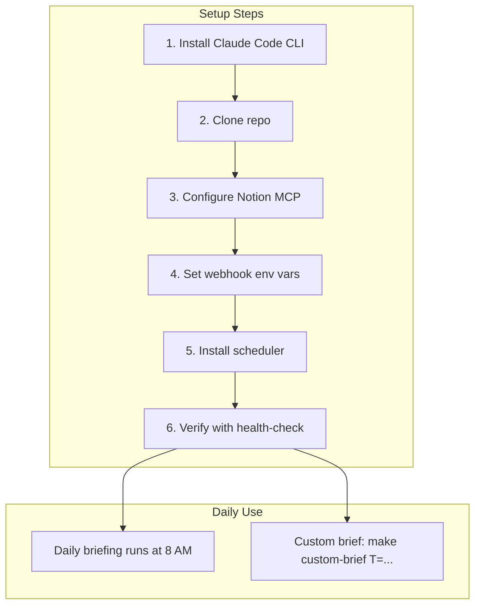

# Setup Guide

Complete setup instructions for the AI News Briefing system, covering both the daily automated briefing and the on-demand custom topic briefing.

---

## Prerequisites

| Requirement | Used by | Details |
|---|---|---|
| **Claude Code CLI** | Both | Installed at `~/.local/bin/claude` with a valid Anthropic API key or Max subscription |
| **Notion MCP** | Both (optional) | The Notion MCP server configured in Claude Code's MCP settings |
| **WebSearch tool** | Both | Built into Claude Code (no extra setup) |
| **Python 3.x** | Slack delivery | Required for `teams-to-slack.py` conversion |
| **GNU Make** | Optional | For `make run`, `make custom-brief`, etc. (`winget install GnuWin32.Make` on Windows) |

---

## 1. Install Claude Code CLI

Follow the official install guide at [code.claude.com](https://code.claude.com). Verify:

```bash
claude --version
```

The CLI should be at `~/.local/bin/claude` (macOS/Linux) or `%USERPROFILE%\.local\bin\claude.exe` (Windows).

---

## 2. Clone the Repository

```bash
git clone https://github.com/hoangsonww/AI-News-Briefing
cd AI-News-Briefing
```

Make scripts executable (macOS/Linux):

```bash
chmod +x briefing.sh custom-brief.sh scripts/*.sh
```

---

## 3. Configure Notion MCP

The system publishes briefings to a Notion database via the Notion MCP server.

### 3a. Add Notion MCP to Claude Code

In your Claude Code MCP settings, add the Notion server. This gives Claude access to your Notion workspace.

### 3b. Create or identify your database

The system expects a Notion database with at least these properties:

| Property | Type | Example |
|---|---|---|
| `Date` | Title | `2026-04-01 - AI Daily Briefing` |
| `Status` | Select or Text | `Complete` |
| `Topics` | Number | `9` |

### 3c. Find your data source ID

Ask Claude Code: *"List my Notion data sources"* or use the `notion-search` MCP tool. Copy the `data_source_id` for your target database.

The default data source ID is:

```
856794cc-d871-4a95-be2d-2a1600920a19
```

To use a different database, replace this ID in:
- `prompt.md` (daily briefing, Step 3)
- `prompt-custom-brief.md` (custom briefing, Phase 5)

---

## 4. Set Up Notifications (Optional)

### Microsoft Teams

1. Create a Power Automate webhook workflow for your Teams channel.
   Full guide: [NOTIFY_TEAMS.md](NOTIFY_TEAMS.md)

2. Set the webhook URL:

**macOS/Linux:**
```bash
export AI_BRIEFING_TEAMS_WEBHOOK="https://your-teams-webhook-url"
```

**Windows (persistent):**
```powershell
[Environment]::SetEnvironmentVariable("AI_BRIEFING_TEAMS_WEBHOOK", "https://your-teams-webhook-url", "User")
```

### Slack

1. Create an incoming webhook at [api.slack.com/apps](https://api.slack.com/apps).

2. Set the webhook URL:

**macOS/Linux:**
```bash
export AI_BRIEFING_SLACK_WEBHOOK="https://hooks.slack.com/services/T.../B.../..."
```

**Windows (persistent):**
```powershell
[Environment]::SetEnvironmentVariable("AI_BRIEFING_SLACK_WEBHOOK", "https://hooks.slack.com/services/T.../B.../...", "User")
```

### Multiple Webhooks

Separate multiple URLs with semicolons:

```bash
export AI_BRIEFING_TEAMS_WEBHOOK="https://webhook-1;https://webhook-2"
```

---

## 5. Schedule the Daily Briefing

### macOS (launchd)

```bash
cp com.ainews.briefing.plist ~/Library/LaunchAgents/
launchctl load ~/Library/LaunchAgents/com.ainews.briefing.plist
launchctl list | grep ainews
```

### Windows (Task Scheduler)

```powershell
.\install-task.ps1              # Default: 8:00 AM
.\install-task.ps1 -Hour 7 -Minute 30  # Custom time
```

### Change schedule

```bash
# macOS: edit plist, then reload
launchctl unload ~/Library/LaunchAgents/com.ainews.briefing.plist
launchctl load ~/Library/LaunchAgents/com.ainews.briefing.plist

# Windows
.\install-task.ps1 -Hour 9 -Minute 0
```

---

## 6. Verify Setup

### Health check

```bash
bash scripts/health-check.sh
# or on Windows:
.\scripts\health-check.ps1
```

### Test Notion connectivity

```bash
bash scripts/test-notion.sh
```

### Manual test run

```bash
# Daily briefing
make run
# or: bash briefing.sh

# Custom brief
make custom-brief T="test topic"
# or: bash custom-brief.sh --topic "test topic"
```

---

## Quick Reference



| Task | Command |
|---|---|
| Run daily briefing | `make run` or `bash briefing.sh` |
| Run custom brief | `make custom-brief T="topic" NOTION=1` or `bash custom-brief.sh --topic "topic" --notion` |
| Check status | `make status` |
| View today's log | `make tail` |
| Test Teams delivery | `bash scripts/notify-teams.sh --all --card-file logs/YYYY-MM-DD-card.json` |
| Test Slack delivery | `bash scripts/notify-slack.sh --all --card-file logs/YYYY-MM-DD-card.json` |
