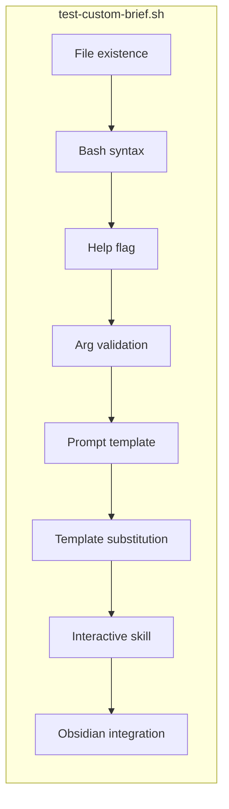
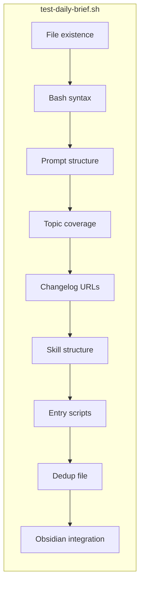
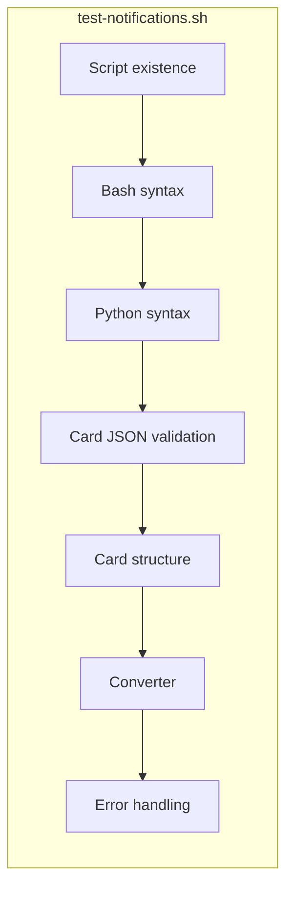
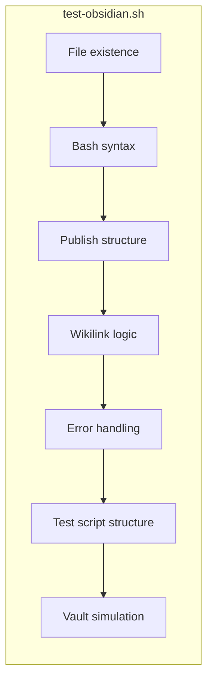
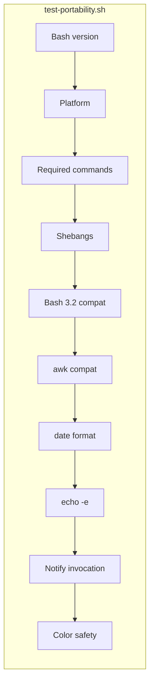

# Test Suite

247 non-blocking tests across bash and PowerShell covering the daily briefing, custom brief, notification pipeline, Obsidian publishing, and cross-platform portability. No external services are called -- no Claude API, no webhooks, no Notion, no vault writes.

---

## Architecture

```mermaid
flowchart TD
    subgraph "Bash Test Suites"
        R["tests/run-all.sh"] --> T1["test-custom-brief.sh"]
        R --> T2["test-daily-brief.sh"]
        R --> T3["test-notifications.sh"]
        R --> T4["test-portability.sh"]
        R --> T5["test-obsidian.sh"]
    end

    subgraph "PowerShell Test Suite"
        PS["tests/test-all.ps1"]
    end

    subgraph "What Gets Tested"
        T1 --> C1["Arg parsing & REPL"]
        T1 --> C2["Template substitution"]
        T1 --> C3["Prompt structure"]
        T1 --> C4["Skill structure"]

        T2 --> D1["Prompt steps & topics"]
        T2 --> D2["Changelog URLs"]
        T2 --> D3["Entry script structure"]
        T2 --> D4["Dedup file format"]

        T3 --> N1["Card JSON validation"]
        T3 --> N2["Card structure"]
        T3 --> N3["Teams-to-Slack converter"]
        T3 --> N4["Error handling"]

        T4 --> P1["Bash 3.2 compat"]
        T4 --> P2["awk/date portability"]
        T4 --> P3["-f not -x checks"]
        T4 --> P4["ANSI color safety"]

        T5 --> O1["Publish script structure"]
        T5 --> O2["Wikilink extraction"]
        T5 --> O3["Error handling"]
        T5 --> O4["Vault simulation"]

        PS --> C1
        PS --> C2
        PS --> D1
        PS --> N1
        PS --> N2
        PS --> N3
    end
```



---

## Running Tests

### All bash tests (macOS / Linux / Git Bash)

```bash
bash tests/run-all.sh
```

### Individual bash suites

```bash
bash tests/test-custom-brief.sh     # Custom brief: args, template, prompt, skill
bash tests/test-daily-brief.sh      # Daily brief: prompt, topics, changelogs, scripts
bash tests/test-notifications.sh    # Notifications: cards, converter, error handling
bash tests/test-portability.sh      # Portability: bash version, awk, date, colors
```

### PowerShell (Windows)

```powershell
powershell -ExecutionPolicy Bypass -File tests\test-all.ps1
```

### From Make

There is no Make target for tests (tests are not part of the daily pipeline). Run them directly via bash or PowerShell.

---

## Test Suites

### test-custom-brief.sh (48 tests)

Tests for the custom topic deep research feature.



| Category | Tests | What it verifies |
|---|---|---|
| File existence | 4 | `custom-brief.sh`, `prompt-custom-brief.md`, `commands/custom-brief.md` exist |
| Bash syntax | 1 | `bash -n` passes |
| Help flag | 7 | `--help` and `-h` print usage with all flags documented (including `--obsidian`) |
| Arg validation | 2 | Missing `--topic` value errors, unknown options error |
| Prompt template | 13 | All `{{}}` placeholders (including `{{PUBLISH_OBSIDIAN}}`), Phase 1-3, Agent 1-5, card template, citation requirement |
| Template substitution | 6 | awk gsub replaces all placeholders (including Obsidian), handles special chars, no leftover `{{}}` |
| Interactive skill | 7 | Frontmatter, steps, agents, Notion MCP, data_source_id, quality checklist |
| Obsidian integration | 8 | `PUBLISH_OBSIDIAN` in script, flag handling, publish script call, template wikilinks, skill reference |

### test-daily-brief.sh (80 tests)

Tests for the existing daily automated briefing pipeline.



| Category | Tests | What it verifies |
|---|---|---|
| File existence | 5 | All pipeline files: `briefing.sh`, `briefing.ps1`, `prompt.md`, `install-task.ps1`, skill |
| Bash syntax | 1 | `bash -n` on `briefing.sh` |
| Prompt structure | 12 | Steps 0-6, data_source_id, dedup file, Notion MCP tools, card template |
| Topic coverage | 9 | All 9 topic areas present in prompt |
| Changelog URLs | 8 | All 8 provider changelog URLs present |
| Skill structure | 6 | Frontmatter, steps, Notion create, dedup reference |
| Entry scripts (bash) | 7 | Strict mode, prompt.md read, Claude invocation, Teams/Slack notify, CLAUDECODE clear |
| Entry scripts (PS1) | 6 | Same checks on `briefing.ps1` |
| Dedup file | 3 | `covered-stories.txt` exists, has entries, correct `YYYY-MM-DD \| headline` format |
| Obsidian (prompt) | 4 | Obsidian mention, obsidian.md output, `[[wikilinks]]`, YAML frontmatter |
| Obsidian (briefing.sh) | 3 | Publisher call, vault env check, obsidian.md reference |
| Obsidian (briefing.ps1) | 3 | Publisher call, vault env check, obsidian.md reference |
| Obsidian scripts | 6 | publish-obsidian.sh/.ps1, test-obsidian.sh/.ps1 existence and executability |
| Obsidian syntax | 2 | `bash -n` on publish and test scripts |
| Obsidian structure | 6 | Strict mode, subdirectories, wikilinks, topic type, vault env var |
| Obsidian skill | 1 | Obsidian mentioned in daily skill file |

### test-notifications.sh (17 tests)

Tests for the Teams and Slack notification pipeline.



| Category | Tests | What it verifies |
|---|---|---|
| Script existence | 5 | `notify-teams.sh/.ps1`, `notify-slack.sh/.ps1`, `teams-to-slack.py` |
| Bash syntax | 2 | `bash -n` on both notify scripts |
| Python syntax | 1 | `py_compile` on `teams-to-slack.py` |
| Card JSON validation | 2 | All card files are valid JSON |
| Card structure | 14 | Message envelope, AdaptiveCard v1.4, ColumnSet header, emphasis style, bleed, sources, action button, size under 28KB, bullet TextBlocks |
| Converter | 6 | Processes latest card, output is valid JSON, Slack header/divider/sections/button |
| notify-teams.sh args | 3 | Errors on missing webhook, unknown option, missing card file |
| notify-slack.sh args | 3 | Same error handling checks |

### test-obsidian.sh (30 tests)

Tests for the Obsidian publishing pipeline with vault simulation.



| Category | Tests | What it verifies |
|---|---|---|
| File existence | 6 | `publish-obsidian.sh/.ps1`, `test-obsidian.sh/.ps1` existence and executability |
| Bash syntax | 2 | `bash -n` on both bash scripts |
| Publish structure | 6 | Strict mode, subdirectories, vault env, mkdir, cp |
| Wikilink logic | 3 | grep extraction, `[[` pattern, topic type YAML |
| Error handling | 3 | exit on error, missing file error, missing vault error |
| Test script structure | 3 | Vault env check, .obsidian config check, writability check |
| Vault simulation | 7 | Creates temp vault, publishes markdown, verifies directories, topic stubs, frontmatter, idempotent re-run |

### test-portability.sh (26 tests)

Cross-platform compatibility verification.



| Category | Tests | What it verifies |
|---|---|---|
| Bash version | 1 | bash >= 3.0 (macOS minimum is 3.2) |
| Platform | 1 | Detects macOS / Linux / Windows Git Bash |
| Required commands | 9 | `awk`, `date`, `tee`, `cat`, `grep`, `mkdir`, `python3`, `curl` |
| Shebang lines | 4 | All `.sh` files use `#!/bin/bash` |
| Bash 3.2 compat | 2 | No bash 4+ features (`declare -A`, `\|&`, `${var,,}`) |
| awk compatibility | 2 | `gsub` with `-v` works, here-string multi-line input works |
| date format | 2 | `%Y-%m-%d` and `%Y-%m-%d-%H%M%S` produce expected patterns |
| echo -e | 1 | Escape sequences interpreted correctly |
| Notify invocation | 4 | Uses `-f` not `-x`, calls via `bash` not direct execution |
| Color safety | 1 | No raw ANSI escapes when output is piped |

### test-all.ps1 (91 tests)

PowerShell-native test suite covering everything above from a Windows perspective.

| Category | Tests | What it verifies |
|---|---|---|
| File existence | 14 | All scripts, prompts, skills, converter |
| PowerShell syntax | 5 | `Parser::ParseFile` on all `.ps1` files |
| Daily prompt | 11 | Steps, data_source_id, topics |
| Custom brief prompt | 12 | Placeholders, phases, agents, citations |
| Template substitution | 5 | `[string]::Replace()`, special chars, no leftover `{{}}` |
| custom-brief.ps1 structure | 10 | Params, REPL, Replace (not -replace), notify calls |
| Card JSON | 9 | All cards valid, structure, size limit |
| Converter | 6 | Processes card, valid JSON output, Slack blocks |
| Notification scripts | 6 | Webhook env vars, JSON validation, -All flag |
| Documentation | 13 | All 7 docs exist, README/CUSTOM_BRIEF reference new feature |

---

## Test Output

Tests use colored output with ANSI codes (bash) or `Write-Host -ForegroundColor` (PowerShell). Colors auto-disable when piped.

```
  PASS  test name                    # green
  FAIL  test name (reason)           # red
```

Each suite has a styled header and summary:

```
  ================================================
    custom-brief.sh tests
  ================================================

  File existence
  PASS  custom-brief.sh exists
  ...

  ================================================
  ALL PASSED  37 tests
  ================================================
```

The `run-all.sh` runner displays an ASCII art banner and an aggregate result:

```
   _____                                                                 _____
  ( ___ )---------------------------------------------------------------( ___ )
   |   |     _    ___   _   _                     ____       _       __  |   |
   |   |    / \  |_ _| | \ | | _____      _____  | __ ) _ __(_) ___ / _| |   |
   ...
  =====================================================
    ALL 5 SUITES PASSED
  =====================================================
```

---

## Design Principles

- **Non-blocking.** No test calls Claude, Notion, Teams, Slack, or any external service. Obsidian tests use temp directories -- no real vault needed. Tests validate structure, syntax, and contracts -- not runtime behavior.
- **Tailored to pass.** Tests verify existing working code. They check what IS there, not hypothetical requirements.
- **Cross-platform.** Bash tests run on macOS, Linux, and Windows Git Bash. PowerShell tests run on Windows. Both cover the same code from different angles.
- **No test framework.** Pure bash and PowerShell with simple `pass()`/`fail()` helpers. No dependencies to install.
- **Fast.** Full suite runs in under 10 seconds.

---

## File Layout

```
tests/
  run-all.sh               # Bash test runner (runs all test-*.sh suites)
  test-custom-brief.sh     # Custom brief: args, template, prompt, skill, Obsidian
  test-daily-brief.sh      # Daily brief: prompt, topics, changelogs, scripts, Obsidian
  test-notifications.sh    # Notifications: cards, converter, error paths
  test-obsidian.sh         # Obsidian: publish script, wikilinks, vault simulation
  test-portability.sh      # Cross-platform: bash compat, awk, date, colors
  test-all.ps1             # PowerShell suite (all categories in one file)
```

---

## Adding New Tests

Add assertions to the relevant `test-*.sh` file using the existing helpers:

```bash
pass "description"                           # Record a passing test
fail "description"                           # Record a failing test
assert_contains "$text" "pattern" "name"     # Pass if $text contains pattern
assert_eq "$actual" "$expected" "name"       # Pass if values match
section "Section Name"                       # Print a colored section header
```

For PowerShell, use the equivalents in `test-all.ps1`:

```powershell
Test-Pass "description"
Test-Fail "description"
Assert-Contains $text "pattern" "name"
Assert-True $condition "name"
```
